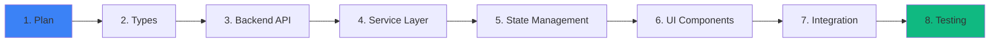

# Adding Features Guide

## Overview

This guide provides step-by-step instructions for implementing new features in BSI Messenger. Follow these patterns to maintain code consistency and quality.

## Feature Development Workflow



---

## Example: Adding Reactions to Messages

### 1. Plan the Feature

**Requirements:**
- Users can react to messages with emojis
- Multiple reactions per message
- One reaction per user per message
- Real-time updates via WebSocket
- Reaction picker UI

**Data Structure:**
```typescript
interface Reaction {
  id: string
  messageId: string
  userId: string
  emoji: string
  createdAt: string
}
```

### 2. Define TypeScript Types

**File:** `src/renderer/src/types/index.ts`

```typescript
// Add to existing types
export interface Reaction {
  id: string
  messageId: string
  userId: string
  emoji: string
  createdAt: string
}

export interface Message {
  id: string
  conversationId: string
  senderId: string
  body: string | null
  attachments: Attachment[]
  reactions: Reaction[]  // Add this
  createdAt: string
  updatedAt: string
}
```

### 3. Backend API (Reference)

**Backend should provide these endpoints:**
```
POST   /messages/:messageId/reactions     - Add reaction
DELETE /messages/:messageId/reactions/:id - Remove reaction
```

**WebSocket events:**
```typescript
{ type: 'reaction:added', data: Reaction }
{ type: 'reaction:removed', data: { id: string, messageId: string } }
```

### 4. Create Service Layer

**File:** `src/renderer/src/services/reactions.service.ts`

```typescript
import { api } from './api.service'
import { Reaction } from '../types'

export const reactionsService = {
  async addReaction(messageId: string, emoji: string): Promise<Reaction> {
    const response = await api.post(`/messages/${messageId}/reactions`, { emoji })
    return response.data
  },

  async removeReaction(messageId: string, reactionId: string): Promise<void> {
    await api.delete(`/messages/${messageId}/reactions/${reactionId}`)
  }
}
```

### 5. Update State Management

**File:** `src/renderer/src/stores/messages.store.ts`

```typescript
interface MessagesState {
  messages: Record<string, Message>
  // ... existing state
  
  // Add these actions
  addReaction: (reaction: Reaction) => void
  removeReaction: (messageId: string, reactionId: string) => void
}

export const useMessagesStore = create<MessagesState>((set) => ({
  // ... existing state
  
  addReaction: (reaction) => {
    set((state) => {
      const message = state.messages[reaction.messageId]
      if (!message) return state
      
      return {
        messages: {
          ...state.messages,
          [reaction.messageId]: {
            ...message,
            reactions: [...message.reactions, reaction]
          }
        }
      }
    })
  },

  removeReaction: (messageId, reactionId) => {
    set((state) => {
      const message = state.messages[messageId]
      if (!message) return state
      
      return {
        messages: {
          ...state.messages,
          [messageId]: {
            ...message,
            reactions: message.reactions.filter(r => r.id !== reactionId)
          }
        }
      }
    })
  }
}))
```

### 6. Update WebSocket Handler

**File:** `src/renderer/src/services/websocket.service.ts`

```typescript
private handleMessage(message: WSMessage) {
  switch (message.type) {
    // ... existing cases
    
    case 'reaction:added':
      useMessagesStore.getState().addReaction(message.data)
      break
    
    case 'reaction:removed':
      useMessagesStore.getState().removeReaction(
        message.data.messageId,
        message.data.id
      )
      break
  }
}
```

### 7. Build UI Components

**File:** `src/renderer/src/components/ReactionPicker.tsx`

```typescript
import { useState } from 'react'

const EMOJI_LIST = ['👍', '❤️', '😂', '😮', '😢', '🔥', '🎉']

interface ReactionPickerProps {
  messageId: string
  onSelect: (emoji: string) => void
}

export const ReactionPicker = ({ messageId, onSelect }: ReactionPickerProps) => {
  const [isOpen, setIsOpen] = useState(false)

  return (
    <div className="relative">
      <button 
        onClick={() => setIsOpen(!isOpen)}
        className="reaction-trigger"
      >
        😊
      </button>
      
      {isOpen && (
        <div className="reaction-picker">
          {EMOJI_LIST.map((emoji) => (
            <button
              key={emoji}
              onClick={() => {
                onSelect(emoji)
                setIsOpen(false)
              }}
              className="emoji-button"
            >
              {emoji}
            </button>
          ))}
        </div>
      )}
    </div>
  )
}
```

**File:** `src/renderer/src/components/ReactionsList.tsx`

```typescript
import { Reaction, User } from '../types'
import { useAuthStore } from '../stores/auth.store'
import { reactionsService } from '../services/reactions.service'

interface ReactionsListProps {
  reactions: Reaction[]
  messageId: string
}

export const ReactionsList = ({ reactions, messageId }: ReactionsListProps) => {
  const { user } = useAuthStore()
  
  // Group by emoji
  const grouped = reactions.reduce((acc, reaction) => {
    if (!acc[reaction.emoji]) {
      acc[reaction.emoji] = []
    }
    acc[reaction.emoji].push(reaction)
    return acc
  }, {} as Record<string, Reaction[]>)

  const handleToggle = async (emoji: string) => {
    const myReaction = reactions.find(
      r => r.emoji === emoji && r.userId === user?.id
    )

    if (myReaction) {
      // Remove my reaction
      await reactionsService.removeReaction(messageId, myReaction.id)
    } else {
      // Add reaction
      await reactionsService.addReaction(messageId, emoji)
    }
  }

  return (
    <div className="reactions-list">
      {Object.entries(grouped).map(([emoji, reactionsList]) => {
        const hasMyReaction = reactionsList.some(r => r.userId === user?.id)
        
        return (
          <button
            key={emoji}
            onClick={() => handleToggle(emoji)}
            className={cn(
              'reaction-bubble',
              hasMyReaction && 'active'
            )}
          >
            <span>{emoji}</span>
            <span className="count">{reactionsList.length}</span>
          </button>
        )
      })}
    </div>
  )
}
```

### 8. Integrate into Message Component

**File:** `src/renderer/src/components/MessageItem.tsx`

```typescript
import { ReactionPicker } from './ReactionPicker'
import { ReactionsList } from './ReactionsList'
import { reactionsService } from '../services/reactions.service'

export const MessageItem = ({ message }: { message: Message }) => {
  const handleAddReaction = async (emoji: string) => {
    await reactionsService.addReaction(message.id, emoji)
  }

  return (
    <div className="message-item">
      <div className="message-body">
        {message.body}
      </div>
      
      {/* Reactions */}
      {message.reactions.length > 0 && (
        <ReactionsList reactions={message.reactions} messageId={message.id} />
      )}
      
      {/* Reaction picker */}
      <ReactionPicker messageId={message.id} onSelect={handleAddReaction} />
    </div>
  )
}
```

### 9. Add Styling

**File:** `src/renderer/src/styles/reactions.css`

```css
.reaction-picker {
  position: absolute;
  bottom: 100%;
  left: 0;
  display: flex;
  gap: 0.5rem;
  padding: 0.5rem;
  background: white;
  border-radius: 0.5rem;
  box-shadow: 0 4px 6px rgba(0, 0, 0, 0.1);
}

.emoji-button {
  font-size: 1.5rem;
  padding: 0.25rem;
  border: none;
  background: none;
  cursor: pointer;
  transition: transform 0.2s;
}

.emoji-button:hover {
  transform: scale(1.2);
}

.reactions-list {
  display: flex;
  gap: 0.25rem;
  flex-wrap: wrap;
  margin-top: 0.5rem;
}

.reaction-bubble {
  display: flex;
  align-items: center;
  gap: 0.25rem;
  padding: 0.25rem 0.5rem;
  background: #f3f4f6;
  border-radius: 1rem;
  border: 1px solid transparent;
  cursor: pointer;
  transition: all 0.2s;
}

.reaction-bubble:hover {
  background: #e5e7eb;
}

.reaction-bubble.active {
  background: #dbeafe;
  border-color: #3b82f6;
}

.reaction-bubble .count {
  font-size: 0.875rem;
  color: #6b7280;
}
```

---

## Feature Patterns

### Pattern 1: Simple CRUD Feature

**Example: User Profile Settings**

1. Add types in `types/index.ts`
2. Create service in `services/profile.service.ts`
3. Add state in `stores/profile.store.ts`
4. Create form component
5. Integrate in settings page

**Boilerplate:**
```typescript
// 1. Type
export interface UserProfile {
  displayName: string
  avatar: string
  bio: string
}

// 2. Service
export const profileService = {
  async getProfile(): Promise<UserProfile> {
    const response = await api.get('/profile')
    return response.data
  },
  
  async updateProfile(data: Partial<UserProfile>): Promise<UserProfile> {
    const response = await api.patch('/profile', data)
    return response.data
  }
}

// 3. Store
export const useProfileStore = create<ProfileState>((set) => ({
  profile: null,
  setProfile: (profile) => set({ profile })
}))

// 4. Component (with TanStack Query)
const ProfileForm = () => {
  const { data: profile } = useQuery({
    queryKey: ['profile'],
    queryFn: profileService.getProfile
  })
  
  const mutation = useMutation({
    mutationFn: profileService.updateProfile,
    onSuccess: (data) => {
      useProfileStore.getState().setProfile(data)
      toast.success('Profile updated')
    }
  })
  
  return <form onSubmit={...} />
}
```

### Pattern 2: Real-time Feature

**Example: Live Presence Indicators**

1. Define WebSocket message type
2. Add handler in `websocket.service.ts`
3. Update store on message received
4. Subscribe in component

**Boilerplate:**
```typescript
// 1. WebSocket handler
case 'presence:update':
  usePresenceStore.getState().updatePresence(message.data)
  break

// 2. Store
export const usePresenceStore = create<PresenceState>((set) => ({
  statuses: {},
  updatePresence: (data) => set((state) => ({
    statuses: { ...state.statuses, [data.userId]: data.status }
  }))
}))

// 3. Component
const UserAvatar = ({ userId }) => {
  const status = usePresenceStore(state => state.statuses[userId])
  
  return (
    <div className="relative">
      
      <span className={`status-${status}`} />
    </div>
  )
}
```

### Pattern 3: Background Job Feature

**Example: File Upload with Progress**

1. Use FormData for multipart upload
2. Track progress with Axios `onUploadProgress`
3. Show progress bar
4. Handle completion/error

**Boilerplate:**
```typescript
const uploadFile = async (file: File) => {
  const formData = new FormData()
  formData.append('file', file)
  
  const response = await api.post('/upload', formData, {
    headers: { 'Content-Type': 'multipart/form-data' },
    onUploadProgress: (progressEvent) => {
      const percentCompleted = Math.round(
        (progressEvent.loaded * 100) / progressEvent.total!
      )
      setProgress(percentCompleted)
    }
  })
  
  return response.data
}
```

---

## Best Practices Checklist

### Before Starting
- [ ] Review existing similar features
- [ ] Check if types already exist
- [ ] Plan data flow (API → Service → Store → Component)
- [ ] Consider real-time requirements

### During Development
- [ ] Use TypeScript strictly (no `any`)
- [ ] Add proper error handling
- [ ] Follow naming conventions
- [ ] Use existing UI components when possible
- [ ] Add loading and error states

### Before Committing
- [ ] Test locally (happy path + edge cases)
- [ ] Check TypeScript errors: `npm run typecheck`
- [ ] Format code: `npm run format`
- [ ] Lint code: `npm run lint`
- [ ] Update documentation if needed

### Code Review Checklist
- [ ] Types are correct and complete
- [ ] Error handling is comprehensive
- [ ] Loading states are shown
- [ ] UI is responsive and accessible
- [ ] Real-time updates work correctly
- [ ] No console errors or warnings

---

## Common Pitfalls

### ❌ Don't: Bypass Service Layer
```typescript
// Bad - direct API call in component
const handleSubmit = async () => {
  await api.post('/messages', data)
}
```

### ✅ Do: Use Service Layer
```typescript
// Good - use service
const handleSubmit = async () => {
  await messagesService.sendMessage(data)
}
```

### ❌ Don't: Store Derived State
```typescript
// Bad - storing computed value
const store = create((set) => ({
  messages: [],
  messageCount: 0, // Derived from messages.length!
}))
```

### ✅ Do: Compute on Read
```typescript
// Good - compute when needed
const store = create((set) => ({
  messages: [],
}))

const messageCount = useMessagesStore(state => state.messages.length)
```

### ❌ Don't: Mutate State Directly
```typescript
// Bad - mutation
const addMessage = (message) => {
  state.messages.push(message) // ❌
}
```

### ✅ Do: Return New Objects
```typescript
// Good - immutable update
const addMessage = (message) => set((state) => ({
  messages: [...state.messages, message]
}))
```

---

## Testing Your Feature

### Manual Testing
1. Test happy path (feature works as expected)
2. Test edge cases (empty state, large data, etc.)
3. Test error cases (network failure, invalid input)
4. Test real-time updates (multiple windows open)
5. Test on different screen sizes
6. Test on mobile (if applicable)

### Browser DevTools
```javascript
// Check store state
useMessagesStore.getState()

// Trigger action manually
useMessagesStore.getState().addMessage(mockMessage)

// Monitor WebSocket
// Open Network tab → WS → Select connection → View messages
```

---

## Getting Help

**Before asking:**
1. Check existing documentation
2. Search codebase for similar implementations
3. Review related components

**When asking:**
1. Describe what you're trying to build
2. Show what you've tried
3. Include error messages if any
4. Share relevant code snippets

**Resources:**
- [ARCHITECTURE.md](./ARCHITECTURE.md) - System overview
- [COMPONENTS.md](./COMPONENTS.md) - UI patterns
- [STATE_MANAGEMENT.md](./STATE_MANAGEMENT.md) - State patterns
- [API.md](./API.md) - API reference

---

*This guide is a living document. Update it when you discover new patterns or best practices.*
