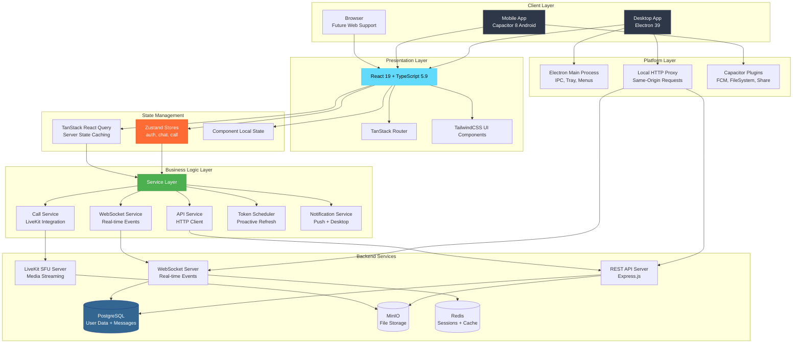
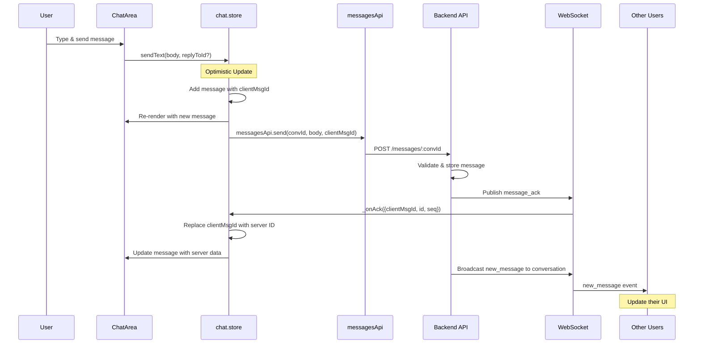
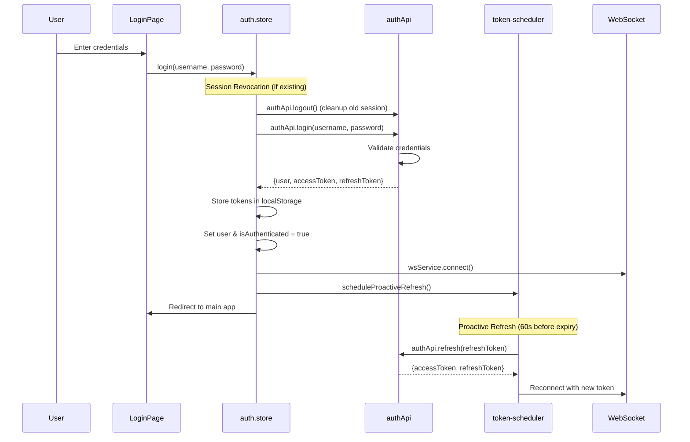
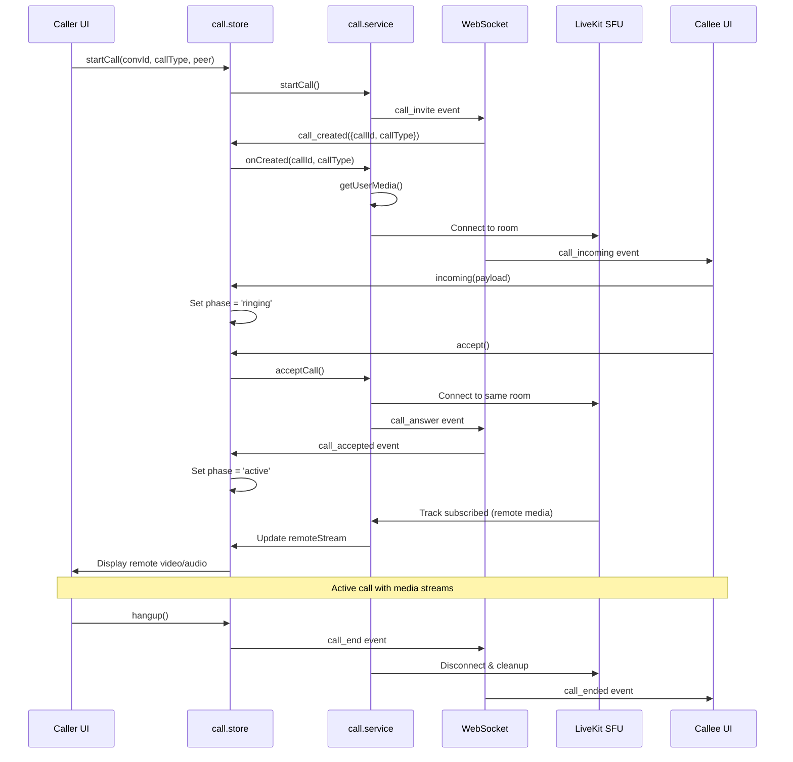
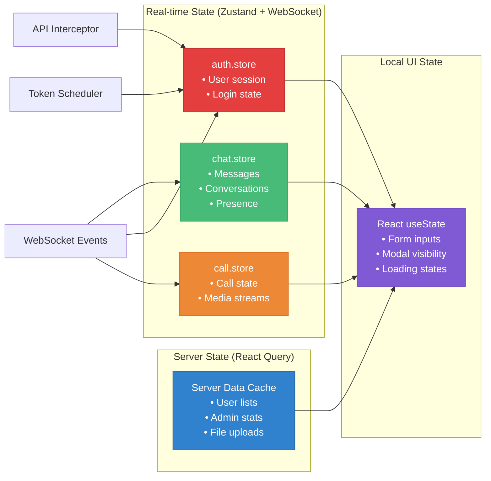
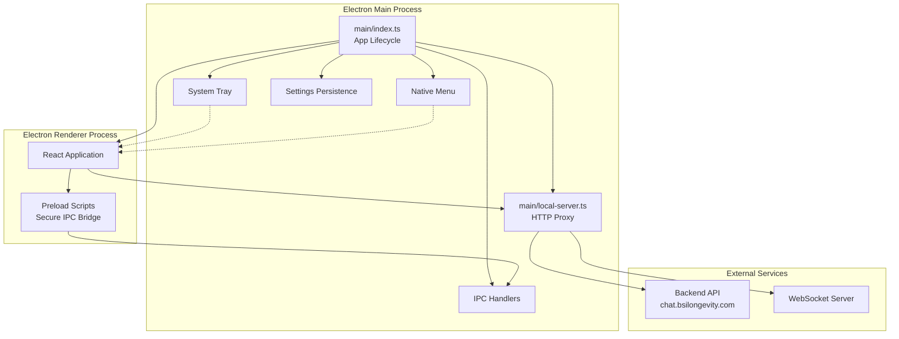
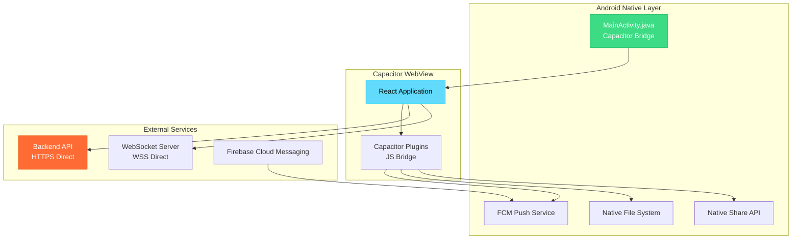

# BSI Messenger Architecture Documentation

## Overview

BSI Messenger is a cross-platform communication application built with modern web technologies, supporting real-time messaging, audio/video calls, and comprehensive user management. The application follows a 3-tier architecture with clear separation of concerns.

## System Architecture



## Technology Stack

### Frontend Technologies

| Technology | Version | Purpose | Justification |
|------------|---------|---------|---------------|
| React | 19.2.1 | UI Framework | Latest stable with concurrent features, excellent ecosystem |
| TypeScript | 5.9.3 | Type Safety | Compile-time error detection, better developer experience |
| TailwindCSS | 3.4.19 | Styling | Utility-first approach, consistent design system |
| TanStack Router | 1.170.16 | Routing | Type-safe routing with file-based structure |
| TanStack React Query | 5.101.2 | Server State | Caching, background updates, optimistic updates |
| Zustand | 5.0.14 | Client State | Simple, boilerplate-free state management |
| Axios | 1.18.1 | HTTP Client | Request/response interceptors, automatic retries |
| React Virtuoso | 4.18.10 | List Virtualization | Performance for large message lists |

### Desktop Technologies

| Technology | Version | Purpose | Justification |
|------------|---------|---------|---------------|
| Electron | 39.2.6 | Desktop Runtime | Cross-platform native capabilities |
| Electron Vite | 5.0.0 | Build Tool | Fast development, optimized bundling |
| Electron Builder | 26.0.12 | Packaging | Multi-platform distribution |

### Mobile Technologies

| Technology | Version | Purpose | Justification |
|------------|---------|---------|---------------|
| Capacitor | 8.4.2 | Mobile Runtime | Native functionality without complex setup |
| Capacitor Push Notifications | 8.1.2 | Push Notifications | FCM integration for Android |
| Capacitor Filesystem | 8.1.2 | File Access | Download and share attachments |
| Capacitor Share | 8.0.1 | Share API | Share content to other apps |

### Real-time & Media

| Technology | Version | Purpose | Justification |
|------------|---------|---------|---------------|
| WebSocket | Native | Real-time Events | Low-latency bidirectional communication |
| LiveKit Client | 2.21.0 | Audio/Video Calls | SFU architecture, handles NAT traversal |

### Build & Development

| Technology | Version | Purpose | Justification |
|------------|---------|---------|---------------|
| Vite | 7.2.6 | Development Server | Lightning-fast HMR, optimized builds |
| ESLint | 9.39.1 | Code Linting | Code quality, consistent style |
| Prettier | 3.7.4 | Code Formatting | Automated formatting, team consistency |

## Component Architecture

```mermaid
graph TD
    App[App.tsx<br/>Main Layout & Routing]
    
    subgraph "Section Components"
        ChatSection[Chat Section]
        InboxSection[Inbox Section - Placeholder]
        BroadcastSection[Broadcast Section - Placeholder]
        TemplatesSection[Templates Section - Placeholder]
        AnalyticsSection[Analytics Section - Placeholder]
        AdminSection[Admin Section]
    end
    
    subgraph "Chat Components"
        Sidebar[Sidebar<br/>Conversation List]
        ChatArea[ChatArea<br/>Message Display]
        ContactInfo[ContactInfoPanel<br/>User Details]
        NewChat[NewChatDialog<br/>Start Conversation]
        CallOverlay[CallOverlay<br/>Audio/Video UI]
    end
    
    subgraph "Admin Components"
        AdminPage[AdminPage<br/>User Management]
        UserTable[User Table]
        StatsCards[Statistics Dashboard]
        UserDialogs[User CRUD Dialogs]
    end
    
    subgraph "Common Components"
        Avatar[Avatar<br/>User Photos]
        AttachImg[AttachmentImage<br/>Media Preview]
        EmptyState[ChannelEmptyState<br/>Placeholder UI]
        Dialogs[Modal Dialogs<br/>Settings, Profile, About]
    end
    
    subgraph "Auth Components"
        LoginPage[LoginPage<br/>Authentication]
    end
    
    App --> ChatSection
    App --> InboxSection
    App --> BroadcastSection
    App --> TemplatesSection
    App --> AnalyticsSection
    App --> AdminSection
    App --> LoginPage
    
    ChatSection --> Sidebar
    ChatSection --> ChatArea
    ChatSection --> ContactInfo
    ChatSection --> NewChat
    ChatSection --> CallOverlay
    
    AdminSection --> AdminPage
    AdminPage --> UserTable
    AdminPage --> StatsCards
    AdminPage --> UserDialogs
    
    Sidebar --> Avatar
    ChatArea --> Avatar
    ChatArea --> AttachImg
    ContactInfo --> Avatar
    
    InboxSection --> EmptyState
    BroadcastSection --> EmptyState
    TemplatesSection --> EmptyState
    AnalyticsSection --> EmptyState
    
    App --> Dialogs
    
    style App fill:#e53e3e,stroke:#c53030,color:#fff
    style ChatSection fill:#48bb78,stroke:#38a169,color:#fff
    style AdminSection fill:#ed8936,stroke:#dd6b20,color:#fff
    style EmptyState fill:#edf2f7,stroke:#cbd5e0,color:#2d3748
```



## Data Flow Architecture

### Message Sending Flow



### Authentication Flow



### Call Flow (Audio/Video)



## State Management Pattern

### Store Responsibilities

| Store | Purpose | Key State | Integration Points |
|-------|---------|-----------|-------------------|
| **auth.store** | User session management | user, isAuthenticated, tokens | • API interceptor<br/>• WebSocket connection<br/>• Token scheduler<br/>• Window bsi:logout event |
| **chat.store** | Conversations & messages | conversations, activeId, messages, readCursors | • WebSocket events<br/>• API services<br/>• Optimistic updates |
| **call.store** | Audio/video call state | phase, peer, streams, controls | • CallService callbacks<br/>• WebSocket signaling<br/>• LiveKit events |

### State Synchronization Strategy



## Design Patterns & Principles

### 1. Separation of Concerns

**Presentation Layer:** React components handle only UI rendering and user interactions.

**Business Logic Layer:** Zustand stores and service classes contain all business logic.

**Data Layer:** API services abstract backend communication, WebSocket service handles real-time events.

### 2. Event-Driven Architecture

**WebSocket Events:** Real-time updates flow through type-safe event handlers.

**Store Events:** Zustand subscriptions trigger UI re-renders automatically.

**IPC Events:** Electron main process communicates with renderer via IPC events.

### 3. Optimistic UI Pattern

**Message Sending:** Messages appear instantly with clientMsgId, updated when server confirms.

**Image Upload:** Local blob URLs provide immediate preview during upload.

**Call Actions:** UI updates immediately, with error rollback if needed.

### 4. Error Boundaries & Graceful Degradation

**Network Errors:** Maintain offline queue, retry with exponential backoff.

**Auth Errors:** Distinguish network failures from auth rejection for appropriate handling.

**Media Errors:** Provide user-friendly error messages for device permission issues.

### 5. HMR-Safe Architecture

**Service Cleanup:** All services clean up listeners/timers on hot reload.

**Store Persistence:** Critical state survives hot reloads via localStorage.

**Event Handler Management:** Prevent duplicate listeners during development.

## Platform-Specific Architecture

### Electron Desktop



**Local Proxy Server Benefits:**
- **Same-Origin Policy:** Avoids CORS issues by making all requests appear same-origin
- **File Protocol Issues:** Eliminates `file://` protocol limitations
- **Transparent Proxy:** No code changes needed between dev and production

### Capacitor Android



**Platform Detection Pattern:**
```typescript
import { Capacitor } from '@capacitor/core'

const IS_NATIVE = Capacitor.isNativePlatform()
const API_URL = IS_NATIVE ? 'https://chat.bsilongevity.com:4443/api' : '/api'
const WS_URL = IS_NATIVE ? 'wss://chat.bsilongevity.com:4443/ws' : `ws://${location.host}/ws`
```

## Security Architecture

### Token Management

**Access Token:** Short-lived JWT (typically 15-30 minutes)
**Refresh Token:** Long-lived token for obtaining new access tokens
**Proactive Refresh:** Automatic renewal 60 seconds before expiry
**Reactive Refresh:** 401 interceptor handles expired tokens gracefully

### WebSocket Security

**Token Authentication:** Token passed via query parameter on connection
**Origin Validation:** Server validates request origin
**Rate Limiting:** Server-side protection against spam/abuse

### Data Security

**Local Storage:** Tokens stored securely in browser localStorage
**Transport Security:** HTTPS/WSS only in production
**Input Validation:** All user inputs validated on both client and server

## Performance Optimizations

### React Performance

**React.memo:** Prevent unnecessary re-renders of expensive components
**useMemo/useCallback:** Memoize expensive calculations and callback functions
**Component Lazy Loading:** Split code and load components on demand

### List Virtualization

**React Virtuoso:** Handle thousands of messages/conversations efficiently
**Dynamic Heights:** Support variable message heights with attachments
**Smooth Scrolling:** Maintain scroll position during real-time updates

### Network Performance

**React Query Caching:** 30-second stale time, background refetch
**Image Optimization:** Lazy loading, blob URL caching with cleanup
**WebSocket Optimization:** Batch events, throttle typing indicators
**Bundle Splitting:** Separate vendor chunks, route-based code splitting

### Real-time Performance

**Optimistic Updates:** Instant UI feedback before server confirmation
**Event Debouncing:** Limit typing indicator frequency
**Connection Pooling:** Reuse WebSocket connection across components
**Offline Queue:** Store messages when disconnected, send when reconnected

## Scalability Considerations

### Frontend Scalability

**Modular Architecture:** Easy to add new sections/features
**Component Composition:** Reusable components reduce duplication
**Service Layer:** Abstract backend changes from UI components
**Type Safety:** TypeScript prevents runtime errors as codebase grows

### Real-time Scalability

**LiveKit SFU:** Scales better than P2P for video calls (handles NAT/firewall)
**WebSocket Events:** Efficient binary protocol for high-frequency updates
**State Normalization:** Flat state structure for efficient updates

### Platform Scalability

**Cross-Platform Code:** 95%+ code sharing between desktop and mobile
**Platform Abstraction:** Clean separation of platform-specific code
**Progressive Enhancement:** Graceful degradation when features unavailable

## Development Workflow

### Hot Module Replacement (HMR)

**Vite Integration:** Lightning-fast updates during development
**State Preservation:** Zustand stores maintain state across reloads
**Service Cleanup:** Prevent memory leaks from duplicate listeners
**Error Recovery:** Graceful error boundaries with retry mechanisms

### Build Process

**Development:** `npm run dev` - Electron + Vite dev server
**Production Desktop:** `npm run build:win|mac|linux` - Electron Builder
**Production Mobile:** Capacitor sync + Android Studio build
**Type Checking:** Separate processes for main/renderer TypeScript

---

*This architecture documentation serves as the foundation for understanding BSI Messenger's design decisions, patterns, and technical implementation. For specific implementation details, refer to the other documentation files in this suite.*