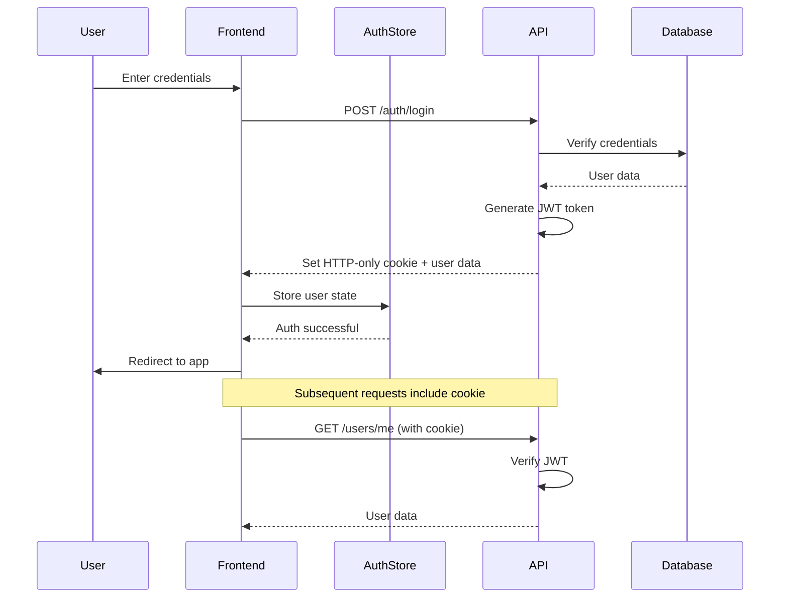
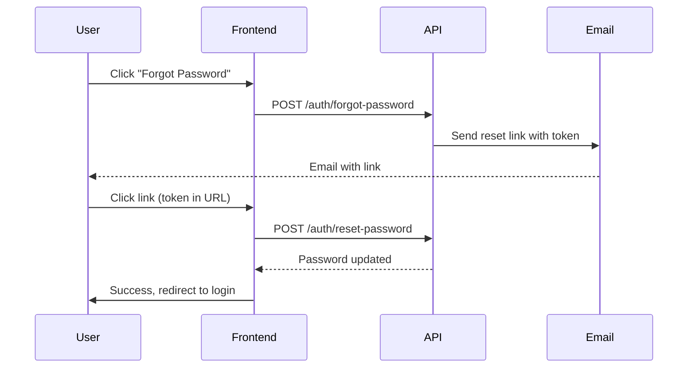

# Authentication & Security

## Overview

BSI Messenger implements JWT-based authentication with HTTP-only cookies for secure session management. The authentication flow integrates with the backend API and manages user sessions across desktop and mobile platforms.

## Authentication Flow



## Authentication Service

**File:** `src/renderer/src/services/auth.service.ts`

```typescript
import { api } from './api.service'
import { useAuthStore } from '../stores/auth.store'

export interface LoginRequest {
  email: string
  password: string
}

export interface RegisterRequest {
  email: string
  password: string
  displayName: string
}

export const authService = {
  async login(credentials: LoginRequest) {
    const response = await api.post('/auth/login', credentials)
    const { user } = response.data
    
    // Store user in Zustand
    useAuthStore.getState().setUser(user)
    
    return user
  },

  async register(data: RegisterRequest) {
    const response = await api.post('/auth/register', data)
    const { user } = response.data
    
    useAuthStore.getState().setUser(user)
    
    return user
  },

  async logout() {
    try {
      await api.post('/auth/logout')
    } finally {
      useAuthStore.getState().clearUser()
      // Clear all application state
      localStorage.clear()
    }
  },

  async getCurrentUser() {
    try {
      const response = await api.get('/users/me')
      const user = response.data
      
      useAuthStore.getState().setUser(user)
      
      return user
    } catch (error) {
      useAuthStore.getState().clearUser()
      throw error
    }
  }
}
```

## Auth Store

**File:** `src/renderer/src/stores/auth.store.ts`

```typescript
import { create } from 'zustand'
import { persist } from 'zustand/middleware'

interface AuthState {
  user: User | null
  isAuthenticated: boolean
  isLoading: boolean
  setUser: (user: User | null) => void
  clearUser: () => void
  setLoading: (loading: boolean) => void
}

export const useAuthStore = create<AuthState>()(
  persist(
    (set) => ({
      user: null,
      isAuthenticated: false,
      isLoading: true,

      setUser: (user) => set({
        user,
        isAuthenticated: !!user,
        isLoading: false
      }),

      clearUser: () => set({
        user: null,
        isAuthenticated: false,
        isLoading: false
      }),

      setLoading: (loading) => set({ isLoading: loading })
    }),
    {
      name: 'auth-storage',
      partialize: (state) => ({
        user: state.user,
        isAuthenticated: state.isAuthenticated
      })
    }
  )
)
```

## Login Component

```typescript
import { useNavigate } from '@tanstack/react-router'
import { authService } from '../services/auth.service'

export const LoginPage = () => {
  const navigate = useNavigate()
  const [email, setEmail] = useState('')
  const [password, setPassword] = useState('')
  const [error, setError] = useState('')

  const handleLogin = async (e: React.FormEvent) => {
    e.preventDefault()
    setError('')

    try {
      await authService.login({ email, password })
      navigate({ to: '/chat' })
    } catch (err: any) {
      setError(err.response?.data?.message || 'Login failed')
    }
  }

  return (
    <form onSubmit={handleLogin}>
      <input
        type="email"
        value={email}
        onChange={(e) => setEmail(e.target.value)}
        required
      />
      <input
        type="password"
        value={password}
        onChange={(e) => setPassword(e.target.value)}
        required
      />
      {error && <div className="error">{error}</div>}
      <button type="submit">Login</button>
    </form>
  )
}
```

## Route Protection

```typescript
// src/renderer/src/App.tsx
import { useAuthStore } from './stores/auth.store'
import { authService } from './services/auth.service'

export const App = () => {
  const { isAuthenticated, isLoading } = useAuthStore()

  useEffect(() => {
    // Restore session on app load
    authService.getCurrentUser().catch(() => {
      // Session expired or invalid
    })
  }, [])

  if (isLoading) {
    return <LoadingScreen />
  }

  return (
    <Router>
      <Route path="/login" component={LoginPage} />
      <Route path="/register" component={RegisterPage} />
      
      {/* Protected routes */}
      <Route path="/chat" component={ChatPage} beforeLoad={requireAuth} />
      <Route path="/settings" component={SettingsPage} beforeLoad={requireAuth} />
    </Router>
  )
}

const requireAuth = () => {
  const { isAuthenticated } = useAuthStore.getState()
  
  if (!isAuthenticated) {
    throw redirect({ to: '/login' })
  }
}
```

## API Interceptor

**Automatic token handling and error responses:**

```typescript
// src/renderer/src/services/api.service.ts
import axios from 'axios'
import { useAuthStore } from '../stores/auth.store'

export const api = axios.create({
  baseURL: API_URL,
  withCredentials: true, // Include cookies
  headers: {
    'Content-Type': 'application/json'
  }
})

// Response interceptor for auth errors
api.interceptors.response.use(
  (response) => response,
  (error) => {
    if (error.response?.status === 401) {
      // Token expired or invalid
      useAuthStore.getState().clearUser()
      window.location.href = '/login'
    }
    return Promise.reject(error)
  }
)
```

## Security Best Practices

### 1. HTTP-Only Cookies

**Backend sets secure cookie:**
```typescript
// Backend reference
res.cookie('token', jwtToken, {
  httpOnly: true,  // Cannot be accessed by JavaScript
  secure: true,    // HTTPS only
  sameSite: 'strict',
  maxAge: 7 * 24 * 60 * 60 * 1000 // 7 days
})
```

### 2. HTTPS Enforcement

```typescript
// Ensure all API calls use HTTPS in production
const API_URL = import.meta.env.PROD
  ? 'https://chat.bsilongevity.com:4443/api'
  : 'http://localhost:4443/api'
```

### 3. Input Validation

```typescript
const validateEmail = (email: string): boolean => {
  const emailRegex = /^[^\s@]+@[^\s@]+\.[^\s@]+$/
  return emailRegex.test(email)
}

const validatePassword = (password: string): string | null => {
  if (password.length < 8) {
    return 'Password must be at least 8 characters'
  }
  if (!/[A-Z]/.test(password)) {
    return 'Password must contain uppercase letter'
  }
  if (!/[0-9]/.test(password)) {
    return 'Password must contain number'
  }
  return null
}
```

### 4. XSS Protection

```typescript
// Always sanitize user input before rendering
import DOMPurify from 'dompurify'

const SafeHTML = ({ content }: { content: string }) => {
  const sanitized = DOMPurify.sanitize(content)
  return <div dangerouslySetInnerHTML={{ __html: sanitized }} />
}
```

### 5. CSRF Protection

- Using `sameSite: 'strict'` cookie attribute
- Backend validates Origin headers
- State verification for OAuth flows

## Session Management

### Auto-refresh Session

```typescript
// Check session validity periodically
useEffect(() => {
  const interval = setInterval(async () => {
    try {
      await authService.getCurrentUser()
    } catch {
      // Session expired
      authService.logout()
    }
  }, 5 * 60 * 1000) // Every 5 minutes

  return () => clearInterval(interval)
}, [])
```

### Logout on Window Close (Desktop)

```typescript
// src/main/index.ts (Electron)
app.on('before-quit', async () => {
  // Optional: notify backend
  await fetch(`${API_URL}/auth/logout`, {
    method: 'POST',
    credentials: 'include'
  })
})
```

## Multi-Device Sessions

**Backend tracks active sessions:**
```sql
-- sessions table (backend reference)
CREATE TABLE sessions (
  id UUID PRIMARY KEY,
  user_id UUID REFERENCES users(id),
  device_name VARCHAR(255),
  device_type VARCHAR(50),
  last_active TIMESTAMP,
  created_at TIMESTAMP DEFAULT NOW()
)
```

**User can view/revoke sessions:**
```typescript
const SessionsList = () => {
  const { data: sessions } = useQuery({
    queryKey: ['sessions'],
    queryFn: () => api.get('/auth/sessions').then(r => r.data)
  })

  const revoke = async (sessionId: string) => {
    await api.delete(`/auth/sessions/${sessionId}`)
  }

  return (
    <div>
      {sessions?.map(session => (
        <div key={session.id}>
          <span>{session.deviceName}</span>
          <span>{formatDate(session.lastActive)}</span>
          <button onClick={() => revoke(session.id)}>Revoke</button>
        </div>
      ))}
    </div>
  )
}
```

## Password Reset Flow



## Error Handling

```typescript
const handleAuthError = (error: any) => {
  const message = error.response?.data?.message
  
  switch (error.response?.status) {
    case 400:
      return 'Invalid credentials'
    case 401:
      return 'Authentication failed'
    case 403:
      return 'Access denied'
    case 429:
      return 'Too many attempts. Please try again later'
    default:
      return message || 'An error occurred'
  }
}
```

## Security Checklist

- [x] Passwords hashed with bcrypt (backend)
- [x] JWT tokens stored in HTTP-only cookies
- [x] HTTPS enforced in production
- [x] Input validation on client and server
- [x] XSS protection with DOMPurify
- [x] CSRF protection with SameSite cookies
- [x] Rate limiting on auth endpoints (backend)
- [x] Account lockout after failed attempts (backend)
- [x] Session timeout (7 days)
- [x] Secure password requirements
- [ ] Two-factor authentication (future)
- [ ] OAuth integration (Google, Microsoft)

---

*For backend authentication implementation details, refer to the backend repository documentation.*
