# BSI Messenger Component Documentation

## Overview

BSI Messenger follows a component-based architecture with clear separation of concerns. Components are organized by feature domains and follow consistent patterns for props, state management, and integration with the service layer.

## Component Architecture

```mermaid
graph TD
    App[App.tsx<br/>Main Application Container]
    
    subgraph "Layout Components"
        TopBar[Top Navigation Bar]
        SectionMenu[Section Menu - Hamburger]
        UserInfo[User Info Display]
    end
    
    subgraph "Auth Components"
        LoginPage[LoginPage<br/>Authentication Form]
    end
    
    subgraph "Chat Components"
        Sidebar[Sidebar<br/>Conversation List]
        ChatArea[ChatArea<br/>Message Display & Input]
        ContactInfo[ContactInfoPanel<br/>User/Group Details]
        NewChat[NewChatDialog<br/>Start New Conversation]
        CallOverlay[CallOverlay<br/>Audio/Video Call UI]
        PartnerProfile[PartnerProfileDialog<br/>Contact Details]
    end
    
    subgraph "Admin Components"
        AdminPage[AdminPage<br/>User Management Dashboard]
    end
    
    subgraph "Placeholder Sections"
        InboxSection[InboxSection<br/>Omnichannel Placeholder]
        BroadcastSection[BroadcastSection<br/>WhatsApp Broadcast Placeholder]
        TemplatesSection[TemplatesSection<br/>Message Templates Placeholder]
        AnalyticsSection[AnalyticsSection<br/>Analytics Dashboard Placeholder]
    end
    
    subgraph "Common Components"
        Avatar[Avatar<br/>User Profile Photos]
        AttachImg[AttachmentImage<br/>Media Preview & Display]
        EmptyState[ChannelEmptyState<br/>Generic Empty State]
        CallIcons[CallIcons<br/>Call Control Buttons]
    end
    
    subgraph "Dialog Components"
        NewUserDialog[NewUserDialog<br/>Create User Form]
        SettingsDialog[SettingsDialog<br/>App Settings]
        UserProfileDialog[UserProfileDialog<br/>Edit Own Profile]
        AboutDialog[AboutDialog<br/>App Information]
    end
    
    App --> LoginPage
    App --> TopBar
    App --> SectionMenu
    App --> UserInfo
    
    App --> Sidebar
    App --> ChatArea
    App --> ContactInfo
    App --> AdminPage
    App --> InboxSection
    App --> BroadcastSection
    App --> TemplatesSection
    App --> AnalyticsSection
    
    App --> NewUserDialog
    App --> SettingsDialog
    App --> UserProfileDialog
    App --> AboutDialog
    
    Sidebar --> NewChat
    ChatArea --> CallOverlay
    ChatArea --> AttachImg
    ContactInfo --> PartnerProfile
    ContactInfo --> CallIcons
    
    Sidebar --> Avatar
    ChatArea --> Avatar
    ContactInfo --> Avatar
    AdminPage --> Avatar
    
    InboxSection --> EmptyState
    BroadcastSection --> EmptyState
    TemplatesSection --> EmptyState
    AnalyticsSection --> EmptyState
    
    style App fill:#e53e3e,stroke:#c53030,color:#fff
    style LoginPage fill:#4299e1,stroke:#3182ce,color:#fff
    style Sidebar fill:#48bb78,stroke:#38a169,color:#fff
    style ChatArea fill:#48bb78,stroke:#38a169,color:#fff
    style AdminPage fill:#ed8936,stroke:#dd6b20,color:#fff
    style EmptyState fill:#edf2f7,stroke:#cbd5e0,color:#2d3748
    style Avatar fill:#805ad5,stroke:#6b46c1,color:#fff
```



---

## Main Application Components

### App.tsx

**Purpose:** Main application container that handles routing, section management, and global UI state.

**Props:** None (root component)

**Key State:**
```typescript
const [showNewUser, setShowNewUser] = useState(false)
const [showSettings, setShowSettings] = useState(false)
const [showProfile, setShowProfile] = useState(false)
const [showAbout, setShowAbout] = useState(false)
const [activeSection, setActiveSection] = useState<Section>('chats')
const [mobileView, setMobileView] = useState<'list' | 'chat'>('list')
const [menuOpen, setMenuOpen] = useState(false)
const [showPanel, setShowPanel] = useState(true)
const [isNarrow, setIsNarrow] = useState(() => window.innerWidth < 1100)
```

**Key Features:**
- **Section Navigation:** Manages active section (chats, inbox, broadcast, templates, analytics)
- **Responsive Layout:** Handles mobile/desktop view switching
- **Modal Management:** Controls visibility of dialogs and overlays
- **IPC Integration:** Listens to Electron menu events
- **Auto-hide Panel:** Automatically hides contact info panel on narrow screens (<1100px)

**Dependencies:**
- `useAuthStore()` - User authentication state
- `useNavigate()` - TanStack Router navigation
- Electron IPC events (`onNewUser`, `onSettings`, etc.)

**Usage Example:**
```typescript
// App.tsx is the root component, used in main.tsx
<RouterProvider router={router} />

// Routes defined in router.tsx:
const chatRoute = createRoute({
  path: '/',
  component: App
})
```

**Event Handlers:**
- `handleLogout()` - Clears auth state and navigates to login
- Window resize listener for responsive panel management
- Click outside handler for menu dropdown
- IPC event cleanup on unmount

---

## Authentication Components

### LoginPage

**Purpose:** Handles user authentication with username/password form.

**Props:** None

**Key State:**
```typescript
const [username, setUsername] = useState('')
const [password, setPassword] = useState('')
const [isLoading, setIsLoading] = useState(false)
```

**Dependencies:**
- `useAuthStore()` - Login action and error state
- `useNavigate()` - Redirect after successful login

**Features:**
- **Form Validation:** Required field validation
- **Loading States:** Shows spinner during login request
- **Error Display:** Shows authentication errors
- **Auto-redirect:** Navigates to main app after successful login

**Usage Example:**
```typescript
// Protected by router guard
const loginRoute = createRoute({
  path: '/login',
  component: LoginPage
})
```

**Form Structure:**
```typescript
<form onSubmit={handleSubmit}>
  <input 
    type="text" 
    value={username}
    onChange={(e) => setUsername(e.target.value)}
    placeholder="Username"
    required
  />
  <input 
    type="password"
    value={password} 
    onChange={(e) => setPassword(e.target.value)}
    placeholder="Password"
    required
  />
  <button type="submit" disabled={isLoading}>
    {isLoading ? 'Signing in...' : 'Sign In'}
  </button>
</form>
```

---

## Chat Components

### Sidebar

**Purpose:** Displays conversation list with search and new chat functionality.

**Props:**
```typescript
interface SidebarProps {
  onOpenSettings: () => void
  mobileHidden: boolean
  onSelectConversation: () => void
}
```

**Key State:**
```typescript
const [searchQuery, setSearchQuery] = useState('')
const [showNewChat, setShowNewChat] = useState(false)
```

**Dependencies:**
- `useChatStore()` - Conversations list and loading states
- `useAuthStore()` - Current user information

**Features:**
- **Conversation List:** Displays all conversations with last message preview
- **Search Functionality:** Real-time filtering of conversations
- **New Chat Button:** Opens dialog to start new conversation
- **Avatar Display:** Shows user/group avatars with status indicators
- **Mobile Responsive:** Can be hidden on mobile when chat is active

**Usage Example:**
```typescript
<Sidebar
  onOpenSettings={() => setShowSettings(true)}
  mobileHidden={mobileView === 'chat'}
  onSelectConversation={() => setMobileView('chat')}
/>
```

**Key Methods:**
- `handleSearch(query)` - Filters conversation list
- `handleSelectConversation(convId)` - Loads conversation and switches view
- `handleNewChat()` - Opens new chat dialog

### ChatArea

**Purpose:** Main message display and input area for active conversation.

**Props:**
```typescript
interface ChatAreaProps {
  onOpenPanel: () => void
  panelOpen: boolean
  mobileHidden: boolean
  onBackToList: () => void
}
```

**Key State:**
```typescript
const [message, setMessage] = useState('')
const [replyTo, setReplyTo] = useState<Message | null>(null)
const [showImageUpload, setShowImageUpload] = useState(false)
```

**Dependencies:**
- `useChatStore()` - Active conversation, messages, send methods
- `useAuthStore()` - Current user for message ownership

**Features:**
- **Virtualized Message List:** Efficient rendering using react-virtuoso
- **Message Input:** Text input with file upload support
- **Reply Functionality:** Thread messages with reply context
- **Image Preview:** Inline image display with lazy loading
- **Typing Indicators:** Shows when other users are typing
- **Optimistic Updates:** Messages appear instantly before server confirmation

**Usage Example:**
```typescript
<ChatArea
  onOpenPanel={() => setShowPanel(true)}
  panelOpen={showPanel || isNarrow}
  mobileHidden={mobileView === 'list'}
  onBackToList={() => setMobileView('list')}
/>
```

**Message Rendering:**
```typescript
const renderMessage = (message: Message) => (
  <div className={`message ${message.senderId === user?.id ? 'own' : 'other'}`}>
    <Avatar userId={message.senderId} size="sm" />
    <div className="message-content">
      {message.replyToId && <ReplyContext messageId={message.replyToId} />}
      <div className="message-body">{message.body}</div>
      {message.attachments?.map(att => 
        <AttachmentImage key={att.id} attachment={att} />
      )}
    </div>
  </div>
)
```

### ContactInfoPanel

**Purpose:** Displays detailed information about conversation participants and call controls.

**Props:**
```typescript
interface ContactInfoPanelProps {
  onClose: () => void
}
```

**Key State:**
```typescript
const [showPartnerProfile, setShowPartnerProfile] = useState(false)
```

**Dependencies:**
- `useChatStore()` - Active conversation and member data
- `useCallStore()` - Call initiation methods

**Features:**
- **User Details:** Shows contact information for DM conversations
- **Group Members:** Lists all group participants with roles
- **Call Buttons:** Audio/Video call initiation
- **Partner Profile:** Opens detailed profile dialog
- **Member Management:** Group admin functions (future)

**Usage Example:**
```typescript
{showPanel && !isNarrow && 
  <ContactInfoPanel onClose={() => setShowPanel(false)} />
}
```

### CallOverlay

**Purpose:** Full-screen audio/video call interface.

**Props:** None (uses call store state)

**Key State:**
```typescript
// State managed by useCallStore()
const {
  phase, peer, localStream, remoteStream,
  micOn, camOn, error, reconnecting
} = useCallStore()
```

**Dependencies:**
- `useCallStore()` - Complete call state management
- `useRef()` - Video element references

**Features:**
- **Video Streams:** Local and remote video display
- **Audio Controls:** Mic mute/unmute toggle
- **Video Controls:** Camera on/off toggle
- **Call States:** Different UI for calling, ringing, active, ended phases
- **Error Handling:** Network reconnection and media device errors
- **Full Screen:** Overlay design that covers entire application

**Usage Example:**
```typescript
// Rendered conditionally based on call phase
{phase !== 'idle' && <CallOverlay />}
```

**Video Element Management:**
```typescript
const localVideoRef = useRef<HTMLVideoElement>(null)
const remoteVideoRef = useRef<HTMLVideoElement>(null)

useEffect(() => {
  if (localVideoRef.current && localStream) {
    localVideoRef.current.srcObject = localStream
  }
}, [localStream])

useEffect(() => {
  if (remoteVideoRef.current && remoteStream) {
    remoteVideoRef.current.srcObject = remoteStream
  }
}, [remoteStream])
```

---

## Dialog Components

### NewChatDialog

**Purpose:** Modal for creating new direct messages or group chats.

**Props:**
```typescript
interface NewChatDialogProps {
  open: boolean
  onClose: () => void
}
```

**Key State:**
```typescript
const [searchUsers, setSearchUsers] = useState('')
const [selectedUsers, setSelectedUsers] = useState<User[]>([])
const [chatType, setChatType] = useState<'dm' | 'group'>('dm')
const [groupTitle, setGroupTitle] = useState('')
```

**Dependencies:**
- `directoryApi.list()` - User search functionality
- `conversationsApi.createDm()` / `conversationsApi.createGroup()` - Create conversation

**Features:**
- **User Search:** Real-time search of organization users
- **Chat Type Selection:** Toggle between DM and group chat
- **Multi-select:** Choose multiple users for group chats
- **Group Naming:** Title input for group conversations
- **Validation:** Ensures required fields are filled

**Usage Example:**
```typescript
<NewChatDialog 
  open={showNewChat} 
  onClose={() => setShowNewChat(false)} 
/>
```

### SettingsDialog

**Purpose:** Application settings and preferences management.

**Props:**
```typescript
interface SettingsDialogProps {
  onClose: () => void
}
```

**Key State:**
```typescript
const [notificationsEnabled, setNotificationsEnabled] = useState(true)
const [soundEnabled, setSoundEnabled] = useState(true)
const [downloadDir, setDownloadDir] = useState('')
const [openAtLogin, setOpenAtLogin] = useState(false)
```

**Dependencies:**
- Electron IPC for desktop-specific settings
- localStorage for notification preferences
- Backend API for server information display

**Features:**
- **Notification Settings:** Toggle notifications and sounds
- **Download Directory:** Choose file download location (desktop only)
- **Auto-start:** Open at login setting (desktop only)
- **Server Info:** Display backend server URL (read-only)
- **Platform Detection:** Shows relevant options per platform

### UserProfileDialog

**Purpose:** Edit current user's profile information.

**Props:**
```typescript
interface UserProfileDialogProps {
  onClose: () => void
}
```

**Key State:**
```typescript
const [displayName, setDisplayName] = useState('')
const [status, setStatus] = useState<UserStatus>('AVAILABLE')
const [firstName, setFirstName] = useState('')
const [lastName, setLastName] = useState('')
// ... other profile fields
```

**Dependencies:**
- `useAuthStore()` - Current user data
- `usersApi.updateMe()` - Update profile
- `usersApi.uploadAvatar()` - Avatar upload

**Features:**
- **Profile Fields:** Edit all user information
- **Avatar Upload:** Change profile photo
- **Status Selection:** Set availability status
- **Form Validation:** Required field validation
- **Real-time Updates:** Changes reflect immediately in UI

---

## Admin Components

### AdminPage

**Purpose:** Complete admin dashboard for user management and system statistics.

**Props:** None

**Key State:**
```typescript
const [users, setUsers] = useState<AdminUser[]>([])
const [stats, setStats] = useState<Stats>({})
const [currentPage, setCurrentPage] = useState(1)
const [searchQuery, setSearchQuery] = useState('')
const [loading, setLoading] = useState(false)
const [selectedUser, setSelectedUser] = useState<AdminUser | null>(null)
const [contextMenuUser, setContextMenuUser] = useState<AdminUser | null>(null)
const [showCreateUser, setShowCreateUser] = useState(false)
const [showEditUser, setShowEditUser] = useState(false)
```

**Dependencies:**
- `adminApi.listUsers()` - Paginated user list
- `adminApi.stats()` - System statistics
- `adminApi.*` - All user management operations
- `useAuthStore()` - Admin permission checking

**Features:**
- **User Table:** Paginated list with search functionality
- **Statistics Dashboard:** System metrics and counts
- **Context Menu:** Right-click actions for user management
- **Create User:** Form to add new users
- **Edit User:** Modify existing user details
- **Role Management:** Set admin privileges
- **User Actions:** Activate, deactivate, delete, reset password

**Usage Example:**
```typescript
// Protected by route guard and component-level permission check
const adminRoute = createRoute({
  path: '/admin',
  component: AdminPage
})
```

**Table Structure:**
```typescript
const renderUserRow = (user: AdminUser) => (
  <tr key={user.id} onContextMenu={(e) => handleContextMenu(e, user)}>
    <td><Avatar userId={user.id} size="sm" /></td>
    <td>{user.displayName}</td>
    <td>{user.username}</td>
    <td>{user.email}</td>
    <td>
      <span className={`status ${user.status.toLowerCase()}`}>
        {user.status}
      </span>
    </td>
    <td>{user.accountType}</td>
    <td>
      <span className={`badge ${user.isActive ? 'active' : 'inactive'}`}>
        {user.isActive ? 'Active' : 'Inactive'}
      </span>
    </td>
    <td>{user._count?.sessions || 0}</td>
    <td>{user._count?.messages || 0}</td>
  </tr>
)
```

---

## Common Components

### Avatar

**Purpose:** Displays user profile photos with fallback to initials.

**Props:**
```typescript
interface AvatarProps {
  userId: string
  size?: 'xs' | 'sm' | 'md' | 'lg' | 'xl'
  showStatus?: boolean
  className?: string
}
```

**Key State:**
```typescript
const [avatarUrl, setAvatarUrl] = useState<string | null>(null)
const [loading, setLoading] = useState(true)
const [error, setError] = useState(false)
```

**Dependencies:**
- `attachmentsApi.getAvatar()` - Fetch avatar image
- User data from various stores/props

**Features:**
- **Dynamic Loading:** Fetches avatar from backend
- **Fallback Rendering:** Shows initials when no avatar available
- **Status Indicator:** Optional online/offline dot
- **Size Variants:** Multiple size presets
- **Error Handling:** Graceful fallback on load failure
- **Blob Cleanup:** Proper URL revocation to prevent memory leaks

**Usage Example:**
```typescript
<Avatar 
  userId="user_123" 
  size="md" 
  showStatus={true}
  className="ring-2 ring-blue-500" 
/>
```

**Fallback Logic:**
```typescript
const getInitials = (displayName: string) => {
  return displayName
    .split(' ')
    .map(part => part[0])
    .join('')
    .toUpperCase()
    .slice(0, 2)
}

const getStatusColor = (status: UserStatus) => {
  switch (status) {
    case 'AVAILABLE': return 'bg-green-500'
    case 'AWAY': return 'bg-yellow-500'  
    case 'DND': return 'bg-red-500'
    case 'OFFLINE': return 'bg-gray-400'
  }
}
```

### AttachmentImage

**Purpose:** Displays image attachments with lazy loading and blob caching.

**Props:**
```typescript
interface AttachmentImageProps {
  attachment: Attachment & { _localUrl?: string }
  className?: string
  onClick?: () => void
}
```

**Key State:**
```typescript
const [imageUrl, setImageUrl] = useState<string | null>(null)
const [loading, setLoading] = useState(true)
const [error, setError] = useState(false)
```

**Dependencies:**
- `attachmentsApi.getFile()` - Download image data
- Global blob cache for performance

**Features:**
- **Lazy Loading:** Only loads when visible
- **Blob Caching:** Prevents duplicate downloads
- **Local Preview:** Shows optimistic uploads via blob URL
- **Error States:** Handles load failures gracefully
- **Click Handler:** Opens full-screen view
- **Memory Management:** Cleans up blob URLs

**Usage Example:**
```typescript
<AttachmentImage
  attachment={messageAttachment}
  className="max-w-xs rounded-lg"
  onClick={() => setShowFullScreen(true)}
/>
```

**Caching Strategy:**
```typescript
// Global cache to prevent duplicate downloads
const blobCache = new Map<string, string>()

const loadImage = async (attachmentId: string) => {
  if (blobCache.has(attachmentId)) {
    return blobCache.get(attachmentId)!
  }
  
  const blobUrl = await attachmentsApi.getFile(attachmentId)
  blobCache.set(attachmentId, blobUrl)
  return blobUrl
}
```

### ChannelEmptyState

**Purpose:** Generic empty state component for placeholder sections.

**Props:**
```typescript
interface ChannelEmptyStateProps {
  icon: React.ReactNode
  title: string
  description: string
  ctaLabel: string
  onCta: () => void
  ctaDisabled?: boolean
}
```

**Dependencies:** None (pure presentational component)

**Features:**
- **Consistent Design:** Standardized empty state layout
- **Customizable Content:** Icon, title, description via props
- **Call-to-Action:** Button with disable state
- **Responsive:** Adapts to container size

**Usage Example:**
```typescript
<ChannelEmptyState
  icon={<InboxIcon />}
  title="Inbox omnichannel"
  description="WhatsApp, Instagram, and webchat conversations will appear here."
  ctaLabel="Connect WhatsApp Business"
  onCta={() => {}}
  ctaDisabled={true}
/>
```

### CallIcons

**Purpose:** Call control buttons (audio/video) for contact panels.

**Props:**
```typescript
interface CallIconsProps {
  conversationId: string
  peer: CallPeer
  size?: 'sm' | 'md' | 'lg'
}
```

**Dependencies:**
- `useCallStore()` - Call initiation methods

**Features:**
- **Audio/Video Buttons:** Start different call types
- **Loading States:** Shows spinner during call setup
- **Disabled States:** Prevents multiple simultaneous calls
- **Size Variants:** Different button sizes

**Usage Example:**
```typescript
<CallIcons
  conversationId={activeConversationId}
  peer={{ id: partnerId, displayName: partnerName }}
  size="md"
/>
```

---

## Placeholder Section Components

### InboxSection / BroadcastSection / TemplatesSection / AnalyticsSection

**Purpose:** Placeholder components for future omnichannel features.

**Props:** None

**Dependencies:**
- `ChannelEmptyState` component

**Features:**
- **Consistent Messaging:** Explains what the section will contain
- **Future-ready:** Prepared structure for feature implementation
- **Visual Design:** Icons and descriptions appropriate to each section

**Current Implementation:**
All four sections currently render `ChannelEmptyState` with section-specific content:

```typescript
export default function InboxSection() {
  return (
    <ChannelEmptyState
      icon={<InboxIcon />}
      title="Inbox omnichannel"
      description="WhatsApp, Instagram, and webchat conversations will appear here. Connect a WhatsApp Business account to start receiving messages."
      ctaLabel="Connect WhatsApp Business"
      onCta={() => {}}
      ctaDisabled={true}
    />
  )
}
```

---

## Component Patterns & Best Practices

### Props Interface Design

**Consistent Naming:**
- Event handlers: `onActionName`
- Boolean props: `showSomething`, `isEnabled`
- State props: `activeItem`, `selectedUser`

**Example:**
```typescript
interface ComponentProps {
  // Data props
  user: User
  conversation: Conversation
  
  // Event handlers  
  onSelect: (id: string) => void
  onClose: () => void
  onSubmit: (data: FormData) => void
  
  // Boolean flags
  isLoading: boolean
  showDetails: boolean
  
  // Optional styling
  className?: string
  size?: 'sm' | 'md' | 'lg'
}
```

### State Management Integration

**Store Subscriptions:**
```typescript
const Component = () => {
  // Destructure only needed state
  const { user, isAuthenticated } = useAuthStore()
  const { conversations, activeId, loadConversations } = useChatStore()
  
  // Local state for component-specific UI
  const [loading, setLoading] = useState(false)
  const [error, setError] = useState<string | null>(null)
}
```

**Store Actions:**
```typescript
const handleAction = async () => {
  try {
    setLoading(true)
    await chatStore.sendMessage(message)
  } catch (err) {
    setError(err.message)
  } finally {
    setLoading(false)
  }
}
```

### Error Boundaries

**Component-Level Error Handling:**
```typescript
const [error, setError] = useState<string | null>(null)

const handleAsyncAction = async () => {
  try {
    await someAsyncOperation()
  } catch (err) {
    setError(err instanceof Error ? err.message : 'An error occurred')
    console.error('Component error:', err)
  }
}

if (error) {
  return (
    <div className="error-state">
      <p>Something went wrong: {error}</p>
      <button onClick={() => setError(null)}>Try Again</button>
    </div>
  )
}
```

### Performance Optimizations

**React.memo for Expensive Components:**
```typescript
const ExpensiveComponent = React.memo(({ data, onAction }) => {
  // Expensive rendering logic
}, (prevProps, nextProps) => {
  // Custom comparison logic
  return prevProps.data.id === nextProps.data.id
})
```

**useMemo for Computed Values:**
```typescript
const filteredItems = useMemo(() => {
  return items.filter(item => 
    item.title.toLowerCase().includes(searchQuery.toLowerCase())
  )
}, [items, searchQuery])
```

**useCallback for Event Handlers:**
```typescript
const handleClick = useCallback((id: string) => {
  onItemSelect(id)
}, [onItemSelect])
```

### Responsive Design Patterns

**Mobile-First Breakpoints:**
```typescript
const [isMobile, setIsMobile] = useState(false)

useEffect(() => {
  const checkMobile = () => setIsMobile(window.innerWidth < 768)
  checkMobile()
  
  window.addEventListener('resize', checkMobile)
  return () => window.removeEventListener('resize', checkMobile)
}, [])

// Conditional rendering
{isMobile ? <MobileLayout /> : <DesktopLayout />}
```

**CSS Classes:**
```css
/* Mobile-first approach */
.component {
  @apply flex-col; /* Default mobile layout */
}

@media (min-width: 768px) {
  .component {
    @apply flex-row; /* Desktop layout */
  }
}
```

---

*This component documentation provides a complete reference for all React components in BSI Messenger. Each component follows consistent patterns for props, state management, and integration with the application architecture.*