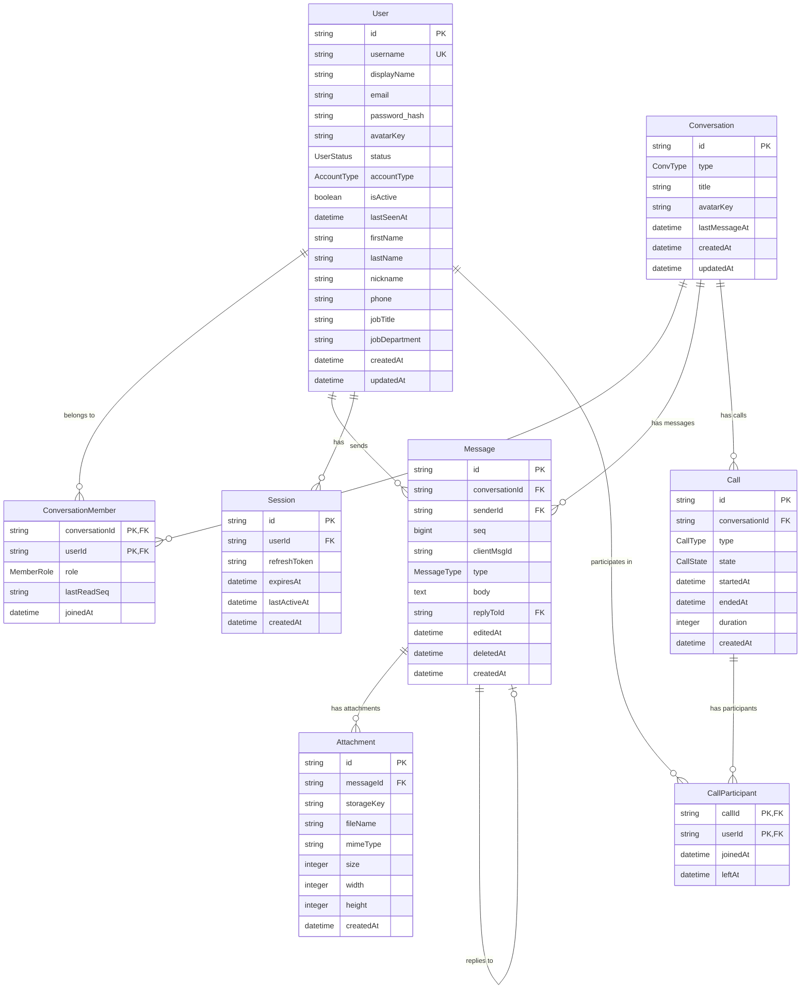

# BSI Messenger Database Schema Documentation

## Overview

BSI Messenger uses PostgreSQL as its primary database with a normalized relational schema optimized for real-time messaging. The database supports user management, conversations, messages with attachments, audio/video calls, and session tracking.

## Database Information

- **Database Engine:** PostgreSQL 16.14
- **Character Set:** UTF8
- **Collation:** Standard conforming strings
- **Owner:** bsichat_owner

## Entity Relationship Diagram



---

## Table Definitions

### User

**Purpose:** Stores user account information and profile data.

```sql
CREATE TABLE "User" (
    id TEXT PRIMARY KEY,
    username TEXT UNIQUE NOT NULL,
    displayName TEXT NOT NULL,
    email TEXT,
    password TEXT NOT NULL, -- bcrypt hashed
    avatarKey TEXT,
    status "UserStatus" DEFAULT 'OFFLINE',
    "accountType" "AccountType" DEFAULT 'USER',
    "isActive" BOOLEAN DEFAULT true,
    "lastSeenAt" TIMESTAMP(3),
    "firstName" TEXT,
    "lastName" TEXT,
    nickname TEXT,
    phone TEXT,
    "jobTitle" TEXT,
    "jobDepartment" TEXT,
    "createdAt" TIMESTAMP(3) DEFAULT CURRENT_TIMESTAMP,
    "updatedAt" TIMESTAMP(3) DEFAULT CURRENT_TIMESTAMP
);
```

**Indexes:**
```sql
CREATE UNIQUE INDEX "User_username_key" ON "User"(username);
CREATE INDEX "User_email_idx" ON "User"(email);
CREATE INDEX "User_accountType_idx" ON "User"("accountType");
CREATE INDEX "User_isActive_idx" ON "User"("isActive");
CREATE INDEX "User_lastSeenAt_idx" ON "User"("lastSeenAt");
```

**Constraints:**
- `username` must be unique and not null
- `displayName` must not be null
- `password` must not be null (stored as bcrypt hash)
- `isActive` defaults to true for new accounts

**Business Rules:**
- Username must be unique across the system
- Email can be null (not required for all account types)
- Password is hashed using bcrypt before storage
- `lastSeenAt` is updated on each API request
- Avatar stored as MinIO storage key reference
### Conversation

**Purpose:** Stores conversation metadata for both direct messages and group chats.

```sql
CREATE TABLE "Conversation" (
    id TEXT PRIMARY KEY,
    type "ConvType" NOT NULL,
    title TEXT,
    avatarKey TEXT,
    "lastMessageAt" TIMESTAMP(3),
    "createdAt" TIMESTAMP(3) DEFAULT CURRENT_TIMESTAMP,
    "updatedAt" TIMESTAMP(3) DEFAULT CURRENT_TIMESTAMP
);
```

**Indexes:**
```sql
CREATE INDEX "Conversation_type_idx" ON "Conversation"(type);
CREATE INDEX "Conversation_lastMessageAt_idx" ON "Conversation"("lastMessageAt");
CREATE INDEX "Conversation_createdAt_idx" ON "Conversation"("createdAt");
```

**Business Rules:**
- `title` is null for DIRECT conversations (derived from participants)
- `title` is required for GROUP conversations
- `lastMessageAt` is updated when new messages are sent
- `avatarKey` references MinIO storage for group avatars

### ConversationMember

**Purpose:** Links users to conversations with their roles and read state.

```sql
CREATE TABLE "ConversationMember" (
    "conversationId" TEXT NOT NULL,
    "userId" TEXT NOT NULL,
    role "MemberRole" DEFAULT 'MEMBER',
    "lastReadSeq" TEXT,
    "joinedAt" TIMESTAMP(3) DEFAULT CURRENT_TIMESTAMP,
    
    CONSTRAINT "ConversationMember_pkey" PRIMARY KEY ("conversationId", "userId"),
    CONSTRAINT "ConversationMember_conversationId_fkey" 
        FOREIGN KEY ("conversationId") REFERENCES "Conversation"(id) ON DELETE CASCADE,
    CONSTRAINT "ConversationMember_userId_fkey" 
        FOREIGN KEY ("userId") REFERENCES "User"(id) ON DELETE CASCADE
);
```

**Indexes:**
```sql
CREATE INDEX "ConversationMember_userId_idx" ON "ConversationMember"("userId");
CREATE INDEX "ConversationMember_conversationId_idx" ON "ConversationMember"("conversationId");
CREATE INDEX "ConversationMember_role_idx" ON "ConversationMember"(role);
```

**Business Rules:**
- Composite primary key ensures one membership record per user per conversation
- `lastReadSeq` tracks the last message sequence number the user has read
- DIRECT conversations have exactly 2 members, both with MEMBER role
- GROUP conversations can have multiple members with different roles
- OWNER role can only be held by one member per group
- CASCADE DELETE removes memberships when conversation or user is deleted

### Message

**Purpose:** Stores all messages within conversations with threading support.

```sql
CREATE TABLE "Message" (
    id TEXT PRIMARY KEY,
    "conversationId" TEXT NOT NULL,
    "senderId" TEXT NOT NULL,
    seq BIGINT NOT NULL,
    "clientMsgId" TEXT,
    type "MessageType" DEFAULT 'TEXT',
    body TEXT,
    "replyToId" TEXT,
    "editedAt" TIMESTAMP(3),
    "deletedAt" TIMESTAMP(3),
    "createdAt" TIMESTAMP(3) DEFAULT CURRENT_TIMESTAMP,
    
    CONSTRAINT "Message_conversationId_fkey" 
        FOREIGN KEY ("conversationId") REFERENCES "Conversation"(id) ON DELETE CASCADE,
    CONSTRAINT "Message_senderId_fkey" 
        FOREIGN KEY ("senderId") REFERENCES "User"(id) ON DELETE CASCADE,
    CONSTRAINT "Message_replyToId_fkey" 
        FOREIGN KEY ("replyToId") REFERENCES "Message"(id) ON DELETE SET NULL,
    CONSTRAINT "Message_conversationId_seq_key" 
        UNIQUE ("conversationId", seq)
);
```

**Indexes:**
```sql
CREATE UNIQUE INDEX "Message_conversationId_seq_key" ON "Message"("conversationId", seq);
CREATE INDEX "Message_senderId_idx" ON "Message"("senderId");
CREATE INDEX "Message_createdAt_idx" ON "Message"("createdAt");
CREATE INDEX "Message_replyToId_idx" ON "Message"("replyToId");
CREATE INDEX "Message_clientMsgId_idx" ON "Message"("clientMsgId");
CREATE INDEX "Message_type_idx" ON "Message"(type);
```

**Business Rules:**
- `seq` is auto-incrementing per conversation for message ordering
- Unique constraint on (`conversationId`, `seq`) ensures proper ordering
- `clientMsgId` is used for optimistic updates from frontend
- `replyToId` creates message threading (can be null)
- Soft delete via `deletedAt` timestamp (messages not physically deleted)
- `editedAt` tracks when message content was last modified
- `body` can be null for non-text message types (IMAGE, FILE, etc.)

### Attachment

**Purpose:** Stores file attachment metadata linked to messages.

```sql
CREATE TABLE "Attachment" (
    id TEXT PRIMARY KEY,
    "messageId" TEXT NOT NULL,
    "storageKey" TEXT NOT NULL,
    "fileName" TEXT NOT NULL,
    "mimeType" TEXT NOT NULL,
    size INTEGER NOT NULL,
    width INTEGER,
    height INTEGER,
    "createdAt" TIMESTAMP(3) DEFAULT CURRENT_TIMESTAMP,
    
    CONSTRAINT "Attachment_messageId_fkey" 
        FOREIGN KEY ("messageId") REFERENCES "Message"(id) ON DELETE CASCADE
);
```

**Indexes:**
```sql
CREATE INDEX "Attachment_messageId_idx" ON "Attachment"("messageId");
CREATE INDEX "Attachment_storageKey_idx" ON "Attachment"("storageKey");
CREATE INDEX "Attachment_mimeType_idx" ON "Attachment"("mimeType");
```

**Business Rules:**
- `storageKey` references file in MinIO object storage
- `width` and `height` are populated for image attachments
- `size` is in bytes
- CASCADE DELETE removes attachments when parent message is deleted
- `fileName` preserves original uploaded filename
- `mimeType` used for proper content handling
### Session

**Purpose:** Tracks user refresh tokens for authentication management.

```sql
CREATE TABLE "Session" (
    id TEXT PRIMARY KEY,
    "userId" TEXT NOT NULL,
    "refreshToken" TEXT NOT NULL,
    "expiresAt" TIMESTAMP(3) NOT NULL,
    "lastActiveAt" TIMESTAMP(3) DEFAULT CURRENT_TIMESTAMP,
    "createdAt" TIMESTAMP(3) DEFAULT CURRENT_TIMESTAMP,
    
    CONSTRAINT "Session_userId_fkey" 
        FOREIGN KEY ("userId") REFERENCES "User"(id) ON DELETE CASCADE
);
```

**Indexes:**
```sql
CREATE INDEX "Session_userId_idx" ON "Session"("userId");
CREATE INDEX "Session_refreshToken_idx" ON "Session"("refreshToken");
CREATE INDEX "Session_expiresAt_idx" ON "Session"("expiresAt");
CREATE INDEX "Session_lastActiveAt_idx" ON "Session"("lastActiveAt");
```

**Business Rules:**
- Each refresh token corresponds to one session
- Sessions expire based on `expiresAt` timestamp
- `lastActiveAt` is updated on each token refresh
- CASCADE DELETE removes sessions when user is deleted
- Multiple sessions allowed per user (different devices)

### Call

**Purpose:** Stores audio/video call records and metadata.

```sql
CREATE TABLE "Call" (
    id TEXT PRIMARY KEY,
    "conversationId" TEXT NOT NULL,
    type "CallType" NOT NULL,
    state "CallState" DEFAULT 'RINGING',
    "startedAt" TIMESTAMP(3) DEFAULT CURRENT_TIMESTAMP,
    "endedAt" TIMESTAMP(3),
    duration INTEGER, -- in seconds
    "createdAt" TIMESTAMP(3) DEFAULT CURRENT_TIMESTAMP,
    
    CONSTRAINT "Call_conversationId_fkey" 
        FOREIGN KEY ("conversationId") REFERENCES "Conversation"(id) ON DELETE CASCADE
);
```

**Indexes:**
```sql
CREATE INDEX "Call_conversationId_idx" ON "Call"("conversationId");
CREATE INDEX "Call_state_idx" ON "Call"(state);
CREATE INDEX "Call_startedAt_idx" ON "Call"("startedAt");
CREATE INDEX "Call_type_idx" ON "Call"(type);
```

**Business Rules:**
- `duration` calculated as `endedAt - startedAt` in seconds
- `endedAt` is null for active calls
- Call state transitions: RINGING → ACTIVE → ENDED
- MISSED state for calls that were never answered
- CASCADE DELETE removes calls when conversation is deleted

### CallParticipant

**Purpose:** Tracks which users participated in calls and when.

```sql
CREATE TABLE "CallParticipant" (
    "callId" TEXT NOT NULL,
    "userId" TEXT NOT NULL,
    "joinedAt" TIMESTAMP(3) DEFAULT CURRENT_TIMESTAMP,
    "leftAt" TIMESTAMP(3),
    
    CONSTRAINT "CallParticipant_pkey" PRIMARY KEY ("callId", "userId"),
    CONSTRAINT "CallParticipant_callId_fkey" 
        FOREIGN KEY ("callId") REFERENCES "Call"(id) ON DELETE CASCADE,
    CONSTRAINT "CallParticipant_userId_fkey" 
        FOREIGN KEY ("userId") REFERENCES "User"(id) ON DELETE CASCADE
);
```

**Indexes:**
```sql
CREATE INDEX "CallParticipant_userId_idx" ON "CallParticipant"("userId");
CREATE INDEX "CallParticipant_callId_idx" ON "CallParticipant"("callId");
```

**Business Rules:**
- Composite primary key prevents duplicate participation records
- `leftAt` is null while participant is still in call
- `joinedAt` timestamp for call duration calculations per participant
- CASCADE DELETE removes participation records when call or user is deleted

---

## Enumeration Types

### UserStatus

```sql
CREATE TYPE public."UserStatus" AS ENUM (
    'AVAILABLE',
    'AWAY', 
    'DND',
    'OFFLINE'
);
```

**Values:**
- `AVAILABLE`: User is online and available
- `AWAY`: User is online but away from keyboard
- `DND`: Do Not Disturb - user is online but doesn't want notifications
- `OFFLINE`: User is not connected

### AccountType

```sql
CREATE TYPE public."AccountType" AS ENUM (
    'USER',
    'ADMIN',
    'AGENT',
    'SUPERVISOR', 
    'MODERATOR'
);
```

**Values:**
- `USER`: Regular user account
- `ADMIN`: Full administrative privileges
- `AGENT`: Customer service agent (future omnichannel features)
- `SUPERVISOR`: Manages agents (future omnichannel features) 
- `MODERATOR`: Can moderate conversations and manage users

### ConvType

```sql
CREATE TYPE public."ConvType" AS ENUM (
    'DIRECT',
    'GROUP'
);
```

**Values:**
- `DIRECT`: One-on-one conversation between two users
- `GROUP`: Multi-user group conversation

### MemberRole

```sql
CREATE TYPE public."MemberRole" AS ENUM (
    'OWNER',
    'ADMIN', 
    'MEMBER'
);
```

**Values:**
- `OWNER`: Created the group, has all permissions
- `ADMIN`: Can manage group settings and members
- `MEMBER`: Regular group participant

### MessageType

```sql
CREATE TYPE public."MessageType" AS ENUM (
    'TEXT',
    'IMAGE',
    'FILE', 
    'AUDIO',
    'SYSTEM',
    'CALL'
);
```

**Values:**
- `TEXT`: Plain text message
- `IMAGE`: Image attachment with optional caption
- `FILE`: File attachment (documents, etc.)
- `AUDIO`: Audio message/voice note
- `SYSTEM`: System-generated message (user joined, etc.)
- `CALL`: Call summary message (duration, participants)

### CallType

```sql
CREATE TYPE public."CallType" AS ENUM (
    'AUDIO',
    'VIDEO'
);
```

**Values:**
- `AUDIO`: Voice-only call
- `VIDEO`: Video call with audio

### CallState

```sql
CREATE TYPE public."CallState" AS ENUM (
    'RINGING',
    'ACTIVE',
    'ENDED',
    'MISSED'
);
```

**Values:**
- `RINGING`: Call initiated, waiting for answer
- `ACTIVE`: Call in progress
- `ENDED`: Call completed normally
- `MISSED`: Call was not answered
---

## Common Queries

### User Management

**Get User with Profile:**
```sql
SELECT 
    id, username, "displayName", email, "avatarKey", 
    status, "accountType", "isActive", "lastSeenAt",
    "firstName", "lastName", nickname, phone, 
    "jobTitle", "jobDepartment", "createdAt"
FROM "User" 
WHERE id = $1 AND "isActive" = true;
```

**Search Users:**
```sql
SELECT id, username, "displayName", "avatarKey", status
FROM "User" 
WHERE "isActive" = true 
AND (
    "displayName" ILIKE '%' || $1 || '%' 
    OR username ILIKE '%' || $1 || '%'
)
ORDER BY "displayName"
LIMIT 20;
```

**Admin User List with Stats:**
```sql
SELECT 
    u.id, u.username, u."displayName", u.email, 
    u.status, u."accountType", u."isActive",
    u."createdAt", u."lastSeenAt",
    COUNT(DISTINCT s.id) as session_count,
    COUNT(DISTINCT m.id) as message_count
FROM "User" u
LEFT JOIN "Session" s ON s."userId" = u.id AND s."expiresAt" > NOW()
LEFT JOIN "Message" m ON m."senderId" = u.id
WHERE ($1 IS NULL OR u."displayName" ILIKE '%' || $1 || '%')
GROUP BY u.id
ORDER BY u."createdAt" DESC
OFFSET $2 LIMIT $3;
```

### Conversation Queries

**Get User's Conversations with Last Message:**
```sql
SELECT 
    c.id, c.type, c.title, c."avatarKey", c."lastMessageAt",
    cm."lastReadSeq",
    m.id as last_message_id, m.body as last_message_body,
    m.type as last_message_type, m."createdAt" as last_message_at,
    sender.id as sender_id, sender."displayName" as sender_name
FROM "Conversation" c
JOIN "ConversationMember" cm ON cm."conversationId" = c.id
LEFT JOIN "Message" m ON m.id = (
    SELECT msg.id FROM "Message" msg 
    WHERE msg."conversationId" = c.id 
    AND msg."deletedAt" IS NULL
    ORDER BY msg.seq DESC 
    LIMIT 1
)
LEFT JOIN "User" sender ON sender.id = m."senderId"
WHERE cm."userId" = $1
ORDER BY COALESCE(c."lastMessageAt", c."createdAt") DESC;
```

**Get Conversation Members:**
```sql
SELECT 
    cm."userId", cm.role, cm."joinedAt",
    u.username, u."displayName", u."avatarKey", u.status
FROM "ConversationMember" cm
JOIN "User" u ON u.id = cm."userId"
WHERE cm."conversationId" = $1
AND u."isActive" = true
ORDER BY cm.role, u."displayName";
```

### Message Queries

**Get Conversation Messages (Paginated):**
```sql
SELECT 
    m.id, m."conversationId", m."senderId", m.seq, m."clientMsgId",
    m.type, m.body, m."replyToId", m."editedAt", m."createdAt",
    sender.username as sender_username, sender."displayName" as sender_name,
    sender."avatarKey" as sender_avatar
FROM "Message" m
JOIN "User" sender ON sender.id = m."senderId"
WHERE m."conversationId" = $1 
AND m."deletedAt" IS NULL
AND ($2 IS NULL OR m.seq < $2::bigint)
ORDER BY m.seq DESC
LIMIT $3;
```

**Get Message with Attachments:**
```sql
SELECT 
    m.id, m.type, m.body, m."createdAt", m."senderId",
    COALESCE(
        json_agg(
            json_build_object(
                'id', a.id,
                'storageKey', a."storageKey",
                'fileName', a."fileName", 
                'mimeType', a."mimeType",
                'size', a.size,
                'width', a.width,
                'height', a.height
            )
        ) FILTER (WHERE a.id IS NOT NULL), 
        '[]'::json
    ) as attachments
FROM "Message" m
LEFT JOIN "Attachment" a ON a."messageId" = m.id
WHERE m.id = $1
GROUP BY m.id;
```

**Insert Message with Sequence:**
```sql
WITH next_seq AS (
    SELECT COALESCE(MAX(seq), 0) + 1 as seq 
    FROM "Message" 
    WHERE "conversationId" = $1
)
INSERT INTO "Message" (
    id, "conversationId", "senderId", seq, "clientMsgId", 
    type, body, "replyToId", "createdAt"
)
SELECT $2, $1, $3, seq, $4, $5, $6, $7, NOW()
FROM next_seq
RETURNING id, seq, "createdAt";
```

### Call Queries

**Get Call History for Conversation:**
```sql
SELECT 
    c.id, c.type, c.state, c."startedAt", c."endedAt", c.duration,
    json_agg(
        json_build_object(
            'userId', cp."userId",
            'displayName', u."displayName",
            'joinedAt', cp."joinedAt",
            'leftAt', cp."leftAt"
        ) ORDER BY cp."joinedAt"
    ) as participants
FROM "Call" c
LEFT JOIN "CallParticipant" cp ON cp."callId" = c.id
LEFT JOIN "User" u ON u.id = cp."userId"
WHERE c."conversationId" = $1
GROUP BY c.id
ORDER BY c."startedAt" DESC
LIMIT 50;
```

**Active Calls:**
```sql
SELECT 
    c.id, c."conversationId", c.type, c."startedAt",
    COUNT(cp."userId") as participant_count
FROM "Call" c
LEFT JOIN "CallParticipant" cp ON cp."callId" = c.id AND cp."leftAt" IS NULL
WHERE c.state IN ('RINGING', 'ACTIVE')
GROUP BY c.id
ORDER BY c."startedAt" DESC;
```

---

## Database Optimization

### Performance Indexes

**Message Performance:**
```sql
-- Conversation message ordering (most important)
CREATE INDEX "Message_conversationId_seq_desc_idx" 
ON "Message"("conversationId", seq DESC) 
WHERE "deletedAt" IS NULL;

-- Message pagination queries
CREATE INDEX "Message_conversationId_createdAt_idx" 
ON "Message"("conversationId", "createdAt" DESC);

-- Reply thread lookups
CREATE INDEX "Message_replyToId_createdAt_idx" 
ON "Message"("replyToId", "createdAt") 
WHERE "replyToId" IS NOT NULL;
```

**User Activity Tracking:**
```sql
-- Online users lookup
CREATE INDEX "User_status_lastSeenAt_idx" 
ON "User"(status, "lastSeenAt" DESC) 
WHERE "isActive" = true;

-- User search performance
CREATE INDEX "User_search_idx" 
ON "User" USING gin(to_tsvector('english', "displayName" || ' ' || username))
WHERE "isActive" = true;
```

**Session Management:**
```sql
-- Active session cleanup
CREATE INDEX "Session_expiresAt_idx" 
ON "Session"("expiresAt") 
WHERE "expiresAt" > NOW();

-- User session lookup
CREATE INDEX "Session_userId_active_idx" 
ON "Session"("userId", "lastActiveAt" DESC) 
WHERE "expiresAt" > NOW();
```

### Maintenance Queries

**Clean Expired Sessions:**
```sql
DELETE FROM "Session" 
WHERE "expiresAt" < NOW() - INTERVAL '7 days';
```

**Update User Last Seen:**
```sql
UPDATE "User" 
SET "lastSeenAt" = NOW(), "updatedAt" = NOW()
WHERE id = $1;
```

**Update Conversation Last Message:**
```sql
UPDATE "Conversation" 
SET "lastMessageAt" = NOW(), "updatedAt" = NOW()
WHERE id = $1;
```

**Soft Delete Message:**
```sql
UPDATE "Message" 
SET "deletedAt" = NOW() 
WHERE id = $1 AND "senderId" = $2;
```

---

## Data Migration Considerations

### Version Compatibility

**Schema Versioning:**
- Use sequential migration files for schema changes
- Always include rollback procedures
- Test migrations on production data copies
- Document breaking changes and upgrade paths

**Common Migration Patterns:**

**Adding New Column:**
```sql
-- Migration up
ALTER TABLE "User" ADD COLUMN "timeZone" TEXT DEFAULT 'UTC';

-- Migration down  
ALTER TABLE "User" DROP COLUMN "timeZone";
```

**Adding New Enum Value:**
```sql
-- Migration up
ALTER TYPE "AccountType" ADD VALUE 'GUEST';

-- Note: Removing enum values requires more complex migration
```

**Data Backfill:**
```sql
-- Backfill default values for existing records
UPDATE "User" 
SET "timeZone" = 'UTC' 
WHERE "timeZone" IS NULL;
```

### Performance Considerations

**Large Table Migrations:**
- Use batched updates for large tables
- Monitor replication lag during migrations
- Consider maintenance windows for heavy operations

**Index Creation:**
```sql
-- Create index concurrently (non-blocking)
CREATE INDEX CONCURRENTLY "new_index_name" 
ON "table_name"(column_name);
```

---

## Backup and Recovery

### Backup Strategy

**Daily Backups:**
```bash
# Full database backup
pg_dump -h localhost -U bsichat_owner -d bsichat_db \
  --no-password --verbose --format=custom \
  --file="bsichat_backup_$(date +%Y%m%d_%H%M).dump"

# Schema-only backup
pg_dump -h localhost -U bsichat_owner -d bsichat_db \
  --no-password --schema-only \
  --file="bsichat_schema_$(date +%Y%m%d).sql"
```

**Restore Procedures:**
```bash
# Restore from custom format
pg_restore -h localhost -U bsichat_owner -d bsichat_db \
  --no-password --verbose --clean --if-exists \
  bsichat_backup_20240101_1200.dump

# Restore schema only
psql -h localhost -U bsichat_owner -d bsichat_db \
  -f bsichat_schema_20240101.sql
```

### Data Retention

**Message Retention Policy:**
- Messages are soft-deleted (deletedAt timestamp)
- Hard delete messages older than 1 year
- Preserve message metadata for audit trails

**Session Cleanup:**
- Remove expired sessions daily
- Keep session history for 30 days for analysis

**Call Records:**
- Preserve call history indefinitely
- Archive detailed call logs after 1 year

---

*This database documentation provides comprehensive reference for BSI Messenger's PostgreSQL schema, including table structures, relationships, common queries, and operational procedures.*