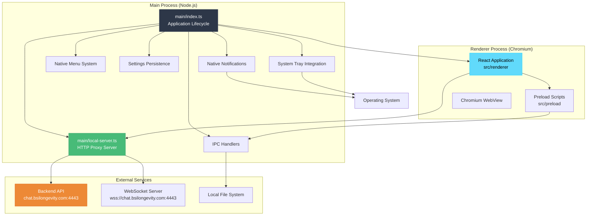
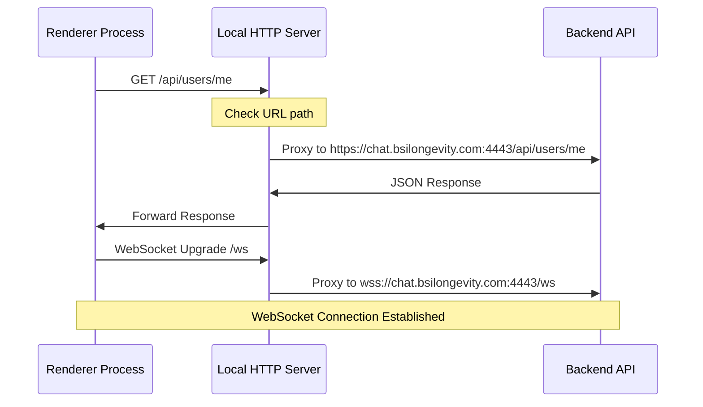

# BSI Messenger Electron/Desktop Documentation

## Overview

BSI Messenger's desktop application is built using Electron 39, providing native desktop capabilities across Windows, macOS, and Linux. The application implements a robust architecture with main process services, local HTTP proxy, system integration, and comprehensive IPC communication.

## Electron Architecture



---

## Main Process Architecture

### main/index.ts

**Purpose:** Core application lifecycle management and main process coordination.

#### Application Lifecycle

**Initialization Sequence:**
1. Start local HTTP proxy server
2. Create main application window
3. Initialize system tray
4. Set up native menu
5. Register IPC handlers
6. Configure security policies

```typescript
app.whenReady().then(async () => {
  // 1. Start local server first
  localServerUrl = await startLocalServer(
    path.join(__dirname, '../renderer')
  )
  
  // 2. Create main window
  createWindow()
  
  // 3. Initialize system integrations
  createTray()
  buildMenu()
  
  // 4. Register IPC handlers
  setupIpcHandlers()
})
```

#### Window Management

**Main Window Configuration:**
```typescript
function createWindow(): void {
  mainWindow = new BrowserWindow({
    width: 1200,
    height: 800,
    minWidth: 800,
    minHeight: 600,
    show: false, // Show after ready-to-show event
    autoHideMenuBar: true,
    icon: icon,
    webPreferences: {
      preload: join(__dirname, '../preload/index.js'),
      sandbox: false,
      nodeIntegration: false,
      contextIsolation: true,
      webSecurity: true
    }
  })

  // Load from local server (not file://)
  mainWindow.loadURL(localServerUrl)
  
  // Show window when ready (prevents white flash)
  mainWindow.once('ready-to-show', () => {
    mainWindow?.show()
  })
}
```

**Window State Management:**
```typescript
// Prevent close, minimize to tray instead
mainWindow.on('close', (e) => {
  if (!isQuitting) {
    e.preventDefault()
    mainWindow?.hide()
  }
})

// Platform-specific behavior
if (process.platform === 'darwin') {
  // macOS: Hide dock icon when all windows closed
  app.on('window-all-closed', () => {
    // Don't quit app, keep in dock
  })
} else {
  // Windows/Linux: Minimize to system tray
  app.on('window-all-closed', () => {
    if (!isQuitting) {
      // Keep app running in tray
    }
  })
}
```
#### Security Configuration

**Content Security Policy:**
```typescript
// Secure defaults for web content
webPreferences: {
  nodeIntegration: false,        // Disable Node.js in renderer
  contextIsolation: true,        // Isolate context between main and renderer
  sandbox: false,                // Needed for preload scripts
  webSecurity: true,             // Enable web security
  allowRunningInsecureContent: false,
  experimentalFeatures: false
}
```

**URL Validation:**
```typescript
// Only allow loading from local server
mainWindow.webContents.on('will-navigate', (event, navigationUrl) => {
  const parsedUrl = new URL(navigationUrl)
  const localUrl = new URL(localServerUrl)
  
  if (parsedUrl.origin !== localUrl.origin) {
    event.preventDefault() // Block external navigation
  }
})
```

---

### main/local-server.ts

**Purpose:** Local HTTP proxy server to avoid CORS issues and provide same-origin requests.

#### Server Architecture

**Why Local Server?**
- **CORS Avoidance:** File:// protocol causes CORS issues with backend API
- **Same Origin:** Makes all requests appear same-origin to the renderer
- **Transparent Proxy:** No code changes needed between dev and production
- **Static Serving:** Serves built renderer files efficiently

**Implementation:**
```typescript
export function startLocalServer(rendererRoot: string): Promise<string> {
  const proxy = httpProxy.createProxyServer({
    changeOrigin: true,
    secure: true, // Backend cert is valid
    timeout: 30000
  })

  const server = createHttpServer((req: IncomingMessage, res: ServerResponse) => {
    const url = req.url ?? '/'

    // Proxy API requests to backend
    if (url.startsWith('/api')) {
      proxy.web(req, res, { target: BACKEND_ORIGIN })
      return
    }

    // Serve static files with SPA fallback
    const urlPath = url.split('?')[0]
    let filePath = join(rendererRoot, decodeURIComponent(urlPath))
    
    if (!existsSync(filePath) || statSync(filePath).isDirectory()) {
      filePath = join(rendererRoot, 'index.html') // SPA fallback
    }
    
    const ext = extname(filePath)
    res.writeHead(200, { 'Content-Type': MIME[ext] ?? 'application/octet-stream' })
    createReadStream(filePath).pipe(res)
  })

  // WebSocket upgrade handling
  server.on('upgrade', (req, socket, head) => {
    if (req.url?.startsWith('/ws')) {
      proxy.ws(req, socket, head, { target: BACKEND_WS_ORIGIN })
    } else {
      socket.destroy()
    }
  })

  return new Promise((resolve, reject) => {
    server.once('error', reject)
    server.listen(0, '127.0.0.1', () => { // Random port, localhost only
      const addr = server.address()
      resolve(`http://127.0.0.1:${(addr as any).port}`)
    })
  })
}
```

#### Proxy Configuration

**Request Flow:**


**Error Handling:**
```typescript
proxy.on('error', (err, req, res) => {
  console.error('[local-server] Proxy error:', err.message)
  
  if (res && 'writeHead' in res && !res.headersSent) {
    res.writeHead(502, { 'Content-Type': 'application/json' })
    res.end(JSON.stringify({ 
      error: 'Bad Gateway', 
      message: err.message 
    }))
  }
})
```

---

## System Integration

### System Tray

**Purpose:** Keep application accessible when window is closed.

```typescript
function createTray(): void {
  if (tray) return
  
  // Use appropriately sized icon for tray
  const trayIcon = nativeImage.createFromPath(icon).resize({ width: 16, height: 16 })
  tray = new Tray(trayIcon)
  tray.setToolTip('BSI Messenger')

  const showWindow = (): void => {
    if (!mainWindow) return
    if (mainWindow.isMinimized()) mainWindow.restore()
    mainWindow.show()
    mainWindow.focus()
  }

  tray.setContextMenu(
    Menu.buildFromTemplate([
      { label: 'Open BSI Messenger', click: showWindow },
      { type: 'separator' },
      {
        label: 'Exit',
        click: () => {
          isQuitting = true
          app.quit()
        }
      }
    ])
  )

  // Left click to toggle window visibility
  tray.on('click', () => {
    if (mainWindow?.isVisible() && !mainWindow.isMinimized()) {
      mainWindow.hide()
    } else {
      showWindow()
    }
  })
}
```

**Platform Differences:**
- **Windows:** Tray icon appears in system tray (bottom right)
- **macOS:** Tray icon appears in menu bar (top right)
- **Linux:** Tray icon location varies by desktop environment

### Native Menu System

**Purpose:** Provide familiar native menu experience with keyboard shortcuts.

```typescript
function buildMenu(): void {
  const isMac = process.platform === 'darwin'

  const template: MenuItemConstructorOptions[] = [
    {
      label: 'File',
      submenu: [
        {
          label: 'New User',
          accelerator: 'CmdOrCtrl+Shift+N',
          click: () => mainWindow?.webContents.send('menu:new-user')
        },
        { type: 'separator' },
        {
          label: 'Logout',
          click: () => mainWindow?.webContents.send('menu:logout')
        },
        isMac ? { role: 'close' } : { role: 'quit' }
      ]
    },
    {
      label: 'Edit',
      submenu: [
        { role: 'undo' },
        { role: 'redo' },
        { type: 'separator' },
        { role: 'cut' },
        { role: 'copy' },
        { role: 'paste' },
        { role: 'selectall' }
      ]
    },
    {
      label: 'View',
      submenu: [
        { role: 'reload' },
        { role: 'forceReload' },
        { role: 'toggleDevTools' },
        { type: 'separator' },
        { role: 'resetZoom' },
        { role: 'zoomIn' },
        { role: 'zoomOut' },
        { type: 'separator' },
        { role: 'togglefullscreen' }
      ]
    }
  ]

  // macOS-specific menu adjustments
  if (isMac) {
    template.unshift({
      label: app.getName(),
      submenu: [
        { role: 'about' },
        { type: 'separator' },
        { role: 'services' },
        { type: 'separator' },
        { role: 'hide' },
        { role: 'hideothers' },
        { role: 'unhide' },
        { type: 'separator' },
        { role: 'quit' }
      ]
    })
  }

  Menu.setApplicationMenu(Menu.buildFromTemplate(template))
}
```
---

## IPC Communication

### IPC Handlers (Main Process)

**Purpose:** Secure communication bridge between main and renderer processes.

```typescript
function setupIpcHandlers(): void {
  // File dialog for download directory selection
  ipcMain.handle('select-download-dir', async () => {
    const result = await dialog.showOpenDialog(mainWindow!, {
      properties: ['openDirectory'],
      title: 'Select Download Directory'
    })
    return result.canceled ? null : result.filePaths[0]
  })

  // Settings management
  ipcMain.handle('get-settings', readSettings)
  ipcMain.handle('set-settings', async (_, patch: Partial<AppSettings>) => {
    return writeSettings(patch)
  })

  // System integration settings
  ipcMain.handle('get-open-at-login', () => {
    return app.getLoginItemSettings().openAtLogin
  })
  
  ipcMain.handle('set-open-at-login', (_, enabled: boolean) => {
    app.setLoginItemSettings({ openAtLogin: enabled })
    return enabled
  })

  // Utility functions
  ipcMain.handle('copy-to-clipboard', (_, text: string) => {
    clipboard.writeText(text)
  })

  // Native notifications
  ipcMain.handle('show-notification', (_, options: NotificationOptions) => {
    if (Notification.isSupported()) {
      new Notification({
        title: options.title,
        body: options.body,
        icon: options.icon || icon
      }).show()
    }
  })
}
```

### Preload Script Bridge

**Purpose:** Secure API exposure to renderer process with context isolation.

**File:** `src/preload/index.ts`

```typescript
import { contextBridge, ipcRenderer } from 'electron'
import { electronAPI } from '@electron-toolkit/preload'

// Type-safe IPC bridge
interface MenuBridge {
  onNewUser: (callback: () => void) => () => void
  onLogout: (callback: () => void) => () => void
  onSettings: (callback: () => void) => () => void
  onMyProfile: (callback: () => void) => () => void
  onAbout: (callback: () => void) => () => void
  
  selectDownloadDir: () => Promise<string | null>
  getSettings: () => Promise<AppSettings>
  setSettings: (patch: Partial<AppSettings>) => Promise<AppSettings>
  getOpenAtLogin: () => Promise<boolean>
  setOpenAtLogin: (enabled: boolean) => Promise<boolean>
  copyToClipboard: (text: string) => Promise<void>
  showNotification: (options: NotificationOptions) => Promise<void>
}

// Safe API exposure
const api: MenuBridge = {
  // Event listeners with cleanup functions
  onNewUser: (callback) => {
    const listener = () => callback()
    ipcRenderer.on('menu:new-user', listener)
    return () => ipcRenderer.removeListener('menu:new-user', listener)
  },
  
  onLogout: (callback) => {
    const listener = () => callback()
    ipcRenderer.on('menu:logout', listener)
    return () => ipcRenderer.removeListener('menu:logout', listener)
  },

  // IPC method wrappers
  selectDownloadDir: () => ipcRenderer.invoke('select-download-dir'),
  getSettings: () => ipcRenderer.invoke('get-settings'),
  setSettings: (patch) => ipcRenderer.invoke('set-settings', patch),
  getOpenAtLogin: () => ipcRenderer.invoke('get-open-at-login'),
  setOpenAtLogin: (enabled) => ipcRenderer.invoke('set-open-at-login', enabled),
  copyToClipboard: (text) => ipcRenderer.invoke('copy-to-clipboard', text),
  showNotification: (options) => ipcRenderer.invoke('show-notification', options)
}

// Expose to renderer process
contextBridge.exposeInMainWorld('api', api)
contextBridge.exposeInMainWorld('electron', electronAPI)
```

### Renderer Integration

**Usage in React Components:**

```typescript
// Type declaration (src/preload/index.d.ts)
declare global {
  interface Window {
    electron: ElectronAPI
    api: MenuBridge
  }
}

// React component usage
const SettingsDialog = () => {
  const [downloadDir, setDownloadDir] = useState('')
  const [openAtLogin, setOpenAtLogin] = useState(false)

  // Load settings on mount
  useEffect(() => {
    const loadSettings = async () => {
      const settings = await window.api.getSettings()
      const loginSetting = await window.api.getOpenAtLogin()
      setDownloadDir(settings.downloadDir || '')
      setOpenAtLogin(loginSetting)
    }
    loadSettings()
  }, [])

  // Handle directory selection
  const handleSelectDirectory = async () => {
    const dir = await window.api.selectDownloadDir()
    if (dir) {
      await window.api.setSettings({ downloadDir: dir })
      setDownloadDir(dir)
    }
  }

  // Handle startup setting
  const handleOpenAtLogin = async (enabled: boolean) => {
    await window.api.setOpenAtLogin(enabled)
    setOpenAtLogin(enabled)
  }

  return (
    <div className="settings-dialog">
      <div className="setting-group">
        <label>Download Directory:</label>
        <div className="directory-picker">
          <input type="text" value={downloadDir} readOnly />
          <button onClick={handleSelectDirectory}>Browse</button>
        </div>
      </div>
      
      <div className="setting-group">
        <label>
          <input
            type="checkbox"
            checked={openAtLogin}
            onChange={(e) => handleOpenAtLogin(e.target.checked)}
          />
          Open at login
        </label>
      </div>
    </div>
  )
}
```

---

## Settings Persistence

### Settings Storage

**Purpose:** Persist application settings between sessions.

**File Location:** `userData/settings.json`

```typescript
interface AppSettings {
  downloadDir?: string
  // Note: openAtLogin is stored by OS, not in JSON
}

const settingsPath = (): string => join(app.getPath('userData'), 'settings.json')

async function readSettings(): Promise<AppSettings> {
  try {
    const raw = await readFile(settingsPath(), 'utf-8')
    const parsed = JSON.parse(raw)
    return typeof parsed === 'object' && parsed !== null ? parsed : {}
  } catch {
    return {} // File doesn't exist or is corrupted
  }
}

async function writeSettings(patch: Partial<AppSettings>): Promise<AppSettings> {
  const current = await readSettings()
  const next = { ...current, ...patch }
  await writeFile(settingsPath(), JSON.stringify(next, null, 2), 'utf-8')
  return next
}
```

### Platform-Specific Settings

**Auto-Start Configuration:**
```typescript
// Cross-platform auto-start handling
app.setLoginItemSettings({
  openAtLogin: enabled,
  openAsHidden: false, // Show window on startup
  path: process.execPath, // Current executable path
  args: [] // No special startup arguments
})

// Check current setting
const loginSettings = app.getLoginItemSettings()
console.log('Open at login:', loginSettings.openAtLogin)
```

**Platform Differences:**
- **Windows:** Registry entry in `HKEY_CURRENT_USER\Software\Microsoft\Windows\CurrentVersion\Run`
- **macOS:** Login item in System Preferences > Users & Groups > Login Items
- **Linux:** Desktop entry in `~/.config/autostart/`

---

## Native Notifications

### Desktop Notifications

**Purpose:** Show native system notifications for messages and calls.

```typescript
// Main process notification handler
ipcMain.handle('show-notification', (_, options: NotificationOptions) => {
  if (!Notification.isSupported()) {
    console.warn('Notifications not supported on this system')
    return
  }

  const notification = new Notification({
    title: options.title,
    body: options.body,
    icon: options.icon || icon,
    silent: options.silent || false,
    urgency: options.urgency || 'normal' // Linux only
  })

  notification.on('click', () => {
    // Bring app to focus when notification is clicked
    if (mainWindow) {
      if (mainWindow.isMinimized()) mainWindow.restore()
      mainWindow.show()
      mainWindow.focus()
    }
  })

  notification.show()
})
```

**Renderer Process Integration:**
```typescript
// notification.service.ts
const showDesktopNotification = async (title: string, body: string) => {
  try {
    // Check if notifications are enabled in settings
    const enabled = localStorage.getItem(NOTIF_ENABLED_KEY) !== 'false'
    if (!enabled) return

    // Use Electron API if available
    if (window.api?.showNotification) {
      await window.api.showNotification({ title, body })
    } else {
      // Fallback to Web Notifications API
      if ('Notification' in window && Notification.permission === 'granted') {
        new Notification(title, { body })
      }
    }
  } catch (err) {
    console.error('[notification] Failed to show notification:', err)
  }
}
```

---

## Build Configuration

### Electron Builder

**Configuration File:** `electron-builder.yml`

```yaml
appId: com.bsi.messenger
productName: BSI Messenger
artifactName: bsi-messenger-${version}-${platform}-${arch}.${ext}

directories:
  output: dist
  buildResources: build

files:
  - "!**/.vscode/*"
  - "!src/*"
  - "!electron.vite.config.ts"
  - "!{.eslintrc.cjs,.eslintrc.json,eslint.config.js}"
  - "!{.prettierrc,.prettierignore}"
  - "!{README.md,readme.md,README,readme.txt,readme}"
  - "!{tsconfig.json,tsconfig.*.json}"

win:
  target:
    - target: nsis
      arch:
        - x64
        - ia32
  icon: resources/icon.ico
  requestedExecutionLevel: asInvoker

nsis:
  oneClick: false
  allowToChangeInstallationDirectory: true
  installerIcon: resources/icon.ico
  uninstallerIcon: resources/icon.ico
  createDesktopShortcut: true
  createStartMenuShortcut: true

mac:
  target:
    - target: dmg
      arch:
        - x64
        - arm64
  icon: resources/icon.icns
  category: public.app-category.social-networking
  hardenedRuntime: true
  gatekeeperAssess: false
  entitlements: build/entitlements.mac.plist
  entitlementsInherit: build/entitlements.mac.plist

linux:
  target:
    - target: AppImage
      arch:
        - x64
    - target: deb
      arch:
        - x64
  icon: resources/icon.png
  category: Network
```
---

## Development Workflow

### Development Server

**Running Development Mode:**
```bash
# Start Electron with Vite dev server
npm run dev

# Development features:
# - Hot Module Replacement (HMR)
# - React Fast Refresh
# - Source maps for debugging
# - DevTools enabled by default
```

**Development Configuration:**
```typescript
// electron.vite.config.ts
export default defineConfig({
  main: {
    plugins: [externalizeDepsPlugin()]
  },
  preload: {
    plugins: [externalizeDepsPlugin()]
  },
  renderer: {
    resolve: {
      alias: {
        '@renderer': resolve('src/renderer/src')
      }
    },
    server: {
      proxy: {
        '/api': {
          target: 'https://chat.bsilongevity.com:4443',
          changeOrigin: true,
          secure: true
        },
        '/ws': {
          target: 'wss://chat.bsilongevity.com:4443',
          ws: true,
          changeOrigin: true
        }
      }
    }
  }
})
```

### Building for Production

**Build Commands:**
```bash
# Build for current platform
npm run build:win    # Windows (x64, ia32)
npm run build:mac    # macOS (x64, arm64)
npm run build:linux  # Linux (AppImage, deb)

# Build all platforms (requires appropriate OS)
npm run build
```

**Build Output:**
```
dist/
├── win-unpacked/           # Unpacked Windows app
├── win-ia32-unpacked/      # 32-bit Windows app
├── mac/                    # macOS .app bundle
├── mac-arm64/              # Apple Silicon .app
├── linux-unpacked/         # Unpacked Linux app
├── bsi-messenger-1.0.0-win-x64.exe
├── bsi-messenger-1.0.0-mac-x64.dmg
├── bsi-messenger-1.0.0-mac-arm64.dmg
├── bsi-messenger-1.0.0-linux-x64.AppImage
└── bsi-messenger-1.0.0-linux-amd64.deb
```

---

## Debugging

### DevTools

**Opening DevTools:**
```typescript
// In main process during development
if (is.dev) {
  mainWindow.webContents.openDevTools()
}

// Via keyboard shortcut
// F12 or Ctrl+Shift+I (Cmd+Option+I on macOS)
```

**Main Process Debugging:**
```bash
# VSCode launch configuration
{
  "version": "0.2.0",
  "configurations": [
    {
      "name": "Debug Electron Main",
      "type": "node",
      "request": "launch",
      "cwd": "${workspaceRoot}",
      "runtimeExecutable": "${workspaceRoot}/node_modules/.bin/electron",
      "windows": {
        "runtimeExecutable": "${workspaceRoot}/node_modules/.bin/electron.cmd"
      },
      "args": ["."],
      "outputCapture": "std",
      "sourceMaps": true
    }
  ]
}
```

### Logging

**Main Process Logs:**
```typescript
// Main process logs appear in terminal
console.log('[main] Application started')
console.error('[main] Error occurred:', error)

// Production logs location:
// Windows: %APPDATA%\BSI Messenger\logs\
// macOS: ~/Library/Logs/BSI Messenger/
// Linux: ~/.config/BSI Messenger/logs/
```

**Renderer Process Logs:**
```typescript
// Renderer logs appear in DevTools Console
console.log('[renderer] User logged in')
console.error('[renderer] API request failed:', error)
```

---

## Platform-Specific Considerations

### Windows

**Installation:**
- NSIS installer with custom install directory option
- Desktop and Start Menu shortcuts created
- Uninstaller registered in Control Panel

**Auto-Update:**
- Squirrel.Windows for auto-update (if implemented)
- Background update download
- Restart prompt on update ready

**File Associations:**
```typescript
// Register custom protocol (bsimessenger://)
app.setAsDefaultProtocolClient('bsimessenger')
```

**Windows-Specific APIs:**
```typescript
// Taskbar progress (file downloads)
mainWindow.setProgressBar(0.5) // 50% progress
mainWindow.setProgressBar(-1)  // Remove progress bar

// Flash frame to get attention
mainWindow.flashFrame(true)
```

### macOS

**App Bundle:**
- `.app` bundle with proper Info.plist
- Code signing for Gatekeeper
- Notarization for macOS 10.15+

**Menu Bar Integration:**
- Native menu bar appearance
- System-level keyboard shortcuts
- About/Preferences menu items

**Dock Integration:**
```typescript
// Dock badge (unread count)
app.dock.setBadge('5')
app.dock.setBadge('') // Clear badge

// Dock bounce effect
app.dock.bounce('critical') // Bounce until user clicks
app.dock.bounce('informational') // Bounce once
```

**Dark Mode Support:**
```typescript
// Detect and respond to system theme changes
nativeTheme.on('updated', () => {
  const isDarkMode = nativeTheme.shouldUseDarkColors
  mainWindow?.webContents.send('theme-changed', isDarkMode)
})
```

### Linux

**Package Formats:**
- AppImage: Portable, runs on any distro
- .deb: Debian/Ubuntu package manager
- .rpm: RedHat/Fedora package manager (optional)

**Desktop Integration:**
```desktop
[Desktop Entry]
Name=BSI Messenger
Exec=/opt/BSI Messenger/bsi-messenger
Terminal=false
Type=Application
Icon=bsi-messenger
Categories=Network;InstantMessaging;
```

**Tray Icon Considerations:**
- Different desktop environments handle tray icons differently
- Some require libappindicator or similar libraries
- Test on GNOME, KDE, XFCE

---

## Security Best Practices

### Context Isolation

**Always Enabled:**
```typescript
webPreferences: {
  contextIsolation: true, // Isolate renderer from Node.js
  nodeIntegration: false,  // Disable Node.js in renderer
  sandbox: false          // Needed for preload scripts only
}
```

### Preload Script Security

**Safe Pattern:**
```typescript
// ✅ Good: Expose only specific APIs
contextBridge.exposeInMainWorld('api', {
  selectFile: () => ipcRenderer.invoke('select-file'),
  getSettings: () => ipcRenderer.invoke('get-settings')
})

// ❌ Bad: Exposing entire modules
contextBridge.exposeInMainWorld('electron', require('electron'))
contextBridge.exposeInMainWorld('fs', require('fs'))
```

### Input Validation

**Always Validate IPC Inputs:**
```typescript
ipcMain.handle('save-file', async (_, filePath: unknown) => {
  // Validate input type
  if (typeof filePath !== 'string') {
    throw new Error('Invalid file path')
  }
  
  // Validate path doesn't escape allowed directories
  const normalized = path.normalize(filePath)
  const allowed = app.getPath('documents')
  if (!normalized.startsWith(allowed)) {
    throw new Error('Path outside allowed directory')
  }
  
  // Proceed with safe file operation
  await fs.writeFile(normalized, data)
})
```

### Content Security Policy

**Strict CSP for Renderer:**
```typescript
session.defaultSession.webRequest.onHeadersReceived((details, callback) => {
  callback({
    responseHeaders: {
      ...details.responseHeaders,
      'Content-Security-Policy': [
        "default-src 'self'; " +
        "script-src 'self'; " +
        "style-src 'self' 'unsafe-inline'; " +
        "img-src 'self' data: blob:; " +
        "connect-src 'self' wss://chat.bsilongevity.com https://chat.bsilongevity.com"
      ]
    }
  })
})
```

---

## Performance Optimization

### Window Loading

**Minimize White Flash:**
```typescript
const mainWindow = new BrowserWindow({
  show: false,           // Don't show until ready
  backgroundColor: '#1a202c' // Match app background
})

mainWindow.once('ready-to-show', () => {
  mainWindow.show()
})
```

### Memory Management

**Clear Caches on Quit:**
```typescript
app.on('before-quit', () => {
  session.defaultSession.clearCache()
  session.defaultSession.clearStorageData()
})
```

**Limit Cache Size:**
```typescript
app.commandLine.appendSwitch('disk-cache-size', '104857600') // 100MB
```

---

## Troubleshooting

### Common Issues

**1. App Won't Start**
```bash
# Check if another instance is running
# Windows: Task Manager
# macOS: Activity Monitor
# Linux: ps aux | grep bsi-messenger

# Clear app data
# Windows: %APPDATA%\BSI Messenger
# macOS: ~/Library/Application Support/BSI Messenger
# Linux: ~/.config/BSI Messenger
```

**2. Local Server Port Conflict**
```typescript
// Server uses random port (listen(0))
// Check logs for actual port being used
console.log('Local server started on:', localServerUrl)
```

**3. Settings Not Persisting**
```typescript
// Check settings file location
const settingsPath = join(app.getPath('userData'), 'settings.json')
console.log('Settings path:', settingsPath)

// Verify write permissions
const testWrite = async () => {
  try {
    await writeFile(settingsPath, '{}', 'utf-8')
    console.log('Settings writable')
  } catch (err) {
    console.error('Settings not writable:', err)
  }
}
```

**4. Tray Icon Not Showing**
```typescript
// Ensure icon file exists and is accessible
if (!existsSync(icon)) {
  console.error('Tray icon file not found:', icon)
}

// Linux: May need libappindicator
// sudo apt-get install libappindicator3-1
```

---

## Distribution

### Code Signing

**Windows:**
```bash
# Requires valid code signing certificate
# Configure in electron-builder.yml:
win:
  certificateFile: path/to/cert.pfx
  certificatePassword: ${CERT_PASSWORD}
  signingHashAlgorithms: ['sha256']
```

**macOS:**
```bash
# Requires Apple Developer account
# Configure in electron-builder.yml:
mac:
  identity: "Developer ID Application: Your Name (TEAM_ID)"
  hardenedRuntime: true
  gatekeeperAssess: false
  
# Notarization for macOS 10.15+
afterSign: scripts/notarize.js
```

### Auto-Update Setup

**Update Server Requirements:**
- HTTPS endpoint serving update manifest
- Platform-specific update packages
- Version checking mechanism

**Implementation Example:**
```typescript
import { autoUpdater } from 'electron-updater'

autoUpdater.on('update-available', () => {
  mainWindow?.webContents.send('update-available')
})

autoUpdater.on('update-downloaded', () => {
  mainWindow?.webContents.send('update-ready')
})

// Check for updates on startup
app.whenReady().then(() => {
  if (!is.dev) {
    autoUpdater.checkForUpdates()
  }
})
```

---

## Testing

### E2E Testing with Spectron

```typescript
import { Application } from 'spectron'

describe('BSI Messenger E2E', () => {
  let app: Application

  beforeEach(async () => {
    app = new Application({
      path: electronPath,
      args: [path.join(__dirname, '..')]
    })
    await app.start()
  })

  afterEach(async () => {
    if (app && app.isRunning()) {
      await app.stop()
    }
  })

  it('should launch application', async () => {
    const count = await app.client.getWindowCount()
    expect(count).toBe(1)
  })

  it('should show login page', async () => {
    const title = await app.client.getTitle()
    expect(title).toBe('BSI Messenger')
  })
})
```

### Manual Testing Checklist

**Installation:**
- [ ] Fresh install completes without errors
- [ ] Desktop shortcut created (Windows/Linux)
- [ ] Start menu entry created (Windows)
- [ ] Application appears in Launchpad (macOS)

**First Run:**
- [ ] Window opens at correct size
- [ ] Login page displays correctly
- [ ] Settings are persisted
- [ ] Tray icon appears

**Functionality:**
- [ ] Login/logout works
- [ ] Messages send and receive
- [ ] Notifications appear
- [ ] File downloads work
- [ ] Settings persist between sessions
- [ ] Auto-start toggle works

**Updates:**
- [ ] Auto-update check works
- [ ] Update download completes
- [ ] Update installation successful
- [ ] Settings preserved after update

---

*This Electron documentation provides comprehensive guidance for understanding, developing, and maintaining the desktop application aspects of BSI Messenger. For web-specific functionality, refer to the other documentation files.*