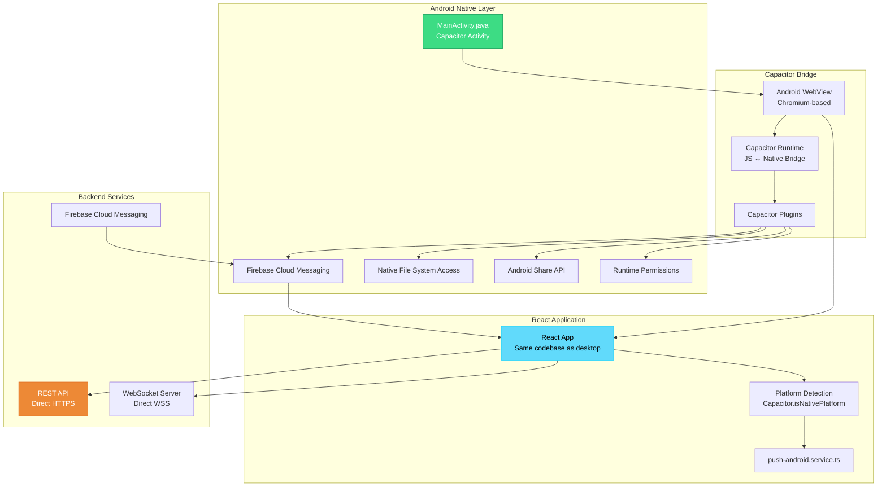

# BSI Messenger Mobile/Capacitor Documentation

## Overview

BSI Messenger mobile app is built using Capacitor 8, enabling the React web application to run natively on Android with access to native device features like push notifications, file system, and sharing capabilities.

## Mobile Architecture



---

## Capacitor Configuration

### capacitor.config.ts

```typescript
import { CapacitorConfig } from '@capacitor/cli'

const config: CapacitorConfig = {
  appId: 'com.bsi.messenger',
  appName: 'BSI Messenger',
  webDir: 'dist/renderer',
  
  server: {
    // Production: connect directly to backend
    androidScheme: 'https',
    cleartext: false
  },
  
  android: {
    buildOptions: {
      keystorePath: 'path/to/keystore.jks',
      keystorePassword: 'password',
      keystoreAlias: 'key-alias',
      keystoreAliasPassword: 'alias-password'
    }
  },
  
  plugins: {
    PushNotifications: {
      presentationOptions: ['badge', 'sound', 'alert']
    },
    SplashScreen: {
      launchShowDuration: 2000,
      backgroundColor: '#1a202c',
      showSpinner: false,
      androidSpinnerStyle: 'small',
      splashFullScreen: true,
      splashImmersive: true
    }
  }
}

export default config
```

### Key Configuration Points

**appId:** Unique package identifier (must match Google Play listing)  
**webDir:** Output directory from Vite build  
**androidScheme:** Use HTTPS for secure WebView loading  
**cleartext:** Disable HTTP for security

---

## Platform Detection

### Conditional Code Execution

```typescript
import { Capacitor } from '@capacitor/core'

const IS_NATIVE = Capacitor.isNativePlatform()
const PLATFORM = Capacitor.getPlatform() // 'android', 'ios', 'web'

// Platform-specific API URLs
export const API_URL = IS_NATIVE 
  ? 'https://chat.bsilongevity.com:4443/api'  // Direct connection
  : '/api'  // Proxy via Vite/local server

export const WS_URL = IS_NATIVE
  ? 'wss://chat.bsilongevity.com:4443/ws'
  : `ws://${location.host}/ws`

// Feature availability
const SUPPORTS_PUSH = IS_NATIVE && PLATFORM === 'android'
const SUPPORTS_SHARE = IS_NATIVE
const SUPPORTS_FILE_SYSTEM = IS_NATIVE
```

### Usage in Components

```typescript
const DownloadButton = ({ fileUrl }: Props) => {
  const handleDownload = async () => {
    if (Capacitor.isNativePlatform()) {
      // Use Filesystem plugin
      const { Filesystem } = await import('@capacitor/filesystem')
      const result = await Filesystem.downloadFile({
        url: fileUrl,
        path: 'Downloads/file.pdf',
        directory: Directory.Documents
      })
      showToast('Downloaded to Documents')
    } else {
      // Desktop: regular download
      window.open(fileUrl)
    }
  }

  return <button onClick={handleDownload}>Download</button>
}
```

---

## Push Notifications (FCM)

### Firebase Setup

**1. Firebase Console Configuration:**
- Create Firebase project
- Add Android app with package name `com.bsi.messenger`
- Download `google-services.json`
- Place in `android/app/google-services.json`

**2. Dependencies (Already Configured):**

```gradle
// android/app/build.gradle
plugins {
    id 'com.android.application'
    id 'com.google.gms.google-services' // Firebase
}

dependencies {
    implementation 'com.google.firebase:firebase-messaging:23.1.0'
    implementation 'com.capacitorjs.plugins:push-notifications:6.0.0'
}
```

### Push Service Implementation

**File:** `src/renderer/src/services/push-android.service.ts`

```typescript
import { Capacitor } from '@capacitor/core'
import { PushNotifications } from '@capacitor/push-notifications'
import { api } from './api.service'

export const registerPushAndroid = async (): Promise<void> => {
  // Guard: Only run on Android
  if (!Capacitor.isNativePlatform() || Capacitor.getPlatform() !== 'android') {
    return
  }

  try {
    // 1. Request permission (Android 13+)
    const permission = await PushNotifications.requestPermissions()
    if (permission.receive !== 'granted') {
      console.warn('[push-android] Permission denied')
      return
    }

    // 2. Register with FCM
    await PushNotifications.register()
    
    // 3. Listen for token
    await PushNotifications.addListener('registration', async (token) => {
      console.log('[push-android] FCM token:', token.value)
      
      // 4. Send token to backend
      try {
        await api.post('/push/register', {
          token: token.value,
          platform: 'android'
        })
      } catch (err) {
        console.error('[push-android] Failed to register token:', err)
      }
    })

    // 5. Handle registration errors
    await PushNotifications.addListener('registrationError', (error) => {
      console.error('[push-android] Registration error:', error)
    })

    // 6. Handle push notifications received
    await PushNotifications.addListener('pushNotificationReceived', (notification) => {
      console.log('[push-android] Push received:', notification)
      // Notification shown automatically by system
    })

    // 7. Handle notification taps
    await PushNotifications.addListener('pushNotificationActionPerformed', (action) => {
      console.log('[push-android] Push action:', action)
      // Navigate to relevant screen
      const data = action.notification.data
      if (data.conversationId) {
        // Navigate to conversation
      }
    })

  } catch (err) {
    console.error('[push-android] Registration failed:', err)
  }
}
```

### Integration in App

```typescript
// src/renderer/src/App.tsx
import { registerPushAndroid } from './services/push-android.service'

function App() {
  const { user } = useAuthStore()

  useEffect(() => {
    if (user) {
      registerPushAndroid()
    }
  }, [user])

  return <div>...</div>
}
```

### Backend Integration

**Server sends push via FCM Admin SDK:**
```typescript
// Backend code (reference)
await admin.messaging().send({
  token: userFCMToken,
  notification: {
    title: message.sender.displayName,
    body: message.body || 'Sent an attachment'
  },
  data: {
    conversationId: message.conversationId,
    messageId: message.id,
    type: 'new_message'
  },
  android: {
    priority: 'high',
    notification: {
      icon: 'notification_icon',
      color: '#4299e1',
      sound: 'default'
    }
  }
})
```

---

## File System Access

### Filesystem Plugin

**Download Files:**
```typescript
import { Filesystem, Directory } from '@capacitor/filesystem'

const downloadFile = async (url: string, filename: string) => {
  try {
    const result = await Filesystem.downloadFile({
      url,
      path: filename,
      directory: Directory.Documents
    })
    
    console.log('Downloaded to:', result.path)
    alert(`File saved to Documents/${filename}`)
  } catch (error) {
    console.error('Download failed:', error)
    alert('Failed to download file')
  }
}
```

**Read Files:**
```typescript
const readFile = async (filename: string) => {
  try {
    const contents = await Filesystem.readFile({
      path: filename,
      directory: Directory.Documents,
      encoding: Encoding.UTF8
    })
    return contents.data
  } catch (error) {
    console.error('Read failed:', error)
    throw error
  }
}
```

**Write Files:**
```typescript
const writeFile = async (filename: string, data: string) => {
  try {
    await Filesystem.writeFile({
      path: filename,
      data: data,
      directory: Directory.Documents,
      encoding: Encoding.UTF8
    })
    console.log('File written successfully')
  } catch (error) {
    console.error('Write failed:', error)
    throw error
  }
}
```

### Directory Options

```typescript
Directory.Documents    // User documents folder
Directory.Data        // App-private data
Directory.Cache       // Temporary cache (can be cleared by system)
Directory.External    // External storage (SD card)
Directory.ExternalStorage // Public external storage
```

---

## Share Functionality

### Share Plugin

```typescript
import { Share } from '@capacitor/share'

const shareMessage = async (text: string) => {
  if (!Capacitor.isNativePlatform()) {
    // Desktop fallback
    navigator.clipboard.writeText(text)
    alert('Copied to clipboard')
    return
  }

  try {
    await Share.share({
      title: 'BSI Messenger',
      text: text,
      dialogTitle: 'Share via'
    })
  } catch (error) {
    console.error('Share failed:', error)
  }
}

const shareFile = async (fileUrl: string, filename: string) => {
  try {
    await Share.share({
      title: 'Share File',
      text: filename,
      url: fileUrl,
      dialogTitle: 'Share via'
    })
  } catch (error) {
    console.error('Share failed:', error)
  }
}
```

---

## Android Build Configuration

### android/app/build.gradle

```gradle
android {
    namespace "com.bsi.messenger"
    compileSdkVersion 34
    
    defaultConfig {
        applicationId "com.bsi.messenger"
        minSdkVersion 24
        targetSdkVersion 34
        versionCode 1
        versionName "1.0.0"
    }
    
    buildTypes {
        release {
            minifyEnabled false
            proguardFiles getDefaultProguardFile('proguard-android-optimize.txt'), 'proguard-rules.pro'
            
            // Code signing (production)
            signingConfig signingConfigs.release
        }
    }
    
    signingConfigs {
        release {
            storeFile file(System.getenv("KEYSTORE_FILE") ?: "release-keystore.jks")
            storePassword System.getenv("KEYSTORE_PASSWORD")
            keyAlias System.getenv("KEY_ALIAS")
            keyPassword System.getenv("KEY_PASSWORD")
        }
    }
}

dependencies {
    implementation 'androidx.appcompat:appcompat:1.6.1'
    implementation 'androidx.coordinatorlayout:coordinatorlayout:1.2.0'
    implementation 'androidx.webkit:webkit:1.8.0'
    implementation 'androidx.swiperefreshlayout:swiperefreshlayout:1.1.0'
    
    // Capacitor
    implementation project(':capacitor-android')
    
    // Capacitor Plugins
    implementation project(':capacitor-app')
    implementation project(':capacitor-filesystem')
    implementation project(':capacitor-keyboard')
    implementation project(':capacitor-push-notifications')
    implementation project(':capacitor-share')
    implementation project(':capacitor-splash-screen')
    implementation project(':capacitor-status-bar')
    
    // Firebase
    implementation platform('com.google.firebase:firebase-bom:32.3.1')
    implementation 'com.google.firebase:firebase-messaging'
}

apply plugin: 'com.google.gms.google-services'
```

### Permissions (AndroidManifest.xml)

```xml
<manifest xmlns:android="http://schemas.android.com/apk/res/android">
    <application>
        <!-- Main Activity -->
        <activity
            android:name=".MainActivity"
            android:exported="true"
            android:launchMode="singleTask"
            android:configChanges="orientation|keyboardHidden|keyboard|screenSize|locale|smallestScreenSize|screenLayout|uiMode"
            android:theme="@style/AppTheme.NoActionBarLaunch">
            <intent-filter>
                <action android:name="android.intent.action.MAIN" />
                <category android:name="android.intent.category.LAUNCHER" />
            </intent-filter>
        </activity>
    </application>
    
    <!-- Permissions -->
    <uses-permission android:name="android.permission.INTERNET" />
    <uses-permission android:name="android.permission.READ_EXTERNAL_STORAGE" />
    <uses-permission android:name="android.permission.WRITE_EXTERNAL_STORAGE" />
    <uses-permission android:name="android.permission.POST_NOTIFICATIONS" />
</manifest>
```

---

## Development Workflow

### Initial Setup

```bash
# 1. Install Capacitor CLI globally (optional)
npm install -g @capacitor/cli

# 2. Sync web assets to Android
npx cap sync android

# 3. Open in Android Studio
npx cap open android
```

### Development Loop

```bash
# 1. Make changes to React code
# 2. Build web assets
npm run build

# 3. Sync to Android
npx cap sync android

# 4. Run in Android Studio or use
cd android && ./gradlew installDebug
```

### Live Reload (Optional)

```typescript
// capacitor.config.ts (development only)
const config: CapacitorConfig = {
  server: {
    url: 'http://192.168.1.100:5173', // Your dev server IP
    cleartext: true
  }
}
```

**Note:** Remember to remove this before production build!

---

## Building for Production

### Debug Build

```bash
cd android
./gradlew assembleDebug

# Output: android/app/build/outputs/apk/debug/app-debug.apk
```

### Release Build

```bash
# 1. Ensure web assets are built
npm run build

# 2. Sync to Android
npx cap sync android

# 3. Build release APK
cd android
./gradlew assembleRelease

# Output: android/app/build/outputs/apk/release/app-release.apk
```

### Code Signing

**Generate Keystore:**
```bash
keytool -genkey -v -keystore release-keystore.jks \
  -alias key-alias -keyalg RSA -keysize 2048 \
  -validity 10000
```

**Configure Signing:**
Set environment variables:
```bash
export KEYSTORE_FILE=/path/to/release-keystore.jks
export KEYSTORE_PASSWORD=your_keystore_password
export KEY_ALIAS=key-alias
export KEY_PASSWORD=your_key_password
```

---

## Responsive Design for Mobile

### Viewport Configuration

```html
<!-- index.html -->
<meta name="viewport" content="width=device-width, initial-scale=1.0, maximum-scale=1.0, user-scalable=no, viewport-fit=cover">
```

### Safe Area Handling

```css
/* Handle notches and camera cutouts */
.app-container {
  padding-top: env(safe-area-inset-top);
  padding-bottom: env(safe-area-inset-bottom);
  padding-left: env(safe-area-inset-left);
  padding-right: env(safe-area-inset-right);
}
```

### Mobile-Specific Styles

```typescript
const ChatArea = () => {
  const isMobile = Capacitor.isNativePlatform()

  return (
    <div className={cn(
      'chat-area',
      isMobile && 'touch-optimized'
    )}>
      {/* Content */}
    </div>
  )
}
```

---

## Troubleshooting

### Common Issues

**1. App Won't Install**
```bash
# Clear build cache
cd android
./gradlew clean

# Check device connection
adb devices

# Reinstall
./gradlew installDebug --stacktrace
```

**2. Push Notifications Not Working**
- Verify `google-services.json` is in `android/app/`
- Check FCM token registration in logs
- Ensure notification permissions granted
- Test with Firebase Console test message

**3. WebView Not Loading**
- Check `webDir` path in `capacitor.config.ts`
- Verify build output exists in `dist/renderer/`
- Check Android logcat for errors:
  ```bash
  adb logcat | grep Capacitor
  ```

**4. File System Access Denied**
- Check permissions in AndroidManifest.xml
- Request runtime permissions for Android 6+
- Use scoped storage for Android 10+

---

## Testing

### Device Testing

```bash
# List connected devices
adb devices

# Install APK
adb install android/app/build/outputs/apk/debug/app-debug.apk

# View logs
adb logcat | grep BSIMessenger
```

### Emulator Testing

```bash
# Start emulator
emulator -avd Pixel_4_API_33

# Install and run
cd android && ./gradlew installDebug
```

---

*This mobile documentation covers Android development with Capacitor. iOS support can be added following similar patterns with platform-specific adjustments.*