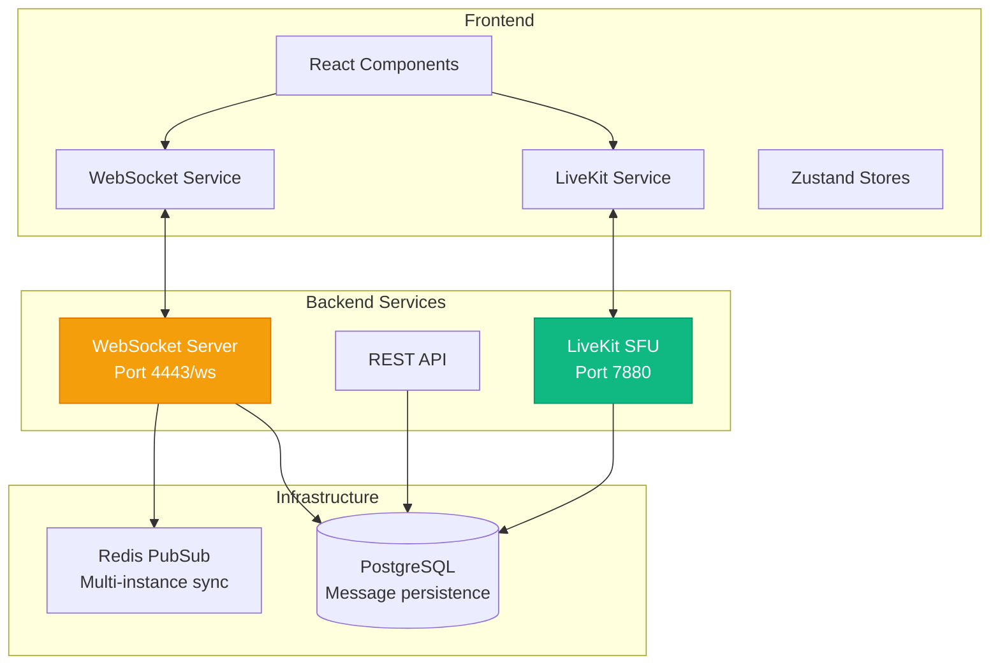

# Real-time Communication

## Overview

BSI Messenger uses two real-time communication technologies:
1. **WebSocket** - For text messaging, presence, and notifications
2. **LiveKit** - For voice and video calls

## Architecture



---

## WebSocket Communication

### Connection Setup

**File:** `src/renderer/src/services/websocket.service.ts`

```typescript
import { WS_URL } from '../config'
import { useMessagesStore } from '../stores/messages.store'
import { usePresenceStore } from '../stores/presence.store'

class WebSocketService {
  private ws: WebSocket | null = null
  private reconnectTimeout: NodeJS.Timeout | null = null
  private heartbeatInterval: NodeJS.Timeout | null = null
  private reconnectAttempts = 0
  private maxReconnectAttempts = 5

  connect(userId: string) {
    if (this.ws?.readyState === WebSocket.OPEN) {
      return
    }

    console.log('[ws] Connecting...')
    this.ws = new WebSocket(`${WS_URL}?userId=${userId}`)

    this.ws.onopen = () => {
      console.log('[ws] Connected')
      this.reconnectAttempts = 0
      this.startHeartbeat()
    }

    this.ws.onmessage = (event) => {
      this.handleMessage(JSON.parse(event.data))
    }

    this.ws.onerror = (error) => {
      console.error('[ws] Error:', error)
    }

    this.ws.onclose = () => {
      console.log('[ws] Disconnected')
      this.stopHeartbeat()
      this.attemptReconnect(userId)
    }
  }

  disconnect() {
    this.reconnectAttempts = this.maxReconnectAttempts // Prevent reconnect
    this.stopHeartbeat()
    
    if (this.reconnectTimeout) {
      clearTimeout(this.reconnectTimeout)
    }
    
    if (this.ws) {
      this.ws.close()
      this.ws = null
    }
  }

  private handleMessage(message: WSMessage) {
    console.log('[ws] Message:', message.type)

    switch (message.type) {
      case 'message:new':
        useMessagesStore.getState().addMessage(message.data)
        break
      
      case 'message:updated':
        useMessagesStore.getState().updateMessage(message.data)
        break
      
      case 'message:deleted':
        useMessagesStore.getState().removeMessage(message.data.id)
        break
      
      case 'presence:update':
        usePresenceStore.getState().updatePresence(message.data)
        break
      
      case 'typing:start':
        usePresenceStore.getState().setTyping(
          message.data.conversationId,
          message.data.userId,
          true
        )
        break
      
      case 'typing:stop':
        usePresenceStore.getState().setTyping(
          message.data.conversationId,
          message.data.userId,
          false
        )
        break
      
      case 'call:incoming':
        // Handle incoming call notification
        break
      
      case 'pong':
        // Heartbeat response
        break
      
      default:
        console.warn('[ws] Unknown message type:', message.type)
    }
  }

  send(type: string, data: any) {
    if (this.ws?.readyState === WebSocket.OPEN) {
      this.ws.send(JSON.stringify({ type, data }))
    } else {
      console.error('[ws] Cannot send, not connected')
    }
  }

  private startHeartbeat() {
    this.heartbeatInterval = setInterval(() => {
      this.send('ping', {})
    }, 30000) // Every 30 seconds
  }

  private stopHeartbeat() {
    if (this.heartbeatInterval) {
      clearInterval(this.heartbeatInterval)
      this.heartbeatInterval = null
    }
  }

  private attemptReconnect(userId: string) {
    if (this.reconnectAttempts >= this.maxReconnectAttempts) {
      console.error('[ws] Max reconnect attempts reached')
      return
    }

    const delay = Math.min(1000 * Math.pow(2, this.reconnectAttempts), 30000)
    console.log(`[ws] Reconnecting in ${delay}ms...`)

    this.reconnectTimeout = setTimeout(() => {
      this.reconnectAttempts++
      this.connect(userId)
    }, delay)
  }
}

export const wsService = new WebSocketService()
```

### Message Types

```typescript
// WebSocket message protocol
type WSMessage =
  // Messages
  | { type: 'message:new'; data: Message }
  | { type: 'message:updated'; data: Message }
  | { type: 'message:deleted'; data: { id: string } }
  
  // Presence
  | { type: 'presence:update'; data: { userId: string; status: 'online' | 'offline' | 'away' } }
  | { type: 'typing:start'; data: { conversationId: string; userId: string } }
  | { type: 'typing:stop'; data: { conversationId: string; userId: string } }
  
  // Calls
  | { type: 'call:incoming'; data: CallData }
  | { type: 'call:ended'; data: { callId: string } }
  
  // System
  | { type: 'ping' }
  | { type: 'pong' }
```

### Integration in App

```typescript
// src/renderer/src/App.tsx
import { wsService } from './services/websocket.service'
import { useAuthStore } from './stores/auth.store'

export const App = () => {
  const { user } = useAuthStore()

  useEffect(() => {
    if (user) {
      wsService.connect(user.id)
      
      return () => {
        wsService.disconnect()
      }
    }
  }, [user])

  return <Router />
}
```

### Sending Messages

```typescript
const ChatInput = ({ conversationId }: Props) => {
  const [text, setText] = useState('')
  const { user } = useAuthStore()

  const sendMessage = () => {
    if (!text.trim()) return

    // Optimistic update
    const tempMessage = {
      id: `temp-${Date.now()}`,
      conversationId,
      senderId: user.id,
      body: text,
      createdAt: new Date().toISOString(),
      status: 'sending'
    }
    
    useMessagesStore.getState().addMessage(tempMessage)

    // Send via WebSocket
    wsService.send('message:send', {
      conversationId,
      body: text
    })

    setText('')
  }

  return (
    <div>
      <input
        value={text}
        onChange={(e) => setText(e.target.value)}
        onKeyPress={(e) => e.key === 'Enter' && sendMessage()}
      />
      <button onClick={sendMessage}>Send</button>
    </div>
  )
}
```

### Typing Indicators

```typescript
import { useDebounce } from '../hooks/useDebounce'

const ChatInput = ({ conversationId }: Props) => {
  const [text, setText] = useState('')
  const [isTyping, setIsTyping] = useState(false)

  // Send typing start
  useEffect(() => {
    if (text && !isTyping) {
      wsService.send('typing:start', { conversationId })
      setIsTyping(true)
    }
  }, [text])

  // Send typing stop after 2s of inactivity
  const debouncedText = useDebounce(text, 2000)
  
  useEffect(() => {
    if (isTyping) {
      wsService.send('typing:stop', { conversationId })
      setIsTyping(false)
    }
  }, [debouncedText])

  return <input value={text} onChange={(e) => setText(e.target.value)} />
}
```

### Presence Store

```typescript
interface PresenceState {
  statuses: Record<string, 'online' | 'offline' | 'away'>
  typing: Record<string, Set<string>> // conversationId -> Set<userId>
  
  updatePresence: (data: { userId: string; status: string }) => void
  setTyping: (conversationId: string, userId: string, typing: boolean) => void
}

export const usePresenceStore = create<PresenceState>((set, get) => ({
  statuses: {},
  typing: {},

  updatePresence: (data) => {
    set((state) => ({
      statuses: {
        ...state.statuses,
        [data.userId]: data.status
      }
    }))
  },

  setTyping: (conversationId, userId, typing) => {
    set((state) => {
      const conversationTyping = new Set(state.typing[conversationId] || [])
      
      if (typing) {
        conversationTyping.add(userId)
      } else {
        conversationTyping.delete(userId)
      }
      
      return {
        typing: {
          ...state.typing,
          [conversationId]: conversationTyping
        }
      }
    })
  }
}))
```

---

## LiveKit Integration

### LiveKit Configuration

**LiveKit server URL:** `wss://chat.bsilongevity.com:7880`

### LiveKit Service

**File:** `src/renderer/src/services/livekit.service.ts`

```typescript
import {
  Room,
  RoomEvent,
  RemoteTrack,
  RemoteParticipant,
  LocalParticipant
} from 'livekit-client'

class LiveKitService {
  private room: Room | null = null

  async joinCall(roomName: string, token: string): Promise<Room> {
    this.room = new Room({
      adaptiveStream: true,
      dynacast: true,
      videoCaptureDefaults: {
        resolution: {
          width: 1280,
          height: 720,
          frameRate: 30
        }
      }
    })

    // Setup event listeners
    this.setupEventListeners()

    // Connect to room
    await this.room.connect(LIVEKIT_URL, token)

    // Enable local audio and video
    await this.room.localParticipant.setMicrophoneEnabled(true)
    await this.room.localParticipant.setCameraEnabled(true)

    return this.room
  }

  async leaveCall() {
    if (this.room) {
      await this.room.disconnect()
      this.room = null
    }
  }

  async toggleMicrophone(enabled: boolean) {
    if (this.room) {
      await this.room.localParticipant.setMicrophoneEnabled(enabled)
    }
  }

  async toggleCamera(enabled: boolean) {
    if (this.room) {
      await this.room.localParticipant.setCameraEnabled(enabled)
    }
  }

  async toggleScreenShare(enabled: boolean) {
    if (this.room) {
      await this.room.localParticipant.setScreenShareEnabled(enabled)
    }
  }

  private setupEventListeners() {
    if (!this.room) return

    // Participant joined
    this.room.on(RoomEvent.ParticipantConnected, (participant: RemoteParticipant) => {
      console.log('[livekit] Participant joined:', participant.identity)
    })

    // Participant left
    this.room.on(RoomEvent.ParticipantDisconnected, (participant: RemoteParticipant) => {
      console.log('[livekit] Participant left:', participant.identity)
    })

    // Track subscribed (remote audio/video)
    this.room.on(RoomEvent.TrackSubscribed, (
      track: RemoteTrack,
      publication,
      participant: RemoteParticipant
    ) => {
      console.log('[livekit] Track subscribed:', track.kind, participant.identity)
      
      if (track.kind === 'video' || track.kind === 'audio') {
        const element = track.attach()
        document.getElementById('remote-media')?.appendChild(element)
      }
    })

    // Track unsubscribed
    this.room.on(RoomEvent.TrackUnsubscribed, (track: RemoteTrack) => {
      track.detach().forEach(el => el.remove())
    })

    // Connection quality changed
    this.room.on(RoomEvent.ConnectionQualityChanged, (quality, participant) => {
      console.log('[livekit] Quality:', quality, participant.identity)
    })

    // Disconnected
    this.room.on(RoomEvent.Disconnected, () => {
      console.log('[livekit] Disconnected from room')
    })
  }

  getRoom(): Room | null {
    return this.room
  }
}

export const livekitService = new LiveKitService()
```

### Call Component

```typescript
import { useEffect, useRef, useState } from 'react'
import { livekitService } from '../services/livekit.service'
import { api } from '../services/api.service'

export const CallWindow = ({ conversationId, callId }: Props) => {
  const [isAudioEnabled, setIsAudioEnabled] = useState(true)
  const [isVideoEnabled, setIsVideoEnabled] = useState(true)
  const localVideoRef = useRef<HTMLVideoElement>(null)

  useEffect(() => {
    initCall()
    return () => {
      livekitService.leaveCall()
    }
  }, [])

  const initCall = async () => {
    // Get LiveKit token from backend
    const { data } = await api.post(`/calls/${callId}/token`)
    const { token, roomName } = data

    // Join room
    const room = await livekitService.joinCall(roomName, token)

    // Attach local video
    const localTrack = Array.from(room.localParticipant.videoTracks.values())[0]
    if (localTrack && localVideoRef.current) {
      localTrack.videoTrack?.attach(localVideoRef.current)
    }
  }

  const toggleAudio = async () => {
    const newState = !isAudioEnabled
    await livekitService.toggleMicrophone(newState)
    setIsAudioEnabled(newState)
  }

  const toggleVideo = async () => {
    const newState = !isVideoEnabled
    await livekitService.toggleCamera(newState)
    setIsVideoEnabled(newState)
  }

  const endCall = async () => {
    await livekitService.leaveCall()
    // Notify backend
    await api.post(`/calls/${callId}/end`)
    // Close call window
  }

  return (
    <div className="call-window">
      <div className="video-grid">
        <video ref={localVideoRef} autoPlay playsInline muted />
        <div id="remote-media" />
      </div>
      
      <div className="call-controls">
        <button onClick={toggleAudio}>
          {isAudioEnabled ? 'Mute' : 'Unmute'}
        </button>
        <button onClick={toggleVideo}>
          {isVideoEnabled ? 'Stop Video' : 'Start Video'}
        </button>
        <button onClick={endCall} className="danger">
          End Call
        </button>
      </div>
    </div>
  )
}
```

### Initiating Calls

```typescript
const startCall = async (conversationId: string, type: 'audio' | 'video') => {
  // Create call on backend
  const { data } = await api.post('/calls', {
    conversationId,
    type
  })

  const { callId, roomName } = data

  // Notify other participants via WebSocket
  wsService.send('call:start', {
    conversationId,
    callId,
    type
  })

  // Open call window
  openCallWindow({ conversationId, callId, roomName })
}
```

### Receiving Calls

```typescript
// Handle incoming call notification
wsService.on('call:incoming', (data) => {
  const { callId, conversationId, caller } = data

  // Show incoming call UI
  showIncomingCallNotification({
    caller: caller.displayName,
    onAccept: () => {
      openCallWindow({ conversationId, callId })
    },
    onDecline: () => {
      api.post(`/calls/${callId}/decline`)
    }
  })
})
```

---

## Performance Optimization

### Message Batching

```typescript
class MessageBatcher {
  private queue: Message[] = []
  private timeout: NodeJS.Timeout | null = null

  add(message: Message) {
    this.queue.push(message)
    
    if (!this.timeout) {
      this.timeout = setTimeout(() => this.flush(), 100)
    }
  }

  private flush() {
    if (this.queue.length > 0) {
      useMessagesStore.getState().addMessages(this.queue)
      this.queue = []
    }
    this.timeout = null
  }
}
```

### Connection Pooling

```typescript
// Reuse WebSocket connection across components
const useWebSocket = () => {
  const { user } = useAuthStore()

  useEffect(() => {
    if (!wsService.isConnected() && user) {
      wsService.connect(user.id)
    }
  }, [user])

  return wsService
}
```

---

## Troubleshooting

### WebSocket Connection Issues

```typescript
// Check connection status
wsService.getState() // 'connecting' | 'open' | 'closing' | 'closed'

// Manual reconnect
wsService.disconnect()
wsService.connect(userId)
```

### LiveKit Connection Issues

```typescript
// Enable debug logging
import { setLogLevel, LogLevel } from 'livekit-client'
setLogLevel(LogLevel.debug)

// Check connection state
room.state // 'connected' | 'disconnected' | 'reconnecting'
```

---

*For backend WebSocket and LiveKit server configuration, refer to the backend repository documentation.*
