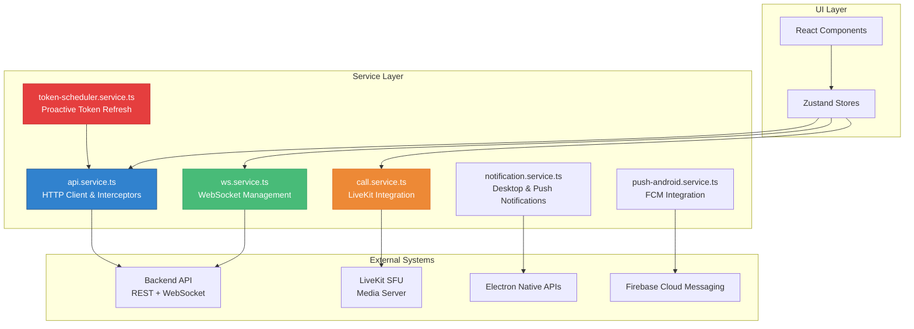
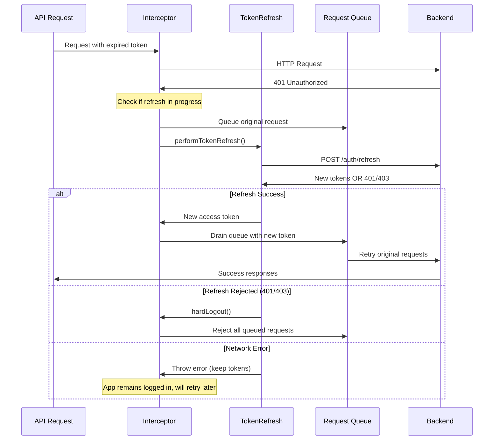
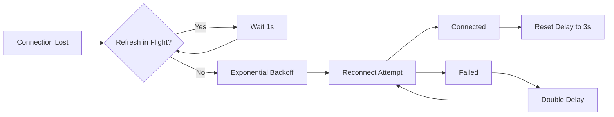
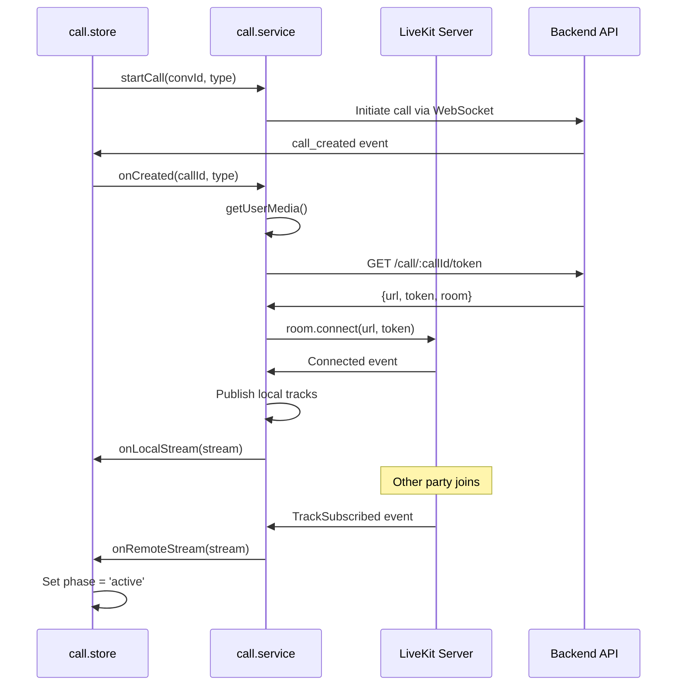

# BSI Messenger Service Layer Documentation

## Overview

The service layer in BSI Messenger provides abstraction between the UI components and external systems (backend APIs, WebSocket, media services). Services handle business logic, error management, and integration patterns while maintaining clean separation of concerns.

## Service Architecture



---

## api.service.ts

**Purpose:** HTTP client with automatic authentication, token refresh, and error handling.

### Core Features

**Axios Configuration:**
- Base URL configuration for different environments
- 15-second timeout for all requests
- JSON content type by default
- Automatic Bearer token injection

**Token Management:**
- Request interceptor adds Authorization header
- Response interceptor handles 401 errors
- Reactive token refresh with request queuing
- Hard logout on refresh token rejection

**Error Handling:**
- Distinguishes network errors from auth rejection
- Preserves tokens during network failures
- User-friendly error messages
- Request retry logic

### Implementation Details

```typescript
const api: AxiosInstance = axios.create({
  baseURL: API_URL,
  timeout: 15000,
  headers: { 'Content-Type': 'application/json' }
})

// Request interceptor - add auth token
api.interceptors.request.use((config: InternalAxiosRequestConfig) => {
  const token = localStorage.getItem(TOKEN_KEY)
  if (token && config.headers) {
    config.headers.Authorization = `Bearer ${token}`
  }
  return config
})
```

### Token Refresh Logic

**Reactive Refresh Flow:**


### API Modules

**Authentication API:**
```typescript
export const authApi = {
  login: (username: string, password: string) =>
    api.post<LoginResponse>('/auth/login', { username, password }),
  logout: () => 
    axios.post(`${API_URL}/auth/logout`, {}, {
      headers: { Authorization: `Bearer ${localStorage.getItem(TOKEN_KEY) ?? ''}` },
      timeout: 5000
    }).catch(() => {}),
  refresh: (refreshToken: string) =>
    api.post<AuthTokens>('/auth/refresh', { refreshToken }),
  changePassword: (password: string) =>
    api.post<{ ok: boolean }>('/auth/change-password', { password })
}
```
**Users API:**
```typescript
export const usersApi = {
  me: () => api.get<{ user: User }>('/users/me'),
  updateMe: (data: Partial<{
    displayName: string
    status: UserStatus
    firstName: string
    lastName: string
    nickname: string
    phone: string
    jobTitle: string
    jobDepartment: string
  }>) => api.patch<{ user: User }>('/users/me', data),
  uploadAvatar: (file: File) => {
    const form = new FormData()
    form.append('avatar', file)
    return api.post('/attachments/avatar', form, {
      headers: { 'Content-Type': 'multipart/form-data' }
    })
  }
}
```

**Admin API:**
```typescript
export const adminApi = {
  listUsers: (params?: { page?: number; limit?: number; search?: string }) =>
    api.get('/admin/users', { params }),
  stats: () => api.get('/admin/stats'),
  activate: (id: string) => api.patch(`/admin/users/${id}/activate`),
  deactivate: (id: string) => api.patch(`/admin/users/${id}/deactivate`),
  setAdmin: (id: string, isAdmin: boolean) =>
    api.patch(`/admin/users/${id}/set-admin`, { isAdmin }),
  createUser: (data: { username: string; displayName: string; password: string; email?: string }) =>
    api.post('/admin/users', data),
  updateUser: (id: string, data: { displayName?: string; username?: string; email?: string | null }) => 
    api.patch(`/admin/users/${id}`, data),
  deleteUser: (id: string) => api.delete(`/admin/users/${id}`),
  setPassword: (id: string, password: string) =>
    api.patch(`/admin/users/${id}/password`, { password })
}
```

### Usage Patterns

**Error Handling:**
```typescript
try {
  const response = await usersApi.updateMe({ displayName: 'New Name' })
  // Success - response.data.user contains updated user
} catch (error) {
  if (error.response?.status === 401) {
    // Token refresh will be handled automatically
    // This catch block won't execute unless refresh also fails
  } else if (error.response?.status === 400) {
    // Validation error - check error.response.data.error for details
  } else {
    // Network or other error
  }
}
```

**File Upload:**
```typescript
const uploadFile = async (conversationId: string, file: File) => {
  try {
    const attachmentData = await attachmentsApi.upload(conversationId, file)
    return attachmentData // { storageKey, fileName, mimeType, sizeBytes, width?, height? }
  } catch (error) {
    throw new Error(`Upload failed: ${error.message}`)
  }
}
```

---

## ws.service.ts

**Purpose:** WebSocket connection management with automatic reconnection and event handling.

### Core Features

**Connection Management:**
- Token-based authentication via query parameter
- Automatic reconnection with exponential backoff
- Connection state awareness (connecting, open, closed)
- Graceful handling of network transitions

**Event System:**
- Type-safe event handlers with Map-based storage
- Event registration/deregistration
- Payload validation and error handling
- HMR-safe cleanup

**Reliability Features:**
- Ping/pong heartbeat (30s interval, 70s timeout)
- Offline message queue with automatic drain
- Token refresh coordination
- Network change detection

### Implementation Details

```typescript
class WsService {
  private ws: WebSocket | null = null
  private handlers = new Map<WsEventType, Set<WsHandler>>()
  private pingInterval: ReturnType<typeof setInterval> | null = null
  private reconnectTimeout: ReturnType<typeof setTimeout> | null = null
  private pongWatchdog: ReturnType<typeof setTimeout> | null = null
  private shouldReconnect = true
  private reconnectDelay = 3000
  private lastPongAt = 0
  private offlineQueue: Array<{ type: string; payload: unknown }> = []
```

### Connection Logic

```typescript
connect() {
  if (this.ws && (this.ws.readyState === WebSocket.OPEN || this.ws.readyState === WebSocket.CONNECTING)) {
    return
  }

  // Don't connect with expired token during refresh
  if (isRefreshInFlight()) {
    console.debug('[WS] Refresh in-flight, delaying connect...')
    this.scheduleReconnect(REFRESH_WAIT_MS)
    return
  }

  const token = localStorage.getItem(TOKEN_KEY)
  if (!token) return

  this.shouldReconnect = true
  this.ws = new WebSocket(`${WS_URL}?token=${token}`)

  this.ws.onopen = () => {
    console.log('[WS] Connected')
    this.reconnectDelay = 3000 // Reset backoff
    this.lastPongAt = Date.now()
    this.startPing()
    this.drainQueue()
  }

  this.ws.onmessage = (e) => {
    try {
      const event: WsEvent = JSON.parse(e.data)
      if (event.type === 'pong') {
        this.lastPongAt = Date.now()
        this.resetPongWatchdog()
      }
      const handlers = this.handlers.get(event.type as WsEventType)
      if (handlers) handlers.forEach((fn) => fn(event.payload))
    } catch {
      console.warn('[WS] Invalid message', e.data)
    }
  }
}
```
### Event System

**Event Registration:**
```typescript
// Type-safe event handling
on<T = unknown>(eventType: WsEventType, handler: WsHandler<T>): void {
  if (!this.handlers.has(eventType)) {
    this.handlers.set(eventType, new Set())
  }
  this.handlers.get(eventType)!.add(handler as WsHandler)
}

off<T = unknown>(eventType: WsEventType, handler: WsHandler<T>): void {
  const handlers = this.handlers.get(eventType)
  if (handlers) {
    handlers.delete(handler as WsHandler)
    if (handlers.size === 0) {
      this.handlers.delete(eventType)
    }
  }
}
```

**Message Sending:**
```typescript
send<T = unknown>(type: string, payload: T): void {
  if (this.ws?.readyState === WebSocket.OPEN) {
    this.ws.send(JSON.stringify({ type, payload }))
  } else {
    // Queue message for when connection is restored
    this.offlineQueue.push({ type, payload })
  }
}
```

### Reconnection Strategy

**Exponential Backoff:**


**Implementation:**
```typescript
private scheduleReconnect(delay: number): void {
  if (!this.shouldReconnect) return
  
  this.reconnectTimeout = setTimeout(() => {
    this.connect()
  }, delay)
}

// In onclose handler:
if (this.shouldReconnect) {
  if (isRefreshInFlight()) {
    this.scheduleReconnect(REFRESH_WAIT_MS) // Don't increase delay
  } else {
    this.reconnectDelay = Math.min(this.reconnectDelay * 2, 30_000) // Cap at 30s
    this.scheduleReconnect(this.reconnectDelay)
  }
}
```

### Usage Patterns

**Store Integration:**
```typescript
// In chat.store.ts
wsService.on('new_message', (payload) => {
  useChatStore.getState()._onNewMessage(payload as Message)
})

wsService.on('message_ack', (payload) => {
  useChatStore.getState()._onAck(payload as WsMessageAckPayload)
})

// In call.store.ts
wsService.on('call_incoming', (payload) => {
  useCallStore.getState().incoming(payload as WsCallIncomingPayload)
})
```

**Cleanup Pattern:**
```typescript
// HMR-safe cleanup
if (import.meta.hot) {
  import.meta.hot.dispose(() => {
    wsService.disconnect()
  })
}
```

---

## call.service.ts

**Purpose:** LiveKit SDK integration for audio/video calls with SFU architecture.

### Core Features

**LiveKit Integration:**
- Room-based call management
- Track publishing/subscribing
- Connection state monitoring
- Media device management

**Media Handling:**
- getUserMedia with permission handling
- Track management (audio/video)
- Single remote MediaStream for all tracks
- Device error mapping to user-friendly messages

**Callback Architecture:**
- Event-driven updates to call store
- Separation of concerns between service and UI
- Error handling with user context

### Implementation Details

```typescript
export interface CallCallbacks {
  onRemoteStream: (stream: MediaStream) => void
  onLocalStream: (stream: MediaStream) => void
  onConnectionState: (state: RTCPeerConnectionState) => void
  onError: (message: string) => void
  onPeerJoined?: () => void
  onPeerLeft?: () => void
  onReconnecting?: () => void
}

class CallService {
  private room: Room | null = null
  private localTracks: LocalTrack[] = []
  private callId: string | null = null
  private cb: CallCallbacks | null = null
  private remoteStream: MediaStream | null = null
```

### Media Device Management

**Device Permission Handling:**
```typescript
private mapMediaError(err: unknown): Error {
  const name = (err as { name?: string })?.name
  if (name === 'NotAllowedError') {
    return new Error('Camera/microphone permission denied. Open Settings > Privacy > Camera & Microphone and allow BSI Messenger.')
  }
  if (name === 'NotFoundError') {
    return new Error('No camera or microphone found on this device.')
  }
  if (name === 'NotReadableError') {
    return new Error('Camera/microphone is in use by another app.')
  }
  return new Error('Failed to access camera/microphone: ' + String(name ?? err))
}
```

**Track Management:**
```typescript
private attachRoomEvents(room: Room): void {
  room.on(RoomEvent.TrackSubscribed, (track: RemoteTrack) => {
    const mst = track.mediaStreamTrack
    if (mst === undefined) return
    
    // Single MediaStream prevents audio/video conflicts
    if (this.remoteStream === null) this.remoteStream = new MediaStream()
    
    // Replace old track of same kind
    for (const old of this.remoteStream.getTracks()) {
      if (old.kind === mst.kind) this.remoteStream.removeTrack(old)
    }
    
    this.remoteStream.addTrack(mst)
    this.cb?.onRemoteStream(this.remoteStream)
  })
}
```
### Call Flow Integration

**Call Lifecycle:**


**Media Controls:**
```typescript
toggleMic(enabled: boolean): void {
  this.localTracks.forEach(track => {
    if (track.kind === Track.Kind.Audio) {
      track.enabled = enabled
    }
  })
}

toggleCam(enabled: boolean): void {
  this.localTracks.forEach(track => {
    if (track.kind === Track.Kind.Video) {
      track.enabled = enabled
    }
  })
}
```

### Usage Patterns

**Service Integration:**
```typescript
// In call.store.ts
export function initCallBridge(): void {
  callService.setCallbacks({
    onLocalStream: (s) => useCallStore.setState({ localStream: s }),
    onRemoteStream: (s) => useCallStore.setState({ remoteStream: s }),
    onConnectionState: (st) => {
      if (st === 'connected') useCallStore.setState({ reconnecting: false })
    },
    onError: (msg) => useCallStore.setState({ error: msg }),
  })
}
```

---

## token-scheduler.service.ts

**Purpose:** Proactive token refresh with network and system event awareness.

### Core Features

**Proactive Refresh:**
- Schedules refresh 60 seconds before token expiry
- JWT payload decoding to extract expiration
- Callback-based refresh execution
- Retry logic with exponential backoff

**Network Awareness:**
- Online/offline event detection
- Immediate refresh on network recovery
- System sleep/wake detection
- Coordinated refresh state management

### Implementation Details

```typescript
let refreshTimeout: ReturnType<typeof setTimeout> | null = null
let refreshCallback: (() => Promise<void>) | null = null
let isRefreshing = false

export function scheduleProactiveRefresh(
  accessToken: string, 
  callback: () => Promise<void>
): void {
  clearProactiveRefresh()
  
  try {
    const payload = JSON.parse(atob(accessToken.split('.')[1]))
    const expiresAt = payload.exp * 1000 // Convert to milliseconds
    const refreshAt = expiresAt - 60_000 // 60 seconds before expiry
    const delay = Math.max(0, refreshAt - Date.now())
    
    refreshCallback = callback
    
    refreshTimeout = setTimeout(async () => {
      await executeRefresh()
    }, delay)
    
  } catch (err) {
    console.error('[token-scheduler] Invalid token format:', err)
  }
}
```

### Network Event Handling

**Online Detection:**
```typescript
window.addEventListener('online', () => {
  console.log('[token-scheduler] Network recovered, triggering refresh')
  if (refreshCallback) executeRefresh()
})

window.addEventListener('offline', () => {
  console.log('[token-scheduler] Network lost')
})
```

**System Wake Detection:**
```typescript
let lastActivity = Date.now()

document.addEventListener('visibilitychange', () => {
  if (document.hidden) {
    lastActivity = Date.now()
  } else {
    const sleepDuration = Date.now() - lastActivity
    if (sleepDuration > 30_000 && refreshCallback) { // 30s threshold
      console.log('[token-scheduler] System wake detected, triggering refresh')
      executeRefresh()
    }
  }
})
```

### Refresh Coordination

**In-Flight State Management:**
```typescript
export function isRefreshInFlight(): boolean {
  return isRefreshing
}

export function setRefreshing(value: boolean): void {
  isRefreshing = value
}

async function executeRefresh(): Promise<void> {
  if (isRefreshing || !refreshCallback) return
  
  isRefreshing = true
  try {
    await refreshCallback()
  } catch (err) {
    console.error('[token-scheduler] Proactive refresh failed:', err)
  } finally {
    isRefreshing = false
  }
}
```

---

## notification.service.ts

**Purpose:** Cross-platform notification management for desktop and mobile.

### Core Features

**Platform Detection:**
- Electron desktop notifications
- Capacitor mobile notifications
- Graceful fallback for unsupported platforms
- Permission request handling

**Notification Types:**
- New message notifications
- Incoming call alerts
- System notifications
- Error notifications

### Implementation Details

**Platform-Specific Initialization:**
```typescript
// Module-level initialization
if (window.api?.showNotification) {
  // Electron desktop
  wsService.on('new_message', handleNewMessageNotification)
} else if (window.Capacitor?.isNativePlatform()) {
  // Capacitor mobile - handled by push-android.service
} else {
  // Web browser - use Web Notifications API
  requestWebNotificationPermission()
}
```

**Desktop Notifications:**
```typescript
const showDesktopNotification = async (title: string, body: string, icon?: string) => {
  try {
    const enabled = localStorage.getItem(NOTIF_ENABLED_KEY) !== 'false'
    if (!enabled) return
    
    await window.api.showNotification({
      title,
      body,
      icon: icon || 'default'
    })
  } catch (err) {
    console.error('[notification] Desktop notification failed:', err)
  }
}
```

### Usage Patterns

**Message Notifications:**
```typescript
const handleNewMessageNotification = (message: Message) => {
  const currentUser = useAuthStore.getState().user
  if (message.senderId === currentUser?.id) return // Don't notify for own messages
  
  const title = message.sender?.displayName || 'New Message'
  const body = message.type === 'TEXT' ? message.body : 'Sent an attachment'
  
  showDesktopNotification(title, body)
}
```

---

## push-android.service.ts

**Purpose:** Firebase Cloud Messaging integration for Android push notifications.

### Core Features

**FCM Integration:**
- Token registration with backend
- Permission handling for Android 13+
- Platform-specific implementation
- NO-OP behavior on non-Android platforms

### Implementation Details

```typescript
export const registerPushAndroid = async (): Promise<void> => {
  // Guard: Only run on Capacitor Android
  if (!Capacitor.isNativePlatform() || Capacitor.getPlatform() !== 'android') {
    return
  }

  try {
    // Request permission (Android 13+)
    const permission = await PushNotifications.requestPermissions()
    if (permission.receive !== 'granted') {
      console.warn('[push-android] Permission denied')
      return
    }

    // Register with FCM
    await PushNotifications.register()
    
    // Get token and send to backend
    const result = await PushNotifications.getToken()
    if (result.value) {
      await api.post('/push/register', {
        token: result.value,
        platform: 'android'
      })
    }
  } catch (err) {
    console.error('[push-android] Registration failed:', err)
  }
}
```

---

## Service Integration Patterns

### Store-Service Communication

**Service → Store Updates:**
```typescript
// Services update stores via direct method calls
wsService.on('new_message', (message) => {
  useChatStore.getState()._onNewMessage(message)
})

// Services access store state for context
const sendMessage = async (body: string) => {
  const { user } = useAuthStore.getState()
  const { activeId } = useChatStore.getState()
  // ... use state for business logic
}
```

**Store → Service Calls:**
```typescript
// Stores call service methods for side effects
const login = async (username: string, password: string) => {
  const response = await authApi.login(username, password)
  wsService.connect() // Start WebSocket after successful login
  scheduleProactiveRefresh(response.data.accessToken, refreshCallback)
}
```
### Error Handling Strategies

**Centralized Error Processing:**
```typescript
// Common error handling utility
export const handleServiceError = (error: unknown, context: string): string => {
  console.error(`[${context}] Error:`, error)
  
  if (error instanceof Error) {
    return error.message
  }
  
  if (typeof error === 'object' && error !== null) {
    const apiError = error as { response?: { data?: { error?: { message?: string } } } }
    return apiError.response?.data?.error?.message || `${context} failed`
  }
  
  return `${context} failed`
}
```

**Service-Specific Error Handling:**
```typescript
// In api.service.ts
const isAuthRejection = (err: unknown): boolean => {
  const status = (err as { response?: { status?: number } })?.response?.status
  return status === 401 || status === 403
}

const isNetworkError = (err: unknown): boolean => {
  return !((err as { response?: unknown })?.response)
}
```

### HMR-Safe Patterns

**Service Cleanup:**
```typescript
// Each service implements cleanup for hot reload
if (import.meta.hot) {
  import.meta.hot.dispose(() => {
    // WebSocket service
    wsService.disconnect()
    
    // Token scheduler  
    clearProactiveRefresh()
    
    // Call service
    callService.cleanup()
    
    // Notification service
    removeAllListeners()
  })
}
```

### Testing Strategies

**Service Mocking:**
```typescript
// Mock API service for testing
jest.mock('./api.service', () => ({
  authApi: {
    login: jest.fn(),
    logout: jest.fn(),
    refresh: jest.fn()
  },
  usersApi: {
    me: jest.fn(),
    updateMe: jest.fn()
  }
}))

// Mock WebSocket service
jest.mock('./ws.service', () => ({
  wsService: {
    connect: jest.fn(),
    disconnect: jest.fn(),
    on: jest.fn(),
    off: jest.fn(),
    send: jest.fn()
  }
}))
```

**Service Unit Tests:**
```typescript
describe('token-scheduler.service', () => {
  beforeEach(() => {
    clearProactiveRefresh()
    jest.clearAllMocks()
  })

  it('should schedule refresh before token expiry', () => {
    const mockCallback = jest.fn()
    const tokenWithExp = createMockToken(Date.now() + 300000) // 5 min from now
    
    scheduleProactiveRefresh(tokenWithExp, mockCallback)
    
    // Fast-forward time
    jest.advanceTimersByTime(240000) // 4 minutes
    expect(mockCallback).toHaveBeenCalled()
  })
})
```

---

## Performance Considerations

### Request Optimization

**API Call Batching:**
```typescript
// Batch related API calls
const loadUserData = async (userId: string) => {
  const [userProfile, userStats] = await Promise.all([
    usersApi.getProfile(userId),
    adminApi.getUserStats(userId)
  ])
  return { userProfile, userStats }
}
```

**Request Deduplication:**
```typescript
// Prevent duplicate requests
const pendingRequests = new Map<string, Promise<any>>()

const getCachedOrFetch = async (key: string, fetcher: () => Promise<any>) => {
  if (pendingRequests.has(key)) {
    return pendingRequests.get(key)
  }
  
  const promise = fetcher()
  pendingRequests.set(key, promise)
  
  try {
    const result = await promise
    return result
  } finally {
    pendingRequests.delete(key)
  }
}
```

### Memory Management

**WebSocket Event Cleanup:**
```typescript
// Prevent memory leaks from event handlers
class ComponentWithWebSocket {
  private cleanup: (() => void)[] = []
  
  componentDidMount() {
    const handler = (data) => { /* handle event */ }
    wsService.on('new_message', handler)
    
    // Store cleanup function
    this.cleanup.push(() => wsService.off('new_message', handler))
  }
  
  componentWillUnmount() {
    this.cleanup.forEach(fn => fn())
  }
}
```

**Blob URL Cleanup:**
```typescript
// In AttachmentImage component
useEffect(() => {
  let blobUrl: string | null = null
  
  const loadImage = async () => {
    blobUrl = await attachmentsApi.getFile(attachmentId)
    setImageUrl(blobUrl)
  }
  
  loadImage()
  
  return () => {
    if (blobUrl) {
      URL.revokeObjectURL(blobUrl)
    }
  }
}, [attachmentId])
```

---

## Service Configuration

### Environment-Specific Configuration

**API URLs:**
```typescript
// src/renderer/src/config/constants.ts
import { Capacitor } from '@capacitor/core'

const IS_NATIVE = Capacitor.isNativePlatform()
const NATIVE_BACKEND = 'https://chat.bsilongevity.com:4443'

export const API_URL = IS_NATIVE ? `${NATIVE_BACKEND}/api` : '/api'
export const WS_URL = IS_NATIVE 
  ? 'wss://chat.bsilongevity.com:4443/ws' 
  : `ws://${location.host}/ws`
```

**Service Timeouts:**
```typescript
// Different timeouts for different operations
const TIMEOUTS = {
  API_REQUEST: 15000,      // General API calls
  FILE_UPLOAD: 60000,      // File uploads
  AUTH_REFRESH: 10000,     // Token refresh
  WEBSOCKET_CONNECT: 5000  // WebSocket connection
}
```

### Service Dependencies

**Dependency Injection Pattern:**
```typescript
// Services can be configured with dependencies
class ApiService {
  constructor(
    private baseURL: string,
    private timeout: number,
    private tokenStorage: TokenStorage
  ) {}
}

// Factory function for service creation
export const createApiService = (config: ApiConfig) => {
  return new ApiService(
    config.baseURL,
    config.timeout,
    new LocalStorageTokenStorage()
  )
}
```

---

## Best Practices

### Service Design Principles

**Single Responsibility:**
- Each service handles one domain (API, WebSocket, Calls, etc.)
- Clear boundaries between services
- Minimal coupling between services

**Error Handling:**
- Always handle errors gracefully
- Provide user-friendly error messages
- Log errors for debugging
- Distinguish recoverable from non-recoverable errors

**State Management:**
- Services are stateless when possible
- State is managed by stores, not services
- Services provide methods, stores provide data

### Service Integration Guidelines

**Store Integration:**
```typescript
// ✅ Good: Services update stores via method calls
wsService.on('event', (data) => {
  store.getState().handleEvent(data)
})

// ❌ Avoid: Services directly manipulating store state
wsService.on('event', (data) => {
  store.setState({ data }) // Direct state manipulation
})
```

**Error Propagation:**
```typescript
// ✅ Good: Let callers handle errors appropriately
const sendMessage = async (body: string) => {
  try {
    return await messagesApi.send(body)
  } catch (error) {
    // Log for debugging
    console.error('[chat] Send message failed:', error)
    // Re-throw for caller to handle
    throw error
  }
}
```

**Service Lifecycle:**
```typescript
// ✅ Good: Clean service lifecycle management
export const startServices = () => {
  wsService.connect()
  notificationService.initialize()
}

export const stopServices = () => {
  wsService.disconnect()
  clearProactiveRefresh()
  callService.cleanup()
}
```

---

*This service layer documentation provides comprehensive guidance for understanding and working with BSI Messenger's service architecture. The services provide clean abstraction between UI components and external systems while maintaining reliability and performance.*