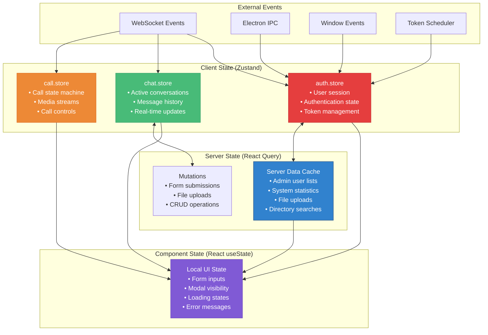
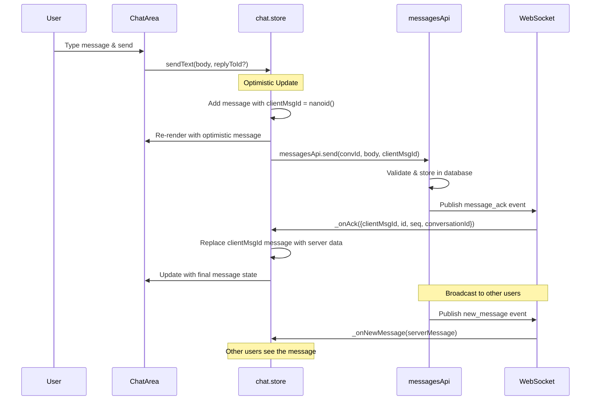
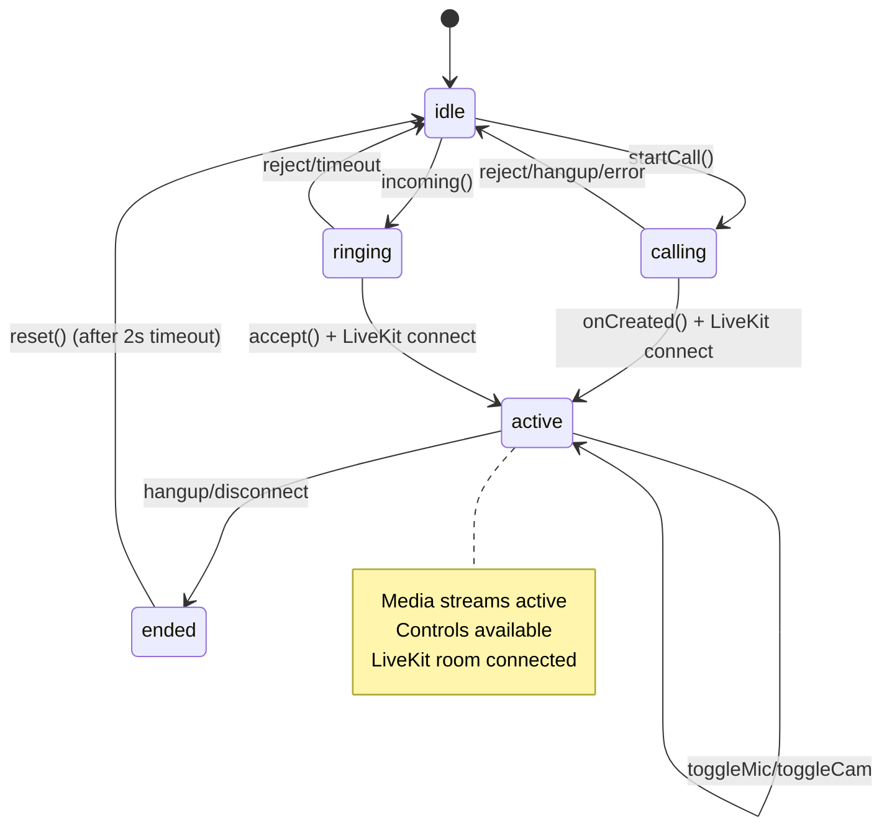
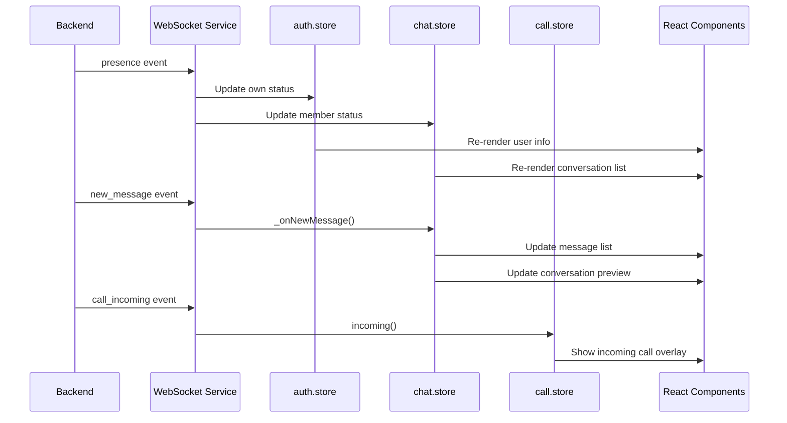

# BSI Messenger State Management Documentation

## Overview

BSI Messenger uses a hybrid state management approach combining Zustand for client state, TanStack React Query for server state, and React's built-in state for component-specific UI state. This architecture provides optimal performance while maintaining clear separation of concerns.

## State Architecture



---

## Zustand Stores

### auth.store.ts

**Purpose:** Manages user authentication, session state, and token lifecycle.

#### State Schema

```typescript
interface AuthState {
  user: User | null
  isAuthenticated: boolean
  isLoading: boolean
  error: string | null
}
```

#### Actions

```typescript
interface AuthActions {
  login: (username: string, password: string) => Promise<void>
  logout: () => Promise<void>
  loadMe: () => Promise<void>
  clearError: () => void
}
```

#### Key Features

**Session Management:**
- Automatic session revocation on new login
- Persistent tokens in localStorage
- Bootstrap authentication on app start

**Token Lifecycle:**
- Proactive refresh scheduling (60s before expiry)
- Integration with token scheduler service
- WebSocket reconnection on token refresh

**Error Handling:**
- Distinguishes network errors from auth rejection
- User-friendly error messages
- Automatic retry strategies

#### Implementation Details

```typescript
export const useAuthStore = create<AuthState & AuthActions>((set, get) => {
  // Module-level event listener for forced logout
  if (typeof window !== 'undefined') {
    window.addEventListener('bsi:logout', () => {
      // Clean logout without API call (token already invalid)
      clearProactiveRefresh()
      wsService.disconnect()
      localStorage.removeItem(TOKEN_KEY)
      localStorage.removeItem(REFRESH_KEY)
      set({ user: null, isAuthenticated: false, error: null, isLoading: false })
    })
  }

  return {
    // Initial state
    user: null,
    isAuthenticated: false,
    isLoading: false,
    error: null,

    // Actions implementation
    login: async (username, password) => {
      // 1. Session revocation (if existing)
      const existingRefresh = localStorage.getItem(REFRESH_KEY)
      if (existingRefresh) {
        wsService.disconnect()
        await authApi.logout().catch(() => {})
        clearProactiveRefresh()
        localStorage.removeItem(TOKEN_KEY)
        localStorage.removeItem(REFRESH_KEY)
      }

      // 2. New login
      wsService.disconnect()
      set({ isLoading: true, error: null })

      try {
        const { data } = await authApi.login(username, password)
        localStorage.setItem(TOKEN_KEY, data.accessToken)
        localStorage.setItem(REFRESH_KEY, data.refreshToken)
        set({ user: data.user, isAuthenticated: true, isLoading: false })
        
        // 3. Start services
        wsService.connect()
        startProactiveRefreshCycle(data.accessToken)
      } catch (err) {
        const msg = err?.response?.data?.message ?? 'Login failed'
        set({ error: msg, isLoading: false })
      }
    }
  }
})
```

#### Integration Points

**WebSocket Service:**
- Connects on successful login
- Disconnects on logout
- Reconnects after token refresh

**Token Scheduler:**
- Schedules proactive refresh
- Handles network recovery
- Manages refresh in-flight state

**API Interceptor:**
- Reactive refresh on 401 errors
- Queue requests during refresh
- Hard logout on refresh rejection

#### Usage Example

```typescript
const LoginComponent = () => {
  const { login, isLoading, error, clearError } = useAuthStore()
  const [credentials, setCredentials] = useState({ username: '', password: '' })

  const handleSubmit = async (e) => {
    e.preventDefault()
    clearError()
    await login(credentials.username, credentials.password)
  }

  return (
    <form onSubmit={handleSubmit}>
      {error && (
        <div className="error-message">
          {error}
          <button onClick={clearError}>×</button>
        </div>
      )}
      {/* Form inputs */}
      <button type="submit" disabled={isLoading}>
        {isLoading ? 'Signing in...' : 'Sign In'}
      </button>
    </form>
  )
}
```

---

### chat.store.ts

**Purpose:** Manages conversations, messages, and real-time chat functionality.

#### State Schema

```typescript
interface ChatState {
  conversations: Conversation[]
  activeId: string | null
  messages: Record<string, Message[]>  // keyed by conversationId
  loadingConvos: boolean
  loadingMsgs: boolean
  readCursors: Record<string, string>  // conversationId -> seq
}
```

#### Actions

```typescript
interface ChatActions {
  loadConversations: () => Promise<void>
  selectConversation: (id: string) => Promise<void>
  sendText: (body: string, replyToId?: string) => Promise<void>
  sendImage: (file: File, caption?: string) => Promise<void>
  deleteMessage: (conversationId: string, messageId: string) => Promise<void>
  markRead: (conversationId: string, seq: string | number) => void
  
  // WebSocket event handlers (private)
  _onNewMessage: (message: Message) => void
  _onAck: (payload: WsMessageAckPayload) => void
  _onPresence: (payload: WsPresencePayload) => void
  _onReceipt: (payload: WsReceiptPayload) => void
}
```

#### Key Features

**Optimistic Updates:**
- Messages appear instantly with clientMsgId
- Server ACK replaces optimistic message with real data
- Image uploads show local blob preview during upload

**Real-time Integration:**
- WebSocket event handlers update state automatically
- Presence updates modify conversation member status
- Read receipts track conversation read state

**Message Management:**
- Conversation-keyed message storage
- Pagination support with "before" sequence
- Thread support via replyToId

#### Optimistic Update Flow



#### Implementation Details

**Optimistic Text Message:**
```typescript
sendText: async (body, replyToId) => {
  const convId = get().activeId
  if (!convId || !body.trim()) return
  
  const me = useAuthStore.getState().user
  const clientMsgId = nanoid()

  // Optimistic message
  const optimistic: Message = {
    id: clientMsgId,
    conversationId: convId,
    senderId: me?.id ?? '',
    sender: me ?? undefined,
    type: 'TEXT',
    body,
    clientMsgId,
    replyToId: replyToId ?? null,
    createdAt: new Date().toISOString()
  }

  // Add to store immediately
  set((s) => ({
    messages: { 
      ...s.messages, 
      [convId]: [...(s.messages[convId] ?? []), optimistic] 
    }
  }))

  try {
    await messagesApi.send(convId, body, clientMsgId, replyToId ? { replyToId } : undefined)
    // Server ACK will update the message via _onAck
  } catch (e) {
    console.error('[chat] sendText failed', e)
    // Note: We don't rollback optimistic updates for UX reasons
  }
}
```

**WebSocket Event Handlers:**
```typescript
_onNewMessage: (m) => {
  set((s) => {
    const existing = s.messages[m.conversationId] ?? []
    
    // Prevent duplicates
    if (m.clientMsgId && existing.some((x) => x.clientMsgId === m.clientMsgId)) return s
    if (existing.some((x) => x.id === m.id)) return s

    // Update conversation preview
    const idx = s.conversations.findIndex((c) => c.id === m.conversationId)
    let convos = s.conversations
    if (idx !== -1) {
      const updated = { ...convos[idx], lastMessage: m }
      convos = [updated, ...convos.slice(0, idx), ...convos.slice(idx + 1)]
    }

    return {
      messages: { ...s.messages, [m.conversationId]: [...existing, m] },
      conversations: convos
    }
  })
}
```

#### Usage Example

```typescript
const ChatComponent = () => {
  const { 
    conversations, 
    activeId, 
    messages, 
    loadingMsgs,
    selectConversation, 
    sendText 
  } = useChatStore()
  
  const [messageInput, setMessageInput] = useState('')
  const activeMessages = messages[activeId ?? ''] ?? []

  const handleSend = async () => {
    if (!messageInput.trim()) return
    await sendText(messageInput)
    setMessageInput('')
  }

  return (
    <div className="chat-container">
      <div className="message-list">
        {loadingMsgs ? (
          <div>Loading messages...</div>
        ) : (
          activeMessages.map(msg => (
            <MessageBubble key={msg.id} message={msg} />
          ))
        )}
      </div>
      
      <div className="message-input">
        <input
          value={messageInput}
          onChange={(e) => setMessageInput(e.target.value)}
          onKeyDown={(e) => e.key === 'Enter' && handleSend()}
          placeholder="Type a message..."
        />
        <button onClick={handleSend}>Send</button>
      </div>
    </div>
  )
}
```

---

### call.store.ts

**Purpose:** Manages audio/video call state machine and media streams.

#### State Schema

```typescript
interface CallState {
  phase: CallPhase  // 'idle' | 'calling' | 'ringing' | 'active' | 'ended'
  callId: string | null
  callType: CallType | null  // 'AUDIO' | 'VIDEO'
  peer: CallPeer | null
  conversationId: string | null
  localStream: MediaStream | null
  remoteStream: MediaStream | null
  micOn: boolean
  camOn: boolean
  error: string | null
  reconnecting: boolean
}
```

#### Actions

```typescript
interface CallActions {
  startCall: (conversationId: string, callType: CallType, peer: CallPeer) => Promise<void>
  incoming: (payload: WsCallIncomingPayload) => void
  accept: () => Promise<void>
  reject: () => void
  hangup: () => void
  toggleMic: () => void
  toggleCam: () => void
  reset: () => void
  setError: (msg: string) => void
  
  // WebSocket event handlers (called by initCallBridge)
  onCreated: (callId: string, callType: CallType) => Promise<void>
  onAccepted: (payload: WsCallAcceptedPayload) => Promise<void>
  onEnded: (payload: WsCallEndedPayload, missed: boolean) => void
}
```

#### Call State Machine



#### Key Features

**SFU Architecture:**
- LiveKit server handles media routing
- No P2P connection issues with NAT/firewall
- Scalable for future group calls

**Media Management:**
- Single MediaStream for all remote tracks
- Proper track cleanup to prevent memory leaks
- Device permission error handling

**Call Signaling:**
- WebSocket for call setup/teardown
- LiveKit for actual media streaming
- Automatic reconnection handling

#### Implementation Details

**Call State Machine:**
```typescript
export const useCallStore = create<CallState & CallActions>((set, get) => {
  const initial = {
    phase: 'idle' as CallPhase,
    callId: null,
    callType: null,
    peer: null,
    conversationId: null,
    localStream: null,
    remoteStream: null,
    micOn: true,
    camOn: true,
    error: null,
    reconnecting: false,
  }

  return {
    ...initial,

    startCall: async (conversationId, callType, peer) => {
      set({ phase: 'calling', callType, peer, conversationId, error: null })
      try {
        await callService.startCall(conversationId, callType)
      } catch (err) {
        set({ phase: 'idle', error: (err as Error).message })
        callService.cleanup()
      }
    },

    incoming: (p) => {
      // Reject if already in a call
      if (get().phase !== 'idle') {
        wsService.send('call_reject', { callId: p.callId })
        return
      }
      
      set({
        phase: 'ringing',
        callId: p.callId,
        callType: p.callType,
        peer: p.from,
        conversationId: p.conversationId,
        error: null,
      })
      
      // Store payload for accept()
      pendingIncoming = p
    }
  }
})
```

**LiveKit Integration Bridge:**
```typescript
export function initCallBridge(): void {
  // Set up callbacks from CallService to Store
  callService.setCallbacks({
    onLocalStream: (s) => useCallStore.setState({ localStream: s }),
    onRemoteStream: (s) => useCallStore.setState({ remoteStream: s }),
    onConnectionState: (st) => {
      if (st === 'connected') useCallStore.setState({ reconnecting: false })
      if (st === 'disconnected' && useCallStore.getState().phase === 'active') {
        useCallStore.setState({ reconnecting: true })
      }
    },
    onPeerJoined: () => useCallStore.setState({ phase: 'active', reconnecting: false }),
    onPeerLeft: () => {
      if (useCallStore.getState().phase === 'active') {
        useCallStore.setState({ error: 'Other party disconnected, waiting...' })
      }
    },
    onError: (msg) => useCallStore.setState({ error: msg }),
  })

  // Wire WebSocket events to store actions
  wsService.on('call_created', (p) => {
    void useCallStore.getState().onCreated(p.callId, p.callType)
  })
  wsService.on('call_incoming', (p) => useCallStore.getState().incoming(p))
  wsService.on('call_accepted', (p) => { void useCallStore.getState().onAccepted(p) })
  wsService.on('call_rejected', (p) => useCallStore.getState().onEnded(p, true))
  wsService.on('call_ended', (p) => useCallStore.getState().onEnded(p, false))
}
```

#### Usage Example

```typescript
const CallOverlay = () => {
  const { 
    phase, 
    peer, 
    localStream, 
    remoteStream, 
    micOn, 
    camOn, 
    error,
    toggleMic, 
    toggleCam, 
    hangup 
  } = useCallStore()
  
  const localVideoRef = useRef<HTMLVideoElement>(null)
  const remoteVideoRef = useRef<HTMLVideoElement>(null)

  // Attach media streams to video elements
  useEffect(() => {
    if (localVideoRef.current && localStream) {
      localVideoRef.current.srcObject = localStream
    }
  }, [localStream])

  useEffect(() => {
    if (remoteVideoRef.current && remoteStream) {
      remoteVideoRef.current.srcObject = remoteStream
    }
  }, [remoteStream])

  if (phase === 'idle') return null

  return (
    <div className="call-overlay">
      <div className="call-header">
        <h3>{peer?.displayName}</h3>
        <span className="call-status">{phase}</span>
      </div>

      <div className="video-container">
        <video ref={remoteVideoRef} autoPlay playsInline className="remote-video" />
        <video ref={localVideoRef} autoPlay muted playsInline className="local-video" />
      </div>

      {error && (
        <div className="error-banner">{error}</div>
      )}

      <div className="call-controls">
        <button 
          onClick={toggleMic}
          className={micOn ? 'active' : 'muted'}
        >
          {micOn ? '🎤' : '🔇'}
        </button>
        
        <button onClick={hangup} className="hangup">
          📞
        </button>
        
        <button 
          onClick={toggleCam}
          className={camOn ? 'active' : 'disabled'}
        >
          {camOn ? '📹' : '📹'}
        </button>
      </div>
    </div>
  )
}
```

---

## State Synchronization Patterns

### Server State vs Client State

**Server State (React Query):**
- Data owned by the server (user lists, admin stats)
- Cacheable and refetchable
- Background updates and invalidation
- Optimistic mutations with rollback

**Client State (Zustand):**
- Data owned by the client (active conversation, UI preferences)
- Real-time updates via WebSocket
- Persistent across page reloads
- Optimistic updates without rollback

**Decision Matrix:**

| Data Type | State Management | Rationale |
|-----------|-----------------|-----------|
| User profile | Server State | Can be modified by admin |
| Conversation list | Client State | Real-time updates critical |
| Message history | Client State | Real-time + optimistic updates |
| Admin user list | Server State | Infrequent access + pagination |
| Call state | Client State | Ephemeral, real-time critical |
| Form inputs | Component State | Temporary, component-specific |

### Cross-Store Communication

**Auth → Chat Integration:**
```typescript
// In chat.store.ts
import { useAuthStore } from './auth.store'

const sendMessage = async (body: string) => {
  const me = useAuthStore.getState().user  // Access other store
  if (!me) throw new Error('User not authenticated')
  
  const optimisticMessage = {
    senderId: me.id,
    sender: me,
    // ... rest of message
  }
}
```

**Store → Service Integration:**
```typescript
// Services can access stores for context
wsService.on('new_message', (payload) => {
  // Update chat store
  useChatStore.getState()._onNewMessage(payload)
  
  // Check if notification needed
  const { user } = useAuthStore.getState()
  if (payload.senderId !== user?.id) {
    notificationService.show(payload)
  }
})
```

### Event-Driven Updates

**WebSocket Event Flow:**


---

## Performance Optimizations

### Selective Subscriptions

**Component-Level Subscriptions:**
```typescript
// Subscribe to specific store slices
const conversations = useChatStore((state) => state.conversations)
const activeId = useChatStore((state) => state.activeId)

// Avoid subscribing to entire store
const { conversations, messages, loadingConvos, loadingMsgs } = useChatStore() // ❌ Over-subscription
```

**Computed Selectors:**
```typescript
// Memoized selectors for derived state
const useActiveConversation = () => 
  useChatStore((state) => {
    const { conversations, activeId } = state
    return conversations.find(c => c.id === activeId) ?? null
  })

const useActiveMessages = () => 
  useChatStore((state) => {
    const { messages, activeId } = state
    return activeId ? (messages[activeId] ?? []) : []
  })
```

### State Normalization

**Flat State Structure:**
```typescript
// ✅ Good: Flat, normalized structure
interface ChatState {
  conversations: Conversation[]           // Array for order
  messages: Record<string, Message[]>     // Object for O(1) lookup
  readCursors: Record<string, string>     // Object for O(1) lookup
}

// ❌ Avoid: Nested structures that cause deep updates
interface BadChatState {
  conversations: {
    [id: string]: {
      data: Conversation
      messages: Message[]
      readCursor: string
    }
  }
}
```

### Batch Updates

**Zustand Batch API:**
```typescript
import { useChatStore } from './chat.store'

// Batch multiple state updates
const handleBulkUpdate = () => {
  useChatStore.setState((state) => ({
    ...state,
    loadingConvos: false,
    conversations: newConversations,
    activeId: firstConversationId
  }))
}
```

**React Query Batch Invalidation:**
```typescript
import { useQueryClient } from '@tanstack/react-query'

const queryClient = useQueryClient()

// Batch invalidate related queries
const handleUserUpdate = () => {
  queryClient.invalidateQueries({ queryKey: ['users'] })
  queryClient.invalidateQueries({ queryKey: ['admin', 'stats'] })
}
```

---

## Testing Strategies

### Store Testing

**Unit Test Stores:**
```typescript
import { useAuthStore } from '../auth.store'

describe('auth.store', () => {
  beforeEach(() => {
    // Reset store state
    useAuthStore.setState({
      user: null,
      isAuthenticated: false,
      isLoading: false,
      error: null
    })
  })

  it('should handle successful login', async () => {
    const mockUser = { id: '1', username: 'test' }
    jest.spyOn(authApi, 'login').mockResolvedValue({ 
      data: { user: mockUser, accessToken: 'token', refreshToken: 'refresh' }
    })

    await useAuthStore.getState().login('test', 'password')

    expect(useAuthStore.getState().user).toEqual(mockUser)
    expect(useAuthStore.getState().isAuthenticated).toBe(true)
  })
})
```

**Integration Testing:**
```typescript
import { renderHook } from '@testing-library/react'
import { useChatStore } from '../chat.store'
import { wsService } from '../services/ws.service'

describe('chat.store integration', () => {
  it('should handle new message via WebSocket', () => {
    const { result } = renderHook(() => useChatStore())
    
    const newMessage = {
      id: 'msg_1',
      conversationId: 'conv_1',
      senderId: 'user_1',
      body: 'Hello',
      createdAt: new Date().toISOString()
    }

    // Simulate WebSocket event
    result.current._onNewMessage(newMessage)

    expect(result.current.messages['conv_1']).toContain(newMessage)
  })
})
```

### Mock Strategies

**Service Mocking:**
```typescript
// Mock WebSocket service for testing
jest.mock('../services/ws.service', () => ({
  wsService: {
    on: jest.fn(),
    off: jest.fn(),
    send: jest.fn(),
    connect: jest.fn(),
    disconnect: jest.fn()
  }
}))
```

**Store Mocking:**
```typescript
// Mock store for component testing
jest.mock('../stores/chat.store', () => ({
  useChatStore: jest.fn(() => ({
    conversations: [],
    activeId: null,
    messages: {},
    loadConversations: jest.fn(),
    sendText: jest.fn()
  }))
}))
```

---

## Best Practices

### Store Design

**Single Responsibility:**
```typescript
// ✅ Good: Each store has clear domain
auth.store    // Authentication & user session
chat.store    // Conversations & messages
call.store    // Audio/video calls

// ❌ Avoid: Mixed responsibilities
ui.store      // Generic UI state (too broad)
```

**Immutable Updates:**
```typescript
// ✅ Good: Immutable state updates
set((state) => ({
  ...state,
  conversations: state.conversations.map(conv =>
    conv.id === updatedConv.id ? { ...conv, ...updates } : conv
  )
}))

// ❌ Avoid: Direct mutations
set((state) => {
  state.conversations[0].title = 'New Title'  // Mutates state
  return state
})
```

### Action Design

**Async Action Patterns:**
```typescript
// ✅ Good: Handle loading and error states
const loadData = async () => {
  set({ loading: true, error: null })
  try {
    const data = await api.getData()
    set({ data, loading: false })
  } catch (error) {
    set({ error: error.message, loading: false })
  }
}

// ✅ Good: Optimistic updates with error handling
const optimisticAction = async (input) => {
  // Optimistic update
  const tempId = nanoid()
  set(state => ({ 
    items: [...state.items, { id: tempId, ...input }] 
  }))

  try {
    const result = await api.create(input)
    // Replace optimistic item with real data
    set(state => ({
      items: state.items.map(item =>
        item.id === tempId ? result : item
      )
    }))
  } catch (error) {
    // Remove optimistic item on error
    set(state => ({
      items: state.items.filter(item => item.id !== tempId)
    }))
    throw error
  }
}
```

### Performance Guidelines

**Subscription Optimization:**
```typescript
// ✅ Good: Subscribe to specific slices
const username = useAuthStore(state => state.user?.username)
const messageCount = useChatStore(state => 
  Object.values(state.messages).flat().length
)

// ❌ Avoid: Full store subscriptions
const auth = useAuthStore()  // Re-renders on any auth change
const chat = useChatStore()  // Re-renders on any chat change
```

**Selector Memoization:**
```typescript
// ✅ Good: Memoized selector
const useActiveConversation = () => {
  return useChatStore(
    useCallback(
      state => state.conversations.find(c => c.id === state.activeId),
      []
    )
  )
}
```

### Error Boundaries

**Store Error Handling:**
```typescript
// Centralized error handling in stores
const handleApiError = (error: unknown, action: string) => {
  const message = error instanceof Error ? error.message : `${action} failed`
  console.error(`[store] ${action} error:`, error)
  set({ error: message })
  
  // Optional: Report to error service
  // errorReporting.captureException(error, { action })
}
```

---

*This state management documentation provides comprehensive guidance for understanding and working with BSI Messenger's state architecture. The hybrid approach ensures optimal performance while maintaining clear separation between server and client concerns.*